# Transformation
* 二维变换
  * 线性变换（同一维度）
    * 缩放 
    > 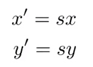

    * 对称
    > 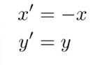
    * 切变
    > 示例：
    > 
    > 变换公式：
    > 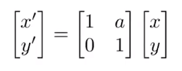
    * 旋转
    > 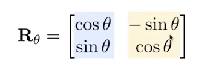
    > $R_{\theta} R_{\theta}^{-1} = 1$,其中$R_{-\theta} = R_{\theta}^{-1} = R_{\theta}^{T}$
    * 变换总公式
    > 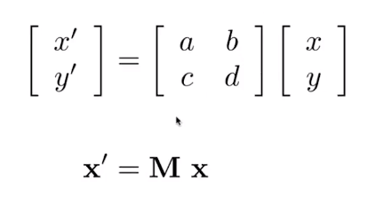
    * 平移
    > 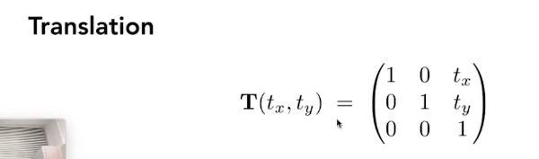
  * 仿射变换
  > 
  * 逆变换
  > 变换后乘逆矩阵
* 三维变换
  * 齐次坐标
  > 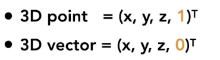

### 齐次坐标

> 为了平移的情况也适用于线性变换，坐标添加一个新的纬度  
> 向量具有平移不变性

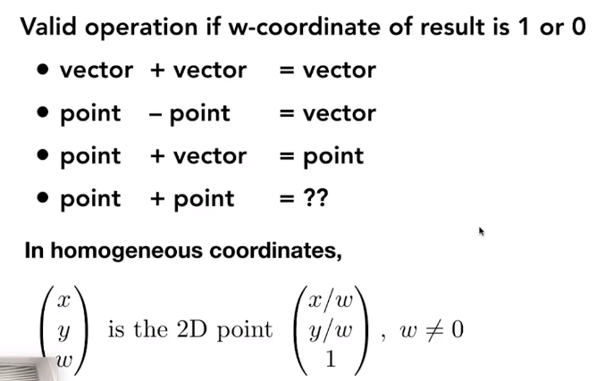

### 变换组合
> * 变换组合的矩阵依次在原矩阵左边添加
> * 变换分解

### 三维变换
* 缩放(Scale)
> 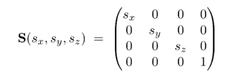
* 平移(Translation)
> 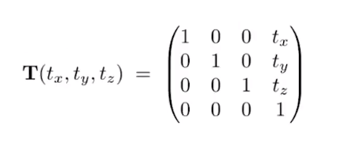
* 绕X轴旋转
> 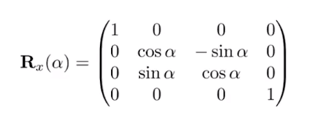
* 绕y轴旋转
> 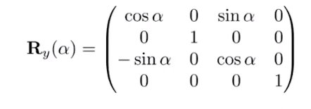
* 绕z轴旋转
> 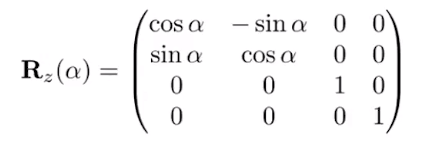
* 任意旋转(rotation)
> 拆分成x，y，z轴旋转  
> 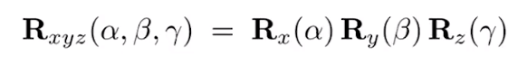  
> 通用公式
> 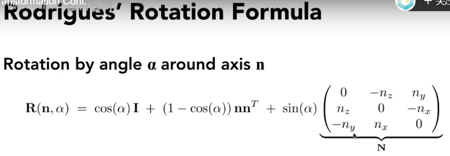
### 观测变换（Viewing transformation)
* 视图变换(View/Camera transformation)
* 投影变换(Projection transformation)
  * 正交(Orthographic projection)
  * 透视(Perspective projection)
