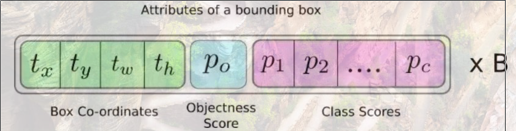

# YOLO
> You Only Look Once  
[YOLO](https://www.jiqizhixin.com/articles/2018-04-23-3)
##### 全卷积神经网路
YOLO仅使用卷积层,属于全卷积神经网络(FCN), 并且拥有75个卷积层,还有跳过连接和上采样层,不使用任何形式的池化,使用步幅为2的卷积层对特征图进行下采样,防止低级特征丢失
> 对于图像而言,上采样的通俗理解是生成对应图像的缩略图,而上采样则是放大图像  
> 池化就是采样

##### 输出

输出的尺寸为$1\times 1\times (B\times (5 + C))$
> 其中B代表每个单元可以预测的边框数量, 5+C表示每个边框所对应的属性  

