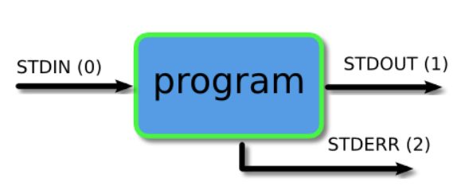
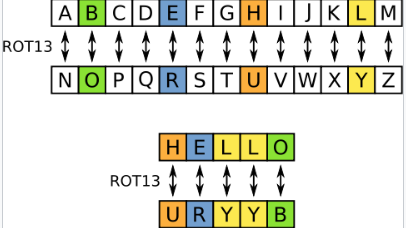

# other

### 虚线文件名(dashed filename)
在linux下有着`-`的文件名,这是用来描述STDIN/STDOUT,又或者是dev/stdin或者devstdout,如果要打开这种文件需要制定相对路径或是绝对路径,例如`./-`
[dashed filename](https://stackoverflow.com/questions/42187323/how-to-open-a-f-dashed-filename-using-terminal)

### 管道与重定向( [piping and Redirection](https://ryanstutorials.net/linuxtutorial/piping.php) )

> STDIN(0)-Standard input  
> STDOUT(1)-Standard output  
> STDERR(2)-Standard error

##### 重定向到文件(Redirecting to a File)
通过重定向符 `>` 可将输出重定向到文件里
* 如果文件不存在,文件会被新建
* 如果文件存在,文件之前的数据被覆盖;如果从文件后添加数据,可用`>>`
> 重定向后,数据内容是一样的,但格式可能和输出到屏幕的时候有所不同

##### 从文件重定向(Redirecting from a File)
通过重定向符`<`,可将文件中的内容输出重定向到程序

##### 重定向错误流(Redirecting STDERR)
可用重定向符`2>`
> 如果要将输出的信息和错误同时重定向到同一个文件,在第二个输出需要添加&  
> 例:`ls xxx > myoutput 2>&1`

##### 管道(Piping)
用于一个程序的输出到另一个程序的输入

### rot13
将字母偏移13位

> 可利用指令`tr 'A-Za-z' 'N-ZA-Mn-za-m'` 替换

### tty和图形界面的切换
`ctrl + alt + F1` 图形界面解决妨碍
