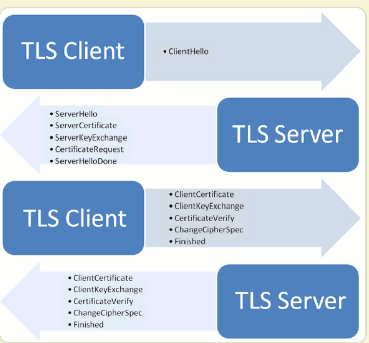

#temp

### 函数调用时候参数的压栈情况
前六个参数从左到右依次放入寄存器:RDI,RSI,RDX,RCX,R8,R9；如果参数在七个以上，多余的参数从右往左依次压入栈中

### Language Server Protocol(LSP)
#### 作用
解决不同语言和编辑器/IDE之间的适配问题
#### 功能
* 语法高亮
* 自动格式化
* 自动补全
* 语法
* 工具提示
* 内联诊断
* 跳转定义
* 项目内查找引用
* 高级文本和符号搜索
#### 原理
类似C/S模式，本地的编辑器视作client，而另外的一个本地进程视作server。每当编辑器（client）需要操作时，就会向server发送一个请求。在server接受到请求后会返回相应的响应

### 计算机时间
#### 1.部分概念
##### 时区
同一地球区块使用的同一时间
##### 协调世界时(UTC)
由国际无线电委员会规定和推荐，并由国际时间局负责保持的以秒为基础的时间标度
##### 格林尼治平均时间(GMT)
在格林尼治子午线上的平太阳时(又称世界时)
> 这是由于地球的公转速度非均匀所致
#### 2. 时间的表示
##### 时间戳
一个无符号整数，定义为格林尼治(又称格林威治)时间1970年01月01日00时00分00秒(北京时间1970年01月01日08时00分00秒)起至现在的总秒数
> 同一时刻，不同时区获得的时间戳是相同的
##### 本地时间
当前时区的本地时间
##### 标准时间
本地时间添加时区信息

用到表示方法为偏移量表示法
> 格林尼治时间 `+` 时区偏移时间

### SSL/TLS协议
##### 有什么用
防止以下问题：
* 窃听风险
  > 第三方获取内容
* 篡改风险
  > 第三方修改内容
* 冒充风险
  > 第三方冒充
##### 原理
对称加密 + 非对称加密（公钥加密法）

对称加密：用于加密通信内容  
非对称加密：用于加密对话密钥

* 如何保证公钥不被篡改
  > 数字签名
* 为什么用到对称加密，直接非对称加密内容不行吗？
  > 非对称加密（公钥加密法）的计算量太大，导致运算时间快

##### 握手过程

该握手过程会用到三个随机数，利用这三个随机数导出一个对称密钥，这样可以尽可能的接近真随机

##### 链接
[阮一峰](https://www.ruanyifeng.com/blog/2014/02/ssl_tls.html)

