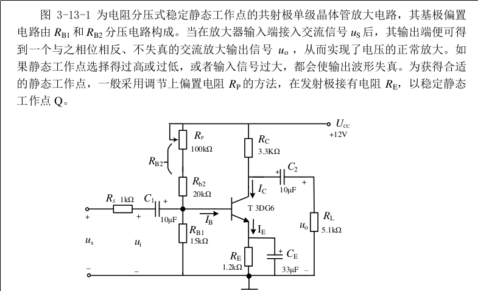
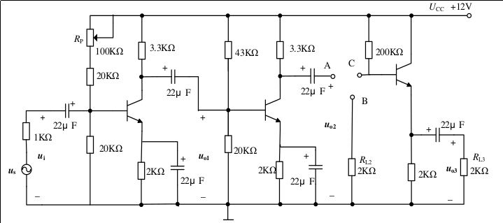
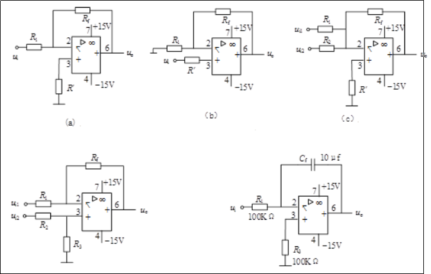
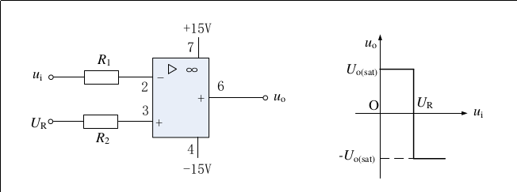
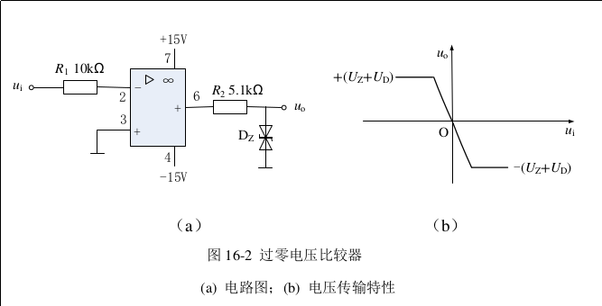
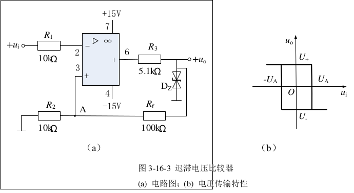
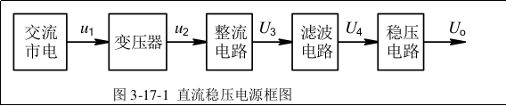
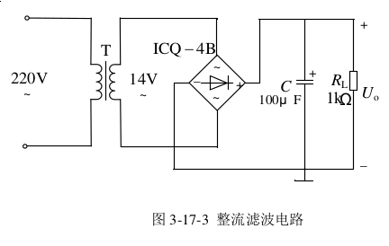
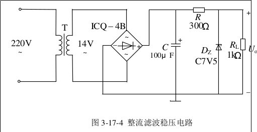

## RLC 串联谐振电路
* 串联电路中,电路复阻抗
> $Z = R + j(\omega L - \frac{1}{\omega C}) = R + j(X_L - X_C)$
* 谐振时候(串联/并联)
> $\omega L - \frac{1}{\omega C} = 0 \Rightarrow X_C = X_L$  
> 谐振角频率和谐振频率: $\omega_{0} = \frac{1}{\sqrt{LC}}, f_0 = \frac{1}{2\pi \sqrt{LC}}$  
> $Z = R \Rightarrow I_0 = \frac{U_S}{R}$  
> 品质因数: $Q = \frac{U_C}{U_S} = \frac{U_L}{U_S} = \frac{1}{\omega_0 RC} = \frac{\omega_0 L}{R} = \frac{1}{R}\sqrt{\frac{L}{C}}$  
> 电流频幅特性: $I = \frac{U_S}{\sqrt{R^2 + (\omega L - \frac{1}{\omega C})^2}} = \frac{U_S}{\sqrt{R^2 + Q^2(\frac{\omega}{\omega_0} - \frac{\omega_0}{\omega})^2}}$
> 通频带: $BW = f_H - f_L = \frac{f_0}{Q}$
* 问答
> * Q对谐振曲线的影响
>   * Q值越大,曲线顶部越尖锐,电路选择性越好; Q值越小,谐振曲线的顶部越圆钝,选择性越差
> * 谐振时候,$U_C$和$U_L$有什么关系? $U_C$,$U_L$与$U_R$有什么关系?
>   * $U_C = U_L$, 方向相反
>   * $U_L = Q U_S, U_C = Q U_S$
> * 电路发生谐振时候, 在实际测量中,总有$U_R < U_S$,原因?
>   * 因为实际中电感的电阻不为零,在谐振的时候电感有分压

## RL串联电路及其功率因数的提高
> 功率因数:$cos\varphi  = \frac{P}{UI}$  
> 损耗:$\Delta U = IR_i, \Delta P = I^2R_i$,其中$R_i$是输电线路的总电阻  
> 无功功率: $Q = U \times Icos\phi$, 其中$\phi$是电压和电流的相位差

* 问答
> * 为什么$U\neq U_D + U_{rL}, I\neq I_D + I_C$
>   * 因为在交流电中,电压和电流具有方向性,$U_D$和$U_{rL}$的相位不一样,所以它们之间的和是矢量和而不是标量和,电流同理
> * 并联电容器提高了电路的功率因数,能否改变感性负载本身的功率因数?
>   * 不能,对于感性负载本身的功率因数是自身的物理特性,并不会被影响
> * 要使功率因数 = 1,应该并联多大的电容?
>   * 谐振
> * 提高功率因数的补偿电容器为什么要在负载端就近连接,而不在发电端集中补偿?
>   * 在实际中,负载离电源源端太远,在源端集中补偿会导致线路上的压降很大,从而导致线路损耗很大,降低了输电效率

## 晶体管共射极放大电路

* 静态
> $U_B \approx \frac{R_{B1}}{R_{B1} + R_{B2}}U_{CC}$  
> $I_E \approx \frac{U_B - U_{BE}}{R_E} \approx (1 + \beta)I_B$  
> $U_{CE} = U_{CC} - I_C(R_C + R_E)$
* 动态
> 电压放大倍数: $A = \frac{u_o}{u_i} \approx -\beta \frac{R_C // R_L}{r_{be}}$  
> 输入电阻: $r_i = R_{B1} // R_{B2} // r_{be} = \frac{u_i}{i_i} = \frac{R_Su_i}{u_s - u_i}$ , 其中$u_s$是信号源电压有效值, $u_i$是放大线路输入电压有效值  
> 输出电阻: $r_o = \frac{R_L(u_{oc}-u_{oL})}{u_{oL}} = R_C$, 其中$u_{oc}$是放大线路开路时输出电压的有效值,$u_{oL}$是放大电路负载$R_L$时输出电压有效值
* 问答
> * 静态工作点变化对输出波形的影响
>   * 静态工作点位置如果上升,Q点就会到达饱和区,就会出现饱和失真,波形的上半部分会丢失
>   * 静态工作点位置如果下降,Q点就会到达截止区,就会出现截止是真,波形的下半部分会丢失
> * 输入信号为什么不选择更高的频率?
>   * 1Khz信号在一般的通用放大电路的频带范围内,过大的信号会超过截止频率从而导致放大器进入非线性区

## 多级阻容耦合放大电路与射极跟随器

* 各级输入电阻
> $r_i = r_{i1} = \frac{u_i}{i_i}$, 其中$u_i$和$i_i$都是用交流电压表/电流表测量  

* 输出电阻
> $r_o = \frac{R_L(U_{oC} - U_{oL})}{u_{oL}}$,其中$u_{oC}$是开路时候输出电压的有效值,$u_{oL}$是接负载$R_L$时的输出电压的有效值

* 问答
> * 写出输入电压和各级输出电压的相位关系
>   * 集电极输出反向,发射集输出同相
> * 写出$A_u$,$A_{u1}$,$A_{u2}$,$A_{u3}$关系和$r_i$和$r_{i1}$, $r_o$和$r_{o3}$关系
>   * $A_u = A_{u1}\times A_{u2}\times A_{u3}$
>   * $r_i = r_{i1}, r_o = r_{o3}$
> * 射极跟随器的电压放大倍数接近1,为何接上射极跟随器后,电路总的电压放大倍数提高了不少?
>   * 加入跟随器后对于前级的输出电阻增加,从而造成前级的放大倍数增加,由于射极跟随器的电压放啊倍数基本不变,所以最终的总放大倍数增加
## 集成放大电路的基本运算电路

* 反相比例运算电路(a)
> $u_o = -\frac{R_f}{R_1}u_i$
* 同相比例运算电路(b)
> $u_o = (1 + \frac{R_f}{R_1})u_i$  
> $R'= R_f // R_i$
* 反相加法运算电路( c)
> $u_o = -(\frac{u_{i1}R_f}{R_1}+\frac{u_{i2}R_f}{R_2})$  
> $R' = R_f // R_1 // R_2$
* 差分放大电路(d)
> $u_o = (1 + \frac{R_f}{R_1})\frac{R_3}{R_2 + R_3}u_{i2} - \frac{R_f}{R_1}u_{i1}$  
> 当$R_1 = R_2 , R_3 = R_f$时, $u_o = \frac{R_f}{R_1}(u_{i2} - u_{i1})$
* 积分运算电路(e)
> $u_o = -(\frac{1}{C_fR_1})\int u_i{\rm d}t$
* 问答
> * 基本运算电路,输出端电压接近饱和,原因有哪些
>   * 频率不在正常的工作范围内
> * 分析$u_o$测量值和计算值之间的误差,说明产生误差的原因
>   * 电源电压的波动,实际的放大器并不理想
## 集成运算放大器的非线性运用
* 电压比较器

> $u_i < U_R \Rightarrow u_o = U_{o(sat)}$  
> $u_i > U_R \Rightarrow u_o = -U_{o(sat)}$
* 过零电压比较器

> $u_i < 0, u_o = +(U_z + U_D)$  
> $u_i > 0, u_o = -(U_z + U_D)$  
> $u_i$附近存在小的线性区域

* 迟滞电压比较器

> 当$u_o > 0$记为$U_+$时, $U_A = \frac{(U_+) R_2}{R_2+R_f}$, 在$u_i > U_A \Rightarrow u_o \rightarrow U_-$   
> 反向同理
## 整流,滤波,稳压电路
* 直流稳压电源框图

* 整流电路

> $u_o = |\sqrt{2}U_2 sin\omega t|$  
> 输出电压平均值: $U_o = \frac{2\sqrt{2}U_2}{\pi} \approx 0.9U_2$

* 整流滤波电路

> $U_o \approx 1.2U_2$

* 整流滤波稳压电路

> $U_o = U_z$

* 问答
> * 在桥式整流电路中,如果某个二极管短路,开路或接反会出现什么问题
>   * 若一个二极管开路就会变成半波整流电路  
>   * 若一个二极管短路,当该二极管在上桥臂,则下桥臂二极管会短路损坏;当该二极管在下桥臂,则相邻的上桥臂二极管会短路损坏, 因短路电流通过PN结,也可能会变成开路
>   * 若一个二极管反接,则电源会与其相邻的另一个二极管形成短路,最后这两管都会因短路电流而损坏
> * 能用双踪示波器同时观察交流输入,直流输出波形吗?为什么?
>   * 不能,因为输入波形和输出的波形不是共用一个地,示波器上的探头接地端会造成短路
> * 引起稳压电源输出电压不稳定的主要原因是什么?
>   * 负载电流的变化在整流电源的内阻上产生电压降,从而引起输入电压的不稳定
  
