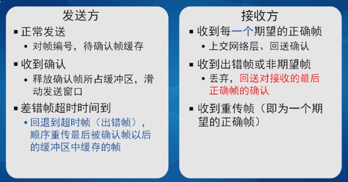
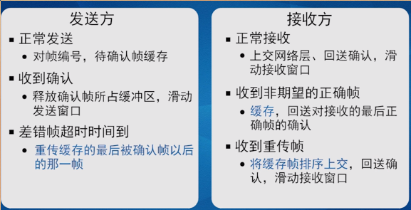
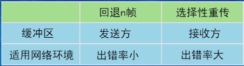
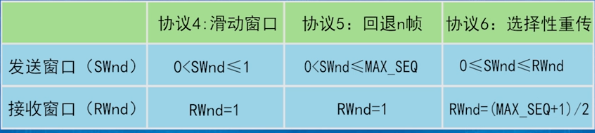

# 协议

## 1.三个单工协议
> 单工: 数据的传输在某个时刻是单向的

* 假设
> 物理层, 数据链路层和网络层各自是独立的处理进程  
> 机器A希望想B发送的是一个可靠的,面向连接的长数据流  
> 机器不会崩溃  
> 从网络层得到的数据是纯的数据
#### 无限制的单工协议(乌托邦协议)
> 数据单项传送  
> 收发双发网络层都处于就绪状态  
> 处理时间忽略不计  
> 缓存空间无限大  
> 完美通道: 信道不损坏,不丢帧  
* 发送方从网络层获得packet,封装成帧后传到物理层(封装)
* 接收方从物理层获得数据,解封装获得packet后传到网络层(解封装)
#### 单工停-等协议(半双工)
> 取消了接收方无限量接受的假设
* 接收方接受到数据后,若能处理就会向发送方发送一个哑帧,发送方接收到哑帧后就会继续发送下一帧数据
#### 有噪声信道的单工协议
> 取消了信道完美的假设

##### PAR技术(肯定确认重传)/ARQ 
* 采取校验帧机制
> 如果接收方接受到的帧通过了校验,接收方会向发送方发送一个确认,发送方在接收到确认后才会发送下一帧  
* 发送计时
> 为解决传输过程中帧丢失的问题,发送方在发送之后会启用一个定时器,如果在超过计时阶段仍未收到接收方的确认,就会重新发送之前的帧
* 为每个帧编独一无二的序号
> 为了避免接收方把重传的帧当做是新帧对待,发送方为每一帧添加序号让接收方区别是新帧还是重传帧  
> 序号还起到重新排序的作用

---
> 为了提高传输效率:
> * 全双工: 双向
> * 捎带确认: 接受方在发送确认帧时候,发送的帧捎带自己的帧数据给发送方  
    > 捎带确认帧发送的时候,启用一个捎带确认的计时器,如果超时了仍没有数据帧要发送,就单独发送确认帧
> * 批量发送数据: 在等待的时间发送数据帧

### 2.滑窗协议
> 两个窗口:发送窗口(已经发送未被确认) 和 接收窗口(期望接收)
* 滑动窗口协议
> 序号用1bit表示  
> 序列号seq和确认值ack"0" "1"交替  
> 确认帧丢失导致重传帧情况: 接收方不接收这一帧,但会重传确认帧  

> 忽略接收方处理到达帧时间 信道利用率=k/(k+bR)
>> b: 信道传输效率; k: 每一帧的大小; R: 来回时间  

> 提高信道利用率方法:批量发送; 此时的利用率为W*k/(k+bR)  
>> W: 滑动窗口最大长度

> 信道容量: 一个帧从发出到目的的期间,信道上能够容纳的帧数量,即带宽-延迟积:B*D   
>> 窗口值: W=2*BD+1(信道利用率100%)  
  1. 未发送数据时候,接收窗口准备接受数据(期待第n帧)
  2. 发送方发送第n帧, 发送窗口开启窗口
  3. 接收方接收到第n帧,该帧正是期待的第n帧,所以接收;并且窗口向下移动一个窗口同时回传第n个确认帧
  4. 发送方接收到第n个确认帧后,发送窗口向下移动窗口
---
---
>在批量连续发送帧的时候,如果其中一帧出错,处理方法如下
* 回退n帧
> 丢弃出错帧以及后续帧,并将出错帧和后续帧重传
  1. 定义序列号seq的取值范围和滑动窗口W
  2. 发送方发送至发送窗口满
  3. 接收窗口为1,对出错帧不确认(引发超时)
  4. 发送方超时重传,从未被确认的帧开始

工作原理:

>注意:回退n帧采用了累计确认,发送方一直保存着未被确认的帧

> 累计确认当七号帧被确认时,前面的帧同时也被确认  
>滑动窗口长度W的选择:发送窗口W<= MAX_SEQ(看bit所对应的十进制数)
* 选择重传 
> 丢弃错帧,只重传出错帧

> 对于接收方: 丢弃出错帧,后续接收到的帧如果是正确的就缓存  
> 对于发送方: 重新发送出错的帧

工作原理:
  
  

NAK(否定确认机制)
>　加快重传  
> 在接收方接收到错帧后,向发送方发送错误帧的编号  

* 比较

>接收滑动窗口W: W=(MAX_SEQ + 1) / 2, 为了保证新老窗口不重叠  
> 发送窗口通常小于接收窗口  

*协议窗口比较

