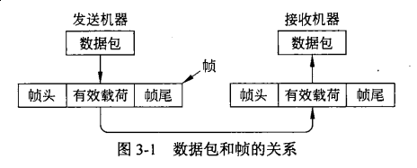
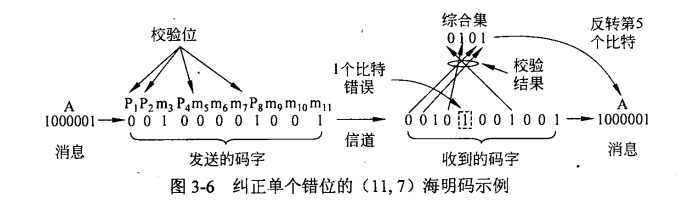

# 数据链路层
> 功能包括:
> 1. 向网络层提供一个定义良好的服务接口
> 2. 处理传输错误
> 3. 调节数据流,确保慢速的接收方不会被快速的发送方淹没
### 3.1.1 提供给网络层的服务
* 无确认的无连接服务  
> 指源机器向目标机器发送独立的帧,目标机器并不对这些帧进行确认;  
> 事先无序建立逻辑连接,并且不会试图去检测丢帧情况,更不会恢复丢失的帧  
> 适合错误率低的场合和实时通信
* 有确认的无连接服务
> 无连接,但发送的每一帧都单独确认  
> 如果一个帧没有在指定时间间隔内送达,发送方将再次发送该帧  
> 适合不可靠的信道,比如无线系统
* 有确认的有链接服务
> 建立连接,确保发的每一帧被接收到且只被接受一次,其中所有帧都按正确顺序接受  
> 传输经过三个不同阶段: 建立连接(变量和计数器初始化) ---> 传输帧 ---> 释放连接(释放变量)  
> 适合长距离且不可靠的链路(卫星通道或者长途电话电路)
### 3.1.2成帧
> 通常是将比特流拆分成多个离散的帧,为每个帧计算一个称为校验和的短令牌,并和帧放在一起传输. 当帧到目机器时候,重新计算该帧的校验和,如果结果和帧包含的不一致则传输过程中出错
#### 帧(frame)

#### 拆分比特流
> 便于发现帧的开始且使用的信道带宽少
* 方法
  * 字节计数法
  > 利用头部的一个字段标识该帧中的字符数  
  > 缺点:一旦头部字段出错,接收方就会失去同步,无法获得下一帧的正确起始位置;即便检验出错误,也无法纠错
  * 字节填充的标志字节法
  > 每个帧使用标志字节(flag byte)作为帧的起始和结束分界符,便于同步  
  > 缺点: 字节填充只使用比特数是8(字节)倍数的帧  
  > 为防止数据中出现标志字节和转义字节干扰分界,通常在**数据**中的标志字节和转义字节前添加转义字符
  
  * 比特填充的标志比特法
  > 同01111110或0x7E作为分隔符,数据中每连续五个1后添加一个0  
  > 相比于字节填充,传输效率更高
  * 物理层编码违禁法
  > 利用物理层中一些冗余比特作为分界符  
  > 容易找到帧的开始和结束且不需要填充数据
### 3.1.3 差错控制
> 确保所有帧最终都被传递到目标机器的网络层,并且保持正确顺序  
> 确保可靠传递的常用方法:接收方向发送发提供一些状况反馈信息(特殊的控制帧)  
> 防止等待超时(帧或确认被丢失):引入计时器  
> 为防止接收方多次接收同一帧,发送方给帧分配序号
#### 差错检测和纠正
* 错误模型
  1. 偶尔出现的极端热噪声快速淹没了信号,引起孤立的**单比特错误**  
  2. 突发性而不以单个形式出现的错误(源自物理过程)  
      > 相比于单比特错误,更难纠错
  3. 擦除信道的而产生的错误
      > 擦除信道: 物理层接收到一个模拟信号远离了1或0的预期值,因而宣布该比特被丢失  
      > 擦除信道更为容易纠错,然而我们往往不能从信道的擦除性质上受益
#### 纠错码
> 一个帧由m个数据位和r个冗余位组成(校验), 其中:  
>  * 在码块中，ｒ个校验位是作为与之相关的ｍ个数据位的函数计算获得的  
>  * 在系统码中,直接发送m个数位,然后发出r个校验位,不是在发送前对它们进行编码
>  * 在线性码中,r个校验位是作为m个数据位的线性函数(异或或模2加)被计算出来的  
---
> n位码字: n=m+r, 其中m位信息和r位校验位  
> 码率: 信息位数和总尾数之比(m/n)  
> 海明距离: 两个码字中不同位的个数; 可将两个码字作异或,结果所得1的位数即为海明距离  
> 为了可靠地**检测**d个错误,需要一个d+1的编码方案; 为了**纠正**d个错误,需要一个2d+1的编码方案;
1. 海明码
> 纠正单个错误所需要的校验位数r的下界:$(m+r+1)\leqslant 2^r$  
> 构码:
> 1. 校验位均为2的幂次方为(2,4,8,16,...); 其余的位填充数据位(左填充)
> 2. 每位数据位的位数可拆成校验位的位数之和(如15=1+2+4+8)  
>     >不妨假定: 若当前数据位的位数可以拆分成多个校验位位数之和,我们称作当前数据位包含这些校验位; 例如:第15位数据位可拆分成第1位,第2位,第4位,第8位之和,则15包含1,或15包含2,...
> 3. 每位校验位的值应符合: 与其他包含当前校验位位数的数据位的对应值所构成的二进制序列满足偶(奇)校验

> 校验:
> 1. 对于每一位校验位,将当前校验位逐步依次与其他包含当前校验位位数的数据位对应值进行异或
> 2. 对于每一位异或后所得的结果依次从右往左排列得到一个二进制序列,并将该二进制序列转为十进制数
> 3. 如果为其他值,则该值所对应的位数出错

> 只能校验一位

2. 二进制卷积码
3. 里德所罗门码
4. 低密度奇偶检验码

#### 检错码
1. 奇偶校验码
> 添加一位冗余位使得二进制序列1的个数为奇数(偶数)个  
> 只能用于检错,且只能检测奇数个错误  
> 延伸 --- 交错校验
2. 互联网校验和
> 进行模x加运算,并将所得结果作校验位追加到报文尾部
3. 循环冗余校验/多项式编码(CRC)
> 基本思想: 将位串看成是系数为0或1的多项式,一个k位帧看作是一个k-1次多项式的系数列表  
> 步骤:
> 1. 发送方和接收方预先预定一个生成多项式G(x),而发送方的原序列对应M(x)
> 2. 假设G(x)为r阶(G(x)最高次数),在帧的低位端加上r个0,对应多项式$x^rM(x)$
> 3. 利用模2除法,用对应与G(x)的位串去除对应于$X^rM(x)$的位串去除对应于
> 4. 利用模2减法,从对应于$x^rM(x)$的位串中减去余数,结果就是被传输的带校验和的帧,设为T(x)
> 校验:
> * 接收方用接受回来的[T(x)+E(x)], 并用该多项式除G(x)
> * 如果整除,则无误 
### 3.1.4 流量控制
> 防止发送速率与接收速率不匹配而导致接收方无法处理持续到来的帧,从而导致丢帧  
> 方法: **基于反馈的流量控制**和**基于速率的流量控制**

