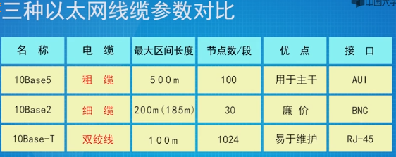
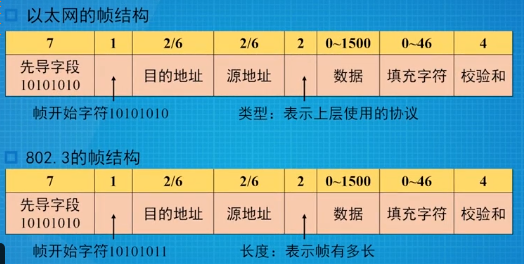
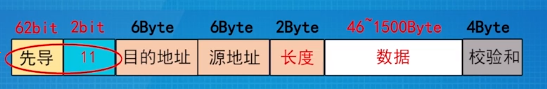

# 介质访问控制子层(MAC)
* 数据通信方式:
  * 单播
    > 一对一通信
  * 广播
    > 一对多通信,所有人都要收到 
  * 组播
    > 一对一个组的通信
### 广播
> 多路访问信道/广播信道: 广播中共享的信道
* 面临的问题
  > 在局域网内,可能会有多个站点同时请求占用同一根信道,需要解决在信道上确定下一个使用者(信道的分配)
### 介质访问控制
* 静态分配
  > 信道预分配给用户  
  > 由于不用用户的使用情况不同,可能会出现分配的信道却没使用的状况,这会造成信道浪费  
  * 适用范围
    > 适用于用户数量少且用户数量是固定的情况;  
    > 适用于通信量大且流量稳定的情况  
    > 不适用于突发性业务的情况
  * 技术
    > 复用技术FDM和TDM
    > * 会出现资源分配不合理,不能满足对资源占用的不同需求问题
    > * 资源浪费,效率低
    > * 高延迟:由于信道是平均分配,在没有被分配到信道的时候需要等待
* 动态分配
  > 信道无需提前分配, 信道是开放的, 是按需需求临时动态分配给用户
### 多路访问协议

| 名               | 义                                                                    | 补充                                                                                                        |
|------------------|-----------------------------------------------------------------------|-------------------------------------------------------------------------------------------------------------|
| 吞吐量S          | 在发送时间T(一个帧时)内发送成功的平均帧数                             | S=1:信道利用率100                                                                                           |
| 运载负载G        | 一个帧时T内所有通信站总共发送的帧平均值(包括原发和重发的帧)           | G=S:无冲突;G>S有冲突;G > 1:冲突频繁                                                                         |
| P0               | 一帧发送成功(未发生冲突)的概率/发送成功的帧在全部已发送的总数站的比例 | S = G x P0                                                                                                  |
| 冲突危险期       | 发送出去的帧容易跟别人发生冲突的时间                                  | T                                                                                                           |
| 在介质中传输速度 |                                                                       | 光速的65%,约200m/μs                                                                                         |
| 冲突窗口         | 一个工作站能够检测到冲突时间的最大值(两个最远工作站之间的传输时间)    | 2t+2T:两个帧时(帧来回的时间)和两个帧处理时间,如果在传播的过程还存在中继器,该时间还需要添加通过中继器的时间 |
* 随机访问协议
  > 用户或站点争用信道  
  > 可能会出现冲突
  * ALOHA协议
    * 纯ALOHA协议
      > 生成帧后即可发送  
      > 检测信道,判断是否发送成功, 如果冲突导致发送失败,则等待随机时间后再次发送  
      > 冲突危险期为2T
      
      > 生成k帧的概率:$Pr[k]=G^ke^{-G}/k!$

      > 信道利用率最大18.4%,此时G=0.5
    * 分隙(时隙)ALOHA协议
      > 将时间分成时隙(时间片),时隙对应帧时T  
      > 发送帧必须在时隙的起点,所以冲突只发生在时隙的起点
      > 冲突危险期为T  
      > 一旦某个站占用某个时隙并发送成功,则该时隙内不会出现冲突

      > 信道利用率最大为36.8,此时G=1;    
  * CSMA协议(载波侦听多路访问协议)
    > 先听后发
    > 缺点: 多个站同时发送帧时会冲突; 由于存在传播延迟的存在,这同样会导致冲突  
      * 非持续式
        > 侦听介质,如果空闲就发送帧;否则就等待随机时间再发送  
        > 缺点: 在等待时间内,介质上没有数据传送,这段时间是浪费的
      * 持续式
        > 侦听介质,如果空闲就发送帧;否则一直侦听直到空闲再发送帧;如果发生了冲突,就随机等待时间再发送
        > 缺点:如果两个站同时在侦听,一旦介质空闲,两个站同时发送帧就会发生冲突
        > * 1-持续
        > * p-持续
          > 侦听到介质空闲后,以P的概率发送,以1-P的概率延迟时间发送;如果介质忙,就会持续侦听直至空闲,重复前面操作;如果已经延迟一段时间了,接着会重复前面操作  
          > p越小,传输效率高
  * CSMA/CD协议(以太网)
    > 实际是一个1-持续的CSMA  
    > 先听后发,边听边发  
    > * 发送帧之前要侦听,如果介质空闲,则发送  
    > * 如果介质忙,持续侦听,一旦空闲立即发送  
    > * 在发送的同时也接收自己的信号,如果信号不一致,则发送冲突
    > * 如果站检测到了冲突,会立即停止帧的发送,同时会发送一个拥塞信号(Jam信号),告知其他站冲突发生
  * 冲突检测的要求
    > * 时隙宽度=最大冲突检测时间(冲突窗口), 保证在一个时隙内能够检测到最远距离的冲突
    > * 发送有效帧时间 >= 最大窗口,防止因为在发生冲突时,已完成短帧发送而无法知道实际上已经发送失败

* 受控访问协议
  > 站点明确分配信道  
  > 不会产生冲突

### 以太网

> 10Base和10Base2的物理拓扑和逻辑拓扑都是总线拓扑  
> 10Base-T的物理结构是星型拓扑,而逻辑拓扑为总线拓扑  
> 编码: 曼彻斯特编码
> 10Base-T优点:
>   * 安装成本大大降低
>   * 即插即用,组网灵活
>   * 星型结构,故障隔离
>   * 适合大批量制造
>   * 具有开放式标准的互操作能力
* 100M以太网(快速以太网)
> IEEE802.3u  
> 与10M的兼容:保留原有的帧格式,接口和过程规则  
> 电缆最大长度: 2500m->2500m  
> 编码方式:4B/5B编码
> 比特时间:100ns->10ns

* 1000M以太网(吉比特以太网/GE)
> IEEE802.3z  
> 向下兼容,但不兼容FDDI和ATM  
> 主要工作在全双工模式,如果在半双工模式,需要使用CSMA/CD技术,可能带来传输距离过短的问题;可使用帧串,帧扩充等方法解决
* 二进制指数后退算法
> 检测到冲突后需要等待的时间
> * 冲突检测到后,时间被分成离散的时隙  
> * 时隙的长度等于信号在介质上来回传输的时间(51.2μs)
> * 一般的,i次冲突后,等待的时间将从(0 ~ $2^i-1$)x52.2μs中随机选择  
> 10Base-T缺点:
>   * 多个用户共享一条10M的上行信道
* 经典以太网
* 交换式以太网
* IEEE以太网命名规则
  * 以10Base2为例子:
    > 10表示10M; Base代表基带传输,线路编码; 2代表支持的分段长度(传输距离),单位为百米; 如果后面跟着T,则代表铜质非屏蔽双绞线,而F代表光缆

* 帧格式
> 以太网帧与IEEE802.3帧的区别:

  * 帧结构(以IEEE802.3为例)

  

  > * 前导码由8byte组成,前七个字节均为10101010, 而最后一个字节为10101011; 表明帧的起始
  >     * 而以太帧的最后一个字节是10101010
  > * 第二个字段和第三个字段中的地址指的是物理地址(MAC地址) 
  >     * OUI:MAC前24位(3Byte),代表着机构或组
  >     * MAC地址的间隔符为-/: /. ,数值为16进制
  > * 第四个字段叫长度字段,表名帧长(不包括前导码,但包括帧头帧尾),最短64B,最长1518B
  >     * 最短64B是由于CSMA/CD要求最短帧的最短发送时间 >= 争用时隙2t
  >     * 在以太帧中长度字段变为类型字段,指明上层网络层的协议
  >     * 若该字段的大小 <= 1536(0x600)则为长度, 若 >1536则为类型
  > * 第五个字段为数据段,范围在46B-1500B 
  >     * 最小要46B是为了保证加上帧头帧尾的18B使得整个帧为64B
  > * 第六个字段为校验字段,4B
  >     * 以太帧的校验是CRC循环冗余校验,校验的范围包括目的/源地址,长度,LLC数据等字段

### 二层交换
* 网桥(交换机)
> 工作在数据链路层,通过检查MAC地址从而转发帧的决策,但不检测网络层
  * 操作
  > 对不同的帧格式重新封装  
  > 对于不同的数据传输速率,对速度快的一方数据进行缓存  
  > 对于不同最大帧长度进行切割  
  > 不同的安全策略以及服务质量  
  * 透明网桥
  > 硬件和软件不需要做任何变化  
  > 工作在混杂模式,接收所有的帧  
  > * 当帧到达网桥时,必须作出丢弃或是转发的决策(根据网桥内部的地址表中查找目的MAC地址)
  >     * 当MAC地址表中找不到地址时候,会采用广播(泛洪)的方式, 同时进行逆向学习(端口-地址)
  >         * 如果目的端口和源端口相同,则丢弃该帧
  >         * 如果目的端口和源端口不同,则转发该帧
  >         * 如果目的端口未知,则广播该帧
  >     * 在向表中加入记录的同时打上时戳, 如果是已有的记录就更新时戳
  >     * 周期性扫描表,删除超时的记录

### 生成树协议STP
* 网络中的冗余结构所带来的问题
  * 多帧传送
  * 广播风暴
  * MAC地址库不稳定
* 生成树算法(STP)
  * 每一个网络有一个根网桥,每一个网桥有一个根端口,每一个网段有一个指定端口
  * 不保证路径最优
  * 非指定端口不参与数据帧的转发,但会侦听树的工作报文,当树上的某些端口失效后,非指定端口重新启用,形成新的生成树

### 虚拟局域网(VLAN)
* 实现
  * 基于MAC地址
  * 基于三层协议
  * 基于端口
  > 在交换机内部存在VLAN成员表,可以区分成员是属于哪个VLAN

### 二层设备
* 网卡
  * 为主机提供介质访问  
  * MAC地址存在于网卡的ROM里  
  * 提供与上层通信  
  * 封装过程一部分  
  * 为访问共享介质提供访问策略
  * 创建信号和介质的借口
* 网桥
  * 过滤部分交通流量,减少冲突,改善网络性能
  * 分流LAN交通
* 交换机(多端口网桥)
  * 微分段
  * 交换模式
    * 存储转发
    > 对帧进行校验  
    > 耗时但出错率低

    * 直通交换()
    > 延迟小,出错率高

    * 无碎片(分片)交换机
    > 读取的字节满64字节后才开始转
