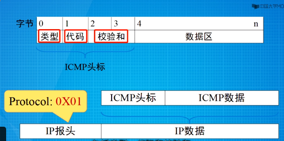

# 网络层
> 将源端数据包送达到目的端(信息封装,目的机识别,路由)

### 网络分类
* 数据报网络
> 提供无连接的服务
  * 抗毁性
* 虚电路网络
> 提供面向连接的服务

| 比较           | 数据报子网                                | 虚电路子网        |
|----------------|-------------------------------------------|-------------------|
| 电路           | 不需要建立                                | 必须建立          |
| 分组           | 包含完整的源地址的目的地址的信息,独立寻径 | 包含一个短标号    |
| 路由           | 不需要保留连接状态                        | 保留连接状态      |
| 路由器失效影响 | 基本没影响                                | 连接/数据传输中断 |
| 服务质量控制   | 很难实现                                  | 容易实现          |
### 被路由协议(IP协议)
> IP的任务:提供一种尽力而为的把数据从源端传输到接收方的方法
* IPv4地址
  > 表示收发数据的主机  
  > 32位二进制表示(约43亿个地址)  
  > 分成两部分:网络部分和主机部分    
  * 类别
    > 分成A,B,C,D,E五大类
    * A类
      > 第一个字节标识网络部分,后三个字节标识主机地址部分  
      > 第一个字节的最高位为0(范围为0-127)
    * B类
      > 前两个字节标识网络部分,后连个字节为标识主机地址部分  
      > 第一个字节的最高两位为10(范围为128-191)  
    * C类
      > 前三个字节为标识网络部分,后一个字节为表示主机地址部分  
      > 第一个字节最高三位为110(范围为192-223)
    * 保留的IP地址
      * 网络地址
        > 主机部分全部为0的地址  
        > 其中32位全为0的地址(0.0.0.0) 表示这个主机,这个网络;而在路由器里面指的是默认路由的目的地址
      * 广播地址
        > 主机部分全为1的地址  
        > 其中32位全为1的地址为泛洪广播地址,指代互联网上所有的主机,而现在指代当前子网的所有主机
      * 环回地址
        > 127.0.0.0  
        > 127.0.0.1代表本机
      * 169.254.0.0
        > 该开头的地址为非正常地址 
      * D类
        > 用作组播放  
        > 第一个字节的最高四位为1110  
        > 部分分配给一台特别的主机
      * E类
        > 用作科研  
        > 第一个字节的最高五位为11110  
        > 不会分配给一台特别的主机
* IPv4分组/报
  > 信息封装的格式
  * 组成
    * 头部
      * 不含选项的头部(12字段--20字节)
        1. 协议版本(4bit)
          > 表明IP协议的版本号
        2. 报头长度(4bit)
          > 表明IP的头部有多长(单位4Byte)  
          > 0101(5)-1111(15),即分组的头部20Byte-60Byte 
        3. 区分服务DS(8bit)
          > 基本不使用  
          > 分组的优先级,丢弃级 
        4. 数据报总长度(16位)
          > 整个分组的总长度(头部+数据)  
          > 单位:Byte 就
        5. 数据报(分组)表示号(16位)
          > 分组/包的序列号  
          > 发送方分配
        6. 标志位(3bit)+分段偏移量(13bit)
          > 对应第六个字段和第七个字段  
          > 标志位:分组是否分片/分段  
          > 偏移量单位8Byte
        7. 生存时间TTl(8bit)
          > 最早的单位为秒,而现在为跳数目(hop)  
          > 没经过一个路由器执行TTL-1,当TTL-1为0时候,分组丢弃,且在丢弃的同时会向源发送一个超时信息  
          > 防止分组在网络里无限循环
        8. 用户协议(8bit)
          > 指明上一层(传输层)采用了什么协议,也表明了数据部分搭载了哪种数据  
          > 常见取值17(UDP), 6(TCP)
        9. 报头校验和(16bit)
          > 互联网校验和
        10. 源IP地址和目的IP地址(32bit)
          > 对应于第11字段和12字段
      * 变长选项
        > 第13字段  
        > 允许主机支持不同的选项,比如安全,源路由,时戳等
      * 填充字段
        > 保证加上选项后的字节数为4Byte(32bit)的整数倍
    * 数据
* IPV6地址
  > 128bit(340涧--$10^{36}$)  
  * 表示
    > 冒分十六进制表示,每16位转为4位十六进制数表示  
    > 地址前缀长度用  /xx 的形式放在地址的后面,表示整个地址  
    > 一个IPv6里面最多一个双冒号
    * 简化
      1. 省略前导0
        > 每一个4位十六进制数的最高位为0则去掉
      2. 忽略全0
  * 分类
    * 单播地址
      * 链路本地地址
        > 只用在单一的链路上  
        > 不转发到其他链路
        * 前64位:FE80:0:0:0
        * 后64位:EUI-64位地址
          > EUI-64位地址:MAC生成的一个地址
          > * 生成:
          >   1. MAC地址化为二进制,并分为前24位和后24位
          >   2. 在上述二进制分开的位置添加15个1和一个0(11111111 11111110), 插入后的地址从高位数起的第七位转为1
          >   3. 将变换后的地址转为冒分表示法,即为IPv6的后64位
      * 可聚合全球单薄地址
        > 可用来标识主机的接口  
        * 高64位
          >网络位
          1. 固定三位001
            > 表示只用到了全球IPv6里面的1/8
          2. 顶级聚类地址TLA(13位)
            > 分给各大地区的网络中心
          3. RES(8bit)
          4. 次级聚类NLA(24)
          5. 站点级的聚类地址SLA(16bit)
        * 低64
          > 主机位

    * 组播地址
    * 任播地址
  * 特殊地址
    * ::/128
      > 未指定地址  
      > 短暂地址状态  
      > 在路由表中代表默认路由
    * ::1/128 
      > 环回地址
    * ff00::/8
      > 组播地址  
    * fe80::/10 (前缀为1111 1110 10)
      > 链路本地地址
    * fec0::/10(前缀为1111 1110 11)
      > 网点本地地址

  * 部分定义
  
  | 名       | 义                              | 补充               |
  |----------|---------------------------------|--------------------|
  | 局域网段 | 交换机一个接口下面的一条链路    |                    |
  | 链路     | 路由器接口下面若干局域网段      |                    |
  | 子网     | 机构/单位下的几条链路构成的网络 |                    |
  | 互联网   |                                 |                    |
  | 邻节点   | 一条链路上的两台主机            | 有时可以跨越交换机 |

* IPv6分组
  * 基本头部(8字段--40Byte)
    1. 协议版本(4bit)
    2. 业务等级(8bit)
      > 数据分组的服务类型  
      > 区分服务,表示优先级
    3. 流标签(20bit)
      > 表示分组的业务需求标记  
      > 提供服务质量
    4. 有效载荷长度(16bit)
      > 指明了搭载的数据长度
    5. 下一头(8bit)
      > 指明了紧跟的扩展头类型  
      > 最后一个扩展头或无扩展头,退化为"用户协议"  
    6. 跳数限制HL(8bit)
      > 类似TTL
    7. 源地址+目的地址(32Byte)
  * 扩展头部
    > 当有多个扩展头时候,需要按序排列
  * 数据
* IPv6过滤技术(IPv4向IPv6的过渡)
  * 双协议栈
    * 网络设备,服务器等必须支持双栈
    * 主机端:可仅支持其中一种
    * 主机端支持双栈,优先IPv6访问
  * 隧道
    * IPv4分组搭载IPv6分组或相反
  * 地址转换技术
  
### 路由
* 步骤
  1. 打开分组,提取目的IP地址 
  2. 把提取出来的IP地址与子网掩码进行与操作,确定目的网络,查找路由表
  3. 重新封装,并按表指示转发
    > TTl-1  
    > 置换源和目的的MAC地址  
    > 重新计算校验和  
    > 可能分片/分段
* 路由表
  > 组成: 目的网络/子网掩码 + 路径代价 +下一跳（网关)+转出接口
  * 路由信息
    * 直连路由
      > 学习感知  
    * 静态路由
      > 人工配置  
      * 缺省路由/默认路由
        > 默认路径:当找不到路径的时候就从这个端口转发  
        > 可以避免错误丢包和路由表的规模,减少路由器负担
      * 优缺点:

        | 优点                                  | 缺点                                 |
        |---------------------------------------|--------------------------------------|
        | 小型网络中容易实施                    | 仅适用于简单网络或特殊用途(静态路由) |
        | 安全,不会发送通告                     | 随着网络增大,配置复杂性显著增长      |
        | 总是通过同一路径到达同一目的网络,稳定 | 需要人工维护和更新                   |
        | 不需要CPU,RAM,带宽的开销              |                                      |
    * 动态路由(常见)
      > 由路由选择协议生成,更新和维护
      * 步骤:
        > 计算最优路径  
        > 装载最优路径到路由表  
        > 引导IP分组转发
      * 量度路径优劣(代价/开销/成本)
        * 路径长度
          > 从源到目的代价总和为路径长度(跳数)  
        * 带宽
          > 链路的最大传输能力以及网络流量
        * 延迟
          > 数据包从源到宿需要花费的传输时间
        * 可靠性
          > 误码率
        * 负载
          > 网络资源(路由器CPU)占用率
        * 通信代价
          > 占用通信线路的代价
      * 优缺点:

      | 优点                   | 缺点                         |
      |------------------------|------------------------------|
      | 适用于多个路由器的网络 | 实施更加复杂                 |
      | 通常不受网络规模限制   | 安全隐患                     |
      | 自动更新和维护路由信息 | 需要CPU,RAM,带宽等开销来维护 |

### 路由选择协议
> 寻找最优路径
* 距离矢量路由选择(DV)
  > 常被用于小型网络  
  > RIP-DV算法
  * 原理:
    1. 每个路由器(节点)维护两个向量,$D_i$和$S_i$
      > $D_i$表示该路由器到其他所有路由的距离  
      > $S_i$表示该路由器到其他所有路由最优路径上的下一条
    2. 在邻居路由器之间交换路由信息(矢量)
    3. 每个路由器(节点)根据收到的矢量信息,更新自己的路由表
  * 特点

  | 优点       | 缺点                                  |
  |------------|---------------------------------------|
  | 简单       | 交换信息大                            |
  | ------     | 路由信息传播慢,可能导致路径信息不一致 |
  | --------   | 收敛慢,度量计数到无穷,路径环          |
  | ---------- | 不适合大型网络                        |
  * 路由选择信息协议RIP
    > 典型DV路由选择协议  
    > 采用跳数作为量度,如果量度超过15则认为不可达  
    > 默认每30s交换一次路由表
    * 衰败原因
      * 目光低
* 链路状态路由选择(LS)
  * 发现邻居结点,了解网络地址
  * 设置到邻居的成本量度
    > 常见的量度:链路带宽(反比),延迟  
    > 发送ECHO分组,另一端应答,从而测量RTT
  * 构造一个分组LSP/LSA,包含上诉所有信息
    > * 发送方的标识
    > * 序列号
    > * 年龄
    > * 邻居列表
    > * 到邻居的成本/量度
  * 发送LSP/LSA分组给其他所有的路由器
    > 1. 每个LSP分组都包含一个序列号,递增
    > 2. 路由器记录下它所看到的所有(源路由器,序列号)对
    > 3. 当一个新的分组到达时,路由器根据记录判断:
    >     * 如果该分组是新的,就泛洪
    >     * 如果重复,丢弃
    >     * 如果过时,则拒绝
    * 序列号回转问题
      > 解决:32位序列号
    * 路由器崩溃/序列号损坏
      > 解决:年龄每秒钟减一,当年龄为0时,该分组抛弃
  * 基于完整的网络图,计算每个目标的最短路径 
  * 特点

  | 优点               | 缺点                     |
  |--------------------|--------------------------|
  | 路由器的认识一致   | 路由器需要较大的存储空间 |
  | LSP构造图完全一样  | 计算负担大               |
  | 收敛快             |                          |
  | 适合大型网络里使用 |                          |

  * 实例
    * OSPF(开放的最短路径优先)
      * 可在大型网络中使用
      * 无路由自环
      * 支持VLSM,CIDR等
      * 使用带宽作为度量值
      * 收敛速度快
      * 分区实现高效管理
      * 用到的分组:

      | OSPF数据包类型    | 描述                                           |
      |-------------------|------------------------------------------------|
      | Hello             | 与邻居建立和维护毗邻关系                       |
      | 数据库描述包(DD)  | 描述一个OSPF路由器的链路状态数据库信息         |
      | 链路状态请求(LSR) | 请求相邻路由器发送其链路状态数据库中的具体条目 |
      | 链路状态更新(LSU) | 向邻居路由器发送链路状态通告                   |
      | 链路状态确认      | 确认收到LSU                                    |

      * 步骤
        1. 建立路由器毗邻关系
        2. 选举DR和BDR
        3. 发现路由
        4. 选择最佳路由
        5. 维护路由信息
* CIDR(无类域间路由)
  * 分配地址方法:按需分配
  * 组成:
    * 三元组
      > IP地址,子网源码,输出线路
      > 如果有多个表项与目标网络匹配,则采用最长地址前缀匹配(选择网络位长的)
  * 优点:
    > 减少了路由表的规模
  * 超网
    > 聚合后的网络  
    > 前提条件:子网构成的地址空间是连续的;下一条是相同的  
    > 隔离了路由翻动

* NAT(网络地址翻译)
> 私有IP地址和公有IP地址之间的转换
  * 打破了IP地址的唯一性
  * 破坏了IP网络的无连接状态,NAT转换器维护这连接状态
  * 违背了最基本的协议分层原则
  * 传输层需要采用TCP或UDP
* PAT
> 多个私有IP地址和一个公有IP地址之间的转换

* ICMP(互联网控制协议)
> 向源报告差错; 测试网络  
> 不生成自己的差错报告
  * 封装
    
    
  * ping
  * tarceroute
  * pmtu

* ARP(地址解析协议)
> 运行在局域网中的协议,是将目标机的ip地址映射到MAC地址的协议

* 拥塞控制
  * 开环
    > 不考虑当前状态,提前考虑  
    > 难以准确估计需求
  * 闭环
    > 建立在反馈环路的基础上
    * 监视系统
    * 传递拥塞信号
    * 调整运行,控制拥塞
* 流量整形
> 调节数据传输的平均速率(和突发数据流)
  * 漏桶
  > 一个不稳定的流转为稳定的流
    * 每个主机连接到网络的接口中都有一个漏桶,即一个优先长度的内部队列
    * 当桶中有分组的时候,输出速率是恒定,当桶空的时候,输出速率是0
    * 当分组到达满的桶时候,分组被丢弃
    * 每个时钟仅允许一个分组或固定数量的分组发送出去
    * 缺点:
     > 不能大量的突发数据
  * 令牌桶
    * 当大量数据突发的时候,令牌桶允许加快输出速率到一定程度
    * 令牌桶拥有令牌,每T秒产生一个令牌的速度往桶中注入令牌
    *  一个分组要发送时候,必须从桶中取出和获取一个令牌
    * 令牌桶算法允许累积令牌,但最多可以累积n个令牌
    * 优点:
      * 令牌桶允许突发,但最大突发受限于令牌桶容量
      * 当桶满的时候,令牌桶算法丢掉的是令牌(不是分组)
    * 计算最大突发时间
      > B+RS=MS  
      > S:突发时间; B:令牌桶容量; R:令牌到达速率; M:最大输出速率

 
