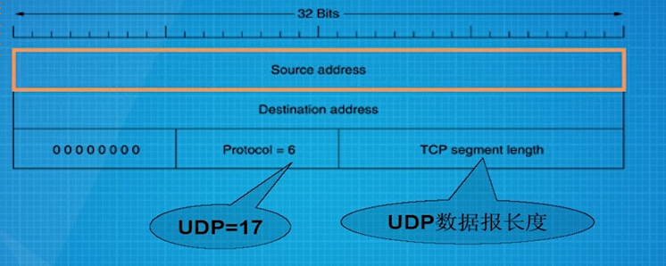
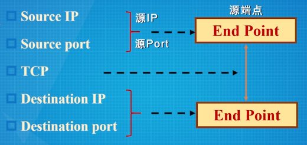
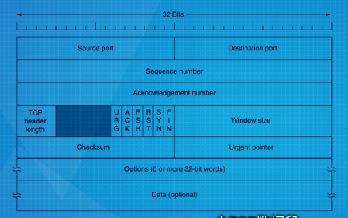
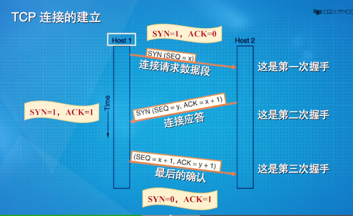
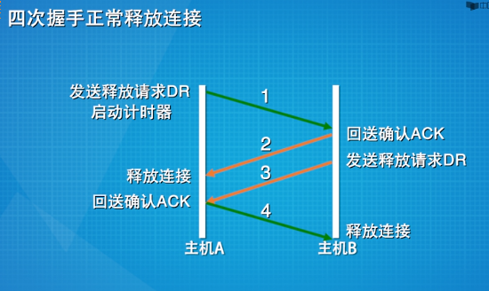

# 传输层
> 提供可靠的,高效的数据传输
* 传输实体
> 完成传输层任务的硬件或软件  
* 服务
  * 面向连接服务
  * 无连接的服务
* 范围
> * 网络层负责把数据从源机送达到目的机(host to host)
> * 传输层负责把数据送达到具体的应用进程(end to end)
* PDU
  * TPDU(segment)
## 用户数据报协议(UDP)
> * 无连接的传输层协议,不提供数据的可靠传输  
> * 可以使用源端口和目的端口 
> * 提供端点标识,端到端的数据传输
> * 不提供差错检测和可靠传输,但简洁高效

* UDP数据段

> 头部:4个字段(8Byte) + 数据  
> 第3个字段:长度字段表示包括头部和数据共有多少字节  
> 第4个字段:校验和(可选),如果不计算校验和,该字段设为0  
> 第1个字段和第2个字段: 源端口和目的端口,均为2Byte,范围在0~65535

* 端口
  * <=1023(知名端口)
  > 用于公共应用(保留全局分配,用于标准服务器),IANA分配  
  > 只用于特权用户,如Unix中的root
  * 1024~49151
  > 用户端口,注册端口
  * >=49152
  > 动态端口,私人端口
  * 自由端口
  > 本地分配,动态
* 校验和计算
  > * 将IP伪头部,UDP头部和数据按16bit一行排列,然后按列补码相加求和(异或),最后将结果取反码
  * IP伪头部

## 通信模型
* 套接字(Socket)
> 端点  
> 组成:(IP,port)

* 通信5元组

> 源端点,TCP/UDP,目的端点

## 传输控制协议TCP
> * 提供可靠的端到端的字节流  
> * 支持TCP的机器都有一个TCP实体,或者是用户进程或操作系统内核,用于管理TCP流和跟IP层的接口  
> * 对于发方:TCP实体接收本地进程的用户数据流,将其分割成不超过64KB的分片(实践中,通常分割成1460个Byte,以通过以太网传输)  
> * 对于收方:当包含TCP数据段的报文到达某台机器的时候,被提交给传输实体,传输实体将其重构除原始的字节流
> * TCP连接上的每个字节都有它自己独有的32位序列号  
> * 但收,发双方的TCP实体不是以字节,而是以数据段的形式交换数据

* 数据段
  * 长度的限制
  > * 必须适合IP分组的64415Byte(65535-20)的载荷限制  
  > * 每个TCP数据段必须适合下层网络的MTU

  * 头部(20Byte)
  > 不包含可选项  
  > 14字段
    * 1和2字段
    > 源端口和目的端口
    * 3字段
    > 序列号(4Byte)  
    > * 表示一个字节的编号
    > * 初始序列号(ISNs)
    >   * 随机产生的
    * 4字段
    > 确认号  
    > 期望接收的字节编号(4Byte)  
    > 采用了确认肯定机制(累计确认)
    * 5字段
    > TCP段头长度(4bit)  
    > 单位:4Byte  
    > 保留字段
    * 6,7,8,9,10,11字段
    > 控制比特(1bit)  
    > * URG
    >   * 当紧急指针使用的时候,URG被置为1,紧急指针是一个对于当前序列号的字节偏移量,指明紧急数据从哪里开始
    > * ACK
    >   * 为1时,表示确认号有效;为0,则无效
    > * PSH
    >   * 表示这是带有PUSH标志的数据,接收方收到这样的数据,应该立刻送到上层,不需要缓存它
    > * RST
    >   * 用来重置一个已经混乱的连接,如果在连接建立阶段,就直接拒绝连接
    > * SYN
    >   * 用在连接建立的过程
    > * FIN
    >   * 被用来释放连接,它表示发送方已经没有数据要传输了,但可以继续接受数据
    * 12字段 
    > 窗口尺寸(16bit)  
    > 高速对方可以发送的数据字节数,即从确认字节号开始,连续发送的字节总数  
    > 为了避免收方被大量涌入的数据所淹没,TCP实体进行流控
    * 13字段
    > 校验和  
    > 计算方法跟UDP数据段中校验和计算一样,不一样的是用户协议取6
    * 14字段
    > 紧急指针  
    > 指明紧急数据  
    > 如果有选项域,它提供了一种增加基本头没有包含的内容的方法
  * 变长的数据字段

* 三次握手

  1. 一方被动地等待一个进来的连接请求
  2. 另一方通过发送连接请求,设置一些参数
  3. 服务方回发确认应答
  4. 应答到达请求方,请求发最后确认,连接建立

* 连接释放

  > * 任何一方在么有数据要传送的时候,都可以发送一个FIN置位了的TCP数据段
  > * 当FIN被确认的时候,该方向的连接被关闭  
  > * 当双向连接都关闭了的时候,连接释放
  * 释放连接的决定权交给请求者独立裁定
  > * 一方发送连接释放请求DR,且期待对方ACK
  > * DR到达接收段,接收端回发ACK,并且也发送一个DR
  > * ACK到达发送方的时候,连接释放;同时,发送方回发ACK,当ACK到达接收段,反方向连接释放  
  > 为避免两军对垒问题,或者DR和ACK丢失问题,采用定时器
  > * 如果一方发送了FIN置位了的DR数据段出去,却在定时器超期之时都没有收到应答,释放连接 
  > * 另一方会注意到连接的对方不在,也会释放
  * 半开放连接
  > 一方连接,另一方已经释放连接
    * 杀死半开方连接的方式
    > 如果在一定的时间内,没有TPDUs到达的话,连接自动释放  
    > 如果这样,传输实体将在发送一个TPDU的时候必须启动定时器,定时器超期,将发送一个哑TPDU,以防被断掉

* 传输策略
> 肯定确认重传  
> 流控
  * 当窗口数为0时,发送者不能正常发送数据段
  > 但可以方Urgent数据  
  > 发送者还可以发送一个字节的数据段,以便让接受者再次发送期待接受的字节号(确认)和窗口数(避免死锁) 
  * 优化接收端
  > 接收端可以推迟500ms发送确认分组和窗口更新,和回显结果一起发送
  * 优化发送端
  > Nagle算法
  > * 当数据以一次一字节的速度到达传输实体的时候,只发送第一个字节,然后将后续的字节缓存起来,直到发出的字节得到确认
  > * 将缓存起来的字节在一个数据段中发出,再继续缓存,知道发出的数据得到确认
  * 傻瓜窗口综合症状
  > 当有大块数据被传递到发送端TCP实体,但接收端的交互式应用每次只读一个字节 
    * 解决方案
    > Clark方案
    > * 禁止发送一个窗口的数据,等待一段时间,等有一定数量空间后再发

* 拥塞控制
> 分组守恒原则:旧去新来
  * 拥塞检测
  > 所有的互联网TCP算法都假定超时是由拥塞引起的,并且通过监视超时的情况来判断是否出现问题
  * 拥塞控制
  > 当一个连接建立的时候,双方选择一个合适的窗口大小,接受方根据自己的缓冲区大小来指定窗口大小  
  > 如果发送者遵守这个窗口大小的限制,则接收段不会出现缓冲区溢出问题,但可能由于网络内部的拥塞发生问题
  * 拥塞两种情形
    * 接收方容量不够
    > 接受者窗口
    * 网络内部有瓶颈
    > 拥塞窗口
      * 决定拥塞窗口大小
      > 慢启动算法
      > * 当连接建立的时候,发送者用当前使用的最大数据段长度初始化拥塞窗口,然后发送一个最大的数据段
      > * 如果如果在定时器超期之前收到确认,则将拥塞窗口翻倍,然后发送数据直至到达上限(超时)
        * 阈值
        > 超时后,阈值降为窗口的一半,然后重新启动慢启动算法直到阈值,阈值后采用线性增长直至超时

* 定时器
  * 重传定时器
  * 持续定时器
  * 保活定时器
