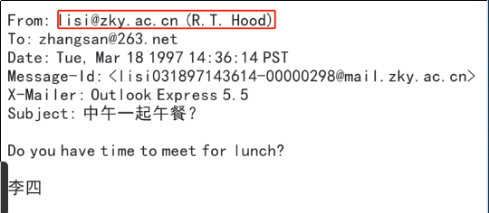
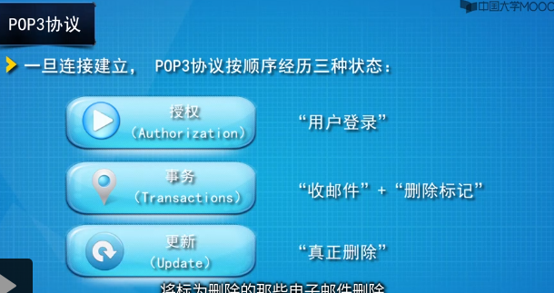
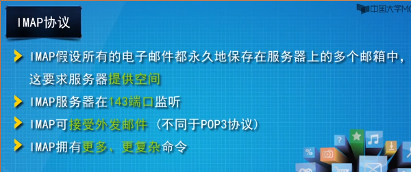

# 7.应用层
> 服务于模型外的用户  
> 分两类:
> * 直接网络应用程序
> * 简介网络应用程序:依靠重定向器实现网络功能

## DNS(域名系统)
> 整个互联网分为250个顶级域,分为两大类:通用和国家或地区域  
> 主要将域名映射到资源记录上
* 资源记录
  * 值
  > 类型所对应的值,可以是数字,也可以是ASCII字符串
  * 类型
  > 什么类型记录
  * 类别
  > IN
  * 生存期
  > 指示这条记录的稳定程度  
  > 极稳定的资源记录会被分配一个很大的值
  * 域名
  > 指出这条记录适用于哪个域  
  > 域名字段是匹配查询条件的主要关键字
* 域名
> 从它向上到根的路径,各个部分用圆点隔开  
> 大小写无关,各部分名字最多63个字符长,整个路径不超过255个字符

* 域名解析
> 1. 应用程序(主机)调用解析器(库),域名作为参数传递进去
> 2. 解析器分送UDP分组给本地DNS服务器,DNS服务器将查找得到的资源记录(IP)返回给解析器,解析器再返回结果给应用程序
> 3. 当本地DNS服务其接收到解析器的解析请求:
>   * 如果待查询的域名正好在服务器内,则返回(权威)资源记录,所谓权威,即指来自于管理该记录的权威机构
>   * 如果域名是远程的,且没有该信息缓存,服务器会向根域名服务器转发这个请求.如果根域服务器有结果,会返回查询的资源记录;如果没有,会告知本地服务器向哪个顶级域名服务器查询
>   * 缓存中的资源记录不具有权威性  

> DNS消息采用UDP数据段来承载,例外:
> * UDP报文超过512字节时候, 主机首次向DNS服务器请求后,服务器返回TC置位(TC=1),再次请求就要TCP连接,将数据分段发送
> * 主从域名服务器之间的数据更新同步
  * 递归查询(解析)
  > 主机向本地DNS服务器
  * 迭代查询(解析)
  > 本地DNS服务器向根域服务器

## 应用
* 电子邮件

  * 用户代理(UA)
    > 让用户能够阅读和发送邮件  
    * MIME
  * 邮件传输代理(MTA)
    > 将邮件从源端到目的端  
    * SMTP
      1. 源机和目的机建立TCP连接(25端口)
      2. 数据交换,传输邮件
        > 1. 客户机等待服务器首先开始通话,服务器回发自己的标识/准备状态
        > 2. 客户机声明发信人和收信人,如果服务器中有该收信人,则回发确认发送  
      3. 发送成功后释放TCP连接

  

  

* 万维网(www)
* web
  * 资源 
  * 统一资源定位器(URL)
  > 资源地址
  * 通信协议HTTP

* FTP
  > TCP连接  
  > 双向二进制文件或ASCII文件传输
  * 两个TCP连接
  > 一条用于控制连接,另一条数据连接
* TFTP
  > UDP连接

* 远程登录

