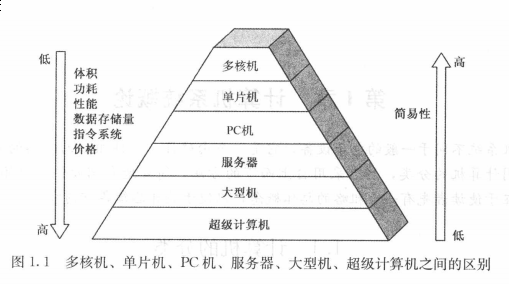
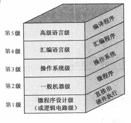

# 第一章
## 1.1 计算机的分类

## 1.2 计算机的发展简史
>1. 数据处理机（电子管计算机）—— 1946 ～ 1957
>2. 工业控制机（晶体管计算机）—— 1958 ～ 1964
>3. 小型计算机（中小规模集成电路计算机） —— 1965 ～ 1971
>4. 微型计算机（大规模）—— 1972 ～ 1990
>5. 单片机（巨大规模集成电路）——1991
## 1.2 计算机的性能指标
| 概念        | 含义                                                          |
|-------------|---------------------------------------------------------------|
| 吞吐量      | 表征一台计算机在某一时间间隔内能够处理的信息量                |
| 响应时间    | 表征从输入有效到系统产生效应之间的时间的时间度量              |
| 利用率      | 给定时间间隔内系统被实际使用的时间所占的比率                  |
| 处理机字长  | 指处理剂运算器中一次能够完成二进制数运算的位数                |
| 总线宽度    | 一般指CPU中运算器与存储器之间进行互连的内部总线二进制位数     |
| 存储器容量  | 存储器中所有存储单元的总数目                                  |
| 存储器带宽  | 单位时间内从存储器读出的二进制数信息量                        |
| 主频        | CPU的工作节拍受主时钟控制，主时钟的频率                       |
| 时钟周期    | 主频的倒数（1/f）                                             |
| CPU执行时间 | 表示CPU执行一般程序所占用的CPU时间（CPU周期数目xCPU时钟周期） |
| CPI         | 每条指令周期数                                                |
| MIPS        | 平均每秒执行多少百万条定点指令数                              |
| FLOPS       | 每秒执行浮点操作的次数                                        |
## 1.3 计算机的硬件
>* 运算器（ALU）
>* 存储器
>* I/O设备（输入/输出设备）
>* 控制器
### 1.34存储器
* 指令
> 指令是由操作码+地址码
* 冯诺依曼架构
> 存储程序—— 将程序（指令序列）存放到存储器中  
> 程序控制—— 控制器依据存储的程序来控制全机协调地完成计算任务
* 基本任务
> 按照计算程序所排的指令序列，先从存储器取出一条指令放进控制器，在经过对操作码的判别后，执行这条指令。接着取出第二条指令，再执行第二条指令，以此类推。  
其中：
>* 取指周期—— 取指令的一段时间
>* 执行周期—— 执行指令的一段时间
* 字
> 字长 —— 组成一个字的二进制位数  
> 数据字 —— 该字代表数据  
> 指令字 —— 该字代表指令  
* 流
> 指令流 —— 取指周期中从内存读出的信息流（一般）  
> 数据流 —— 执行器周期中从内存读出的信息流
## 1.4 计算机的软件
* 系统程序  
>用来简化程序设计，简化使用方法，提高计算机使用效率，发挥和扩大计算机的功能及用途  
> 包括四类：服务型程序、语言程序、操作系统、数据库管理系统
* 应用程序
> 利用计算机来解决某些问题而编制的程序
### 1.4.2 软件的演变
* 手编程序（目的程序） —— 直接用机器语言（机器指令代码）编写程序
* 汇编语言
* 算法语言
>程序执行过程：  
>1. 源程序 —— 算法语言编写的程序
>2. 源程序---> 汇编语言程序 —— 源程序经过编译器（编译程序及其运行系统）编译
>3. 汇编语言程序 ---> 机器语言的目标模块
>4. 链接器 —— 将上述的多个模块与库程序结合在一起解析所有应用
>5. 加载器 —— 将机器代码放入合适的内存位置以便处理器执行
## 1.5 计算机系统的层次结构

* 微程序设计（逻辑电路级别）
> 微指令(硬件级）
* 一般机器级（机器语言级别）
> 微程序解释机器指令系统（硬件级别）
* 操作系统级（混合级）
>有机器指令和广义指令组成  
>广义指令 —— 操作系统定义和解释的软件指令
* 汇编语言级 
> 非必要，主要由应用程序决定
* 高级语言级 

