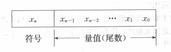
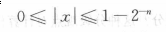
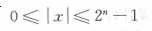
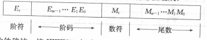
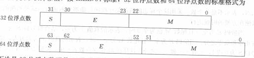
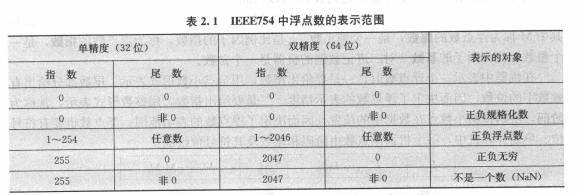

# 运算方法和运算器
## 2.1 数据和文字的表示方法

#### 2.1.1 定点数
> 定点格式——约定机器中所有数据的小数点位置固定不变，原理上，小数点位置固定在哪一位都可以，但通常将数据表示为纯小数或纯整数  
> 纯小数 —— 小数点位于第n位和n-1位之间，取值范围如右图：

> 纯整数 —— 小数点位于最低位的右边，取值范围如右图: 

> **注意：对于二进制数目来说，左边是高位，右边是低位**
#### 2.1.2浮点数

> 尾数（M）—— 用定点小数表示；尾数部分有效数字的位数决定了浮点数的精度

> 指数（又称阶码e）—— 整数形式表示；阶码指明了小数点在数据中的位置

> 标准格式（IEEE754标准）

> **注意：此处的E采用移码的方法表示正负指数，即E = e + 127（E = e + 1023）**

> 规格化表示 —— 为提高数据的表示精度，当尾数的值不为零时候，尾数域的最高位应为1

> 表示范围

> **注意：对于32位而言，指数的偏移值不选128，而选127是为了除去E 全0和全1的情况**

#### 2.1.3 十进制数与二进制浮点数互化

>* 十进制 ---> 二进制
>1. 十进制的整数部分和小数部分分别转为二进制表示
>2. 将上述二进制数的小数点移动，直至格式标准化
>3. 指数部分加上127(1023）
>4. 最后将符号位，阶码，尾数拼合后转化为16进制
>* 二进制 ---> 十进制
>* 将上述过程反过来操作即可

##### 补充
> 移码 —— 仅符号位与补码相反;对于8位二进制数来讲，实际上就是将补码加上128
---
#### 2.1.4 数据的表示方法

##### 十进制数串的表示方法
> 字符串形式 --- 一个字节存放一个十进制数位或符号  
> 压缩的十进制数串 --- 半个字节表示一个十进制数位或符号,符号放在最低数字位之后  
##### 数的机器码
| 机器码 | 表示                                   |
|--------|----------------------------------------|
| 原码   | +为1,-为0                              |
| 补码   | +和原码一样,-除符号位外各位取反,最后+1 |
| 反码   | +和原码一样,-除符号位外取反            |
| 移码   | 补码符号位取反                         |

#### 字符表示方法
> ASCII码:最高位为0,余下7位用来表示符号数据
##### 汉字的表示方法
* 汉字的输入编码
> * 数字编码 --- 常用国标区位码,用数字串代表一个汉字输入;将公布的汉字分区分位(类二维数组),汉字对应的索引即为区位码;**无重码且输入码与内部编码转换方便,但代码不便于记忆**
> * 拼音码 --- 以拼音为基础输入.**掌握拼音后无序训练和记忆,但输入的重码率高且要对同音字作选择**
> * 字形编码 --- 以汉字的形状编码(五笔),对汉字的笔画部件用字母和数字进行编码,然后按笔画顺序输入
* 汉字内码
> 用于汉字信息的存储,交换,检索等操作,一般用两个字节表示,当用一个字节表示时,最高位取"1"
* 汉字子模码
> 用点阵表示汉字字形,是汉字的输出形式;子模点阵只能用来构成汉字库,而不能用于机内存储(占用空间大)

#### 2.1.5 校验码
* 奇偶校验码
> 添加一位校验位,使得"1"的个数为奇数/偶数个;提供奇数个错误检测,无法检测偶数个错误,无法纠错  

