# 存储器
### 存储器的分类
#### 概念
| 名       | 义                   | 补充                 |
|----------|----------------------|----------------------|
| 存储位元 | 存储器中最小存储单元 | 通常为一位二进制代码 |
| 存储单元 | 若干个存储位元组成   |                      |
| 存储器   | 由许多存储单元组成   |                      |

#### 分类
* 存储介质
  > 存储器的存取速度取决于物理状态的改变速度
  * 半导体存储器
    
    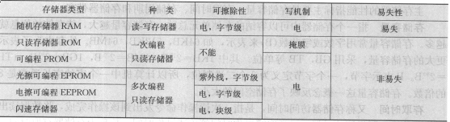
  * 磁表面存储器
* 存取方式
  * 随机存储器
    > 存储器中的任何存储单元的内容都被随机存取,且存取时间和存取单元的物理位置无关
  * 顺序存储器
    > 磁带  
    > 磁盘是半顺序存储器
* 存储内容内容可变性
  * 只读存储器(ROM)
    > 内容固定不变,只读不写
  * 随机读写存储器(RAM)
    > 即可读取又可写入
* 信息易失性
  > 断电后能否保存数据
  * 易失性存储器
  * 非易失性存储器
* 系统中的作用
  * 分类1
    * 内部存储器
      > 半导体存储器都是内部存储器
    * 外部存储器
  * 分类2
    * 主存储器
    * 高速缓冲存储器
    * 辅助存储器
    * 控制存储器
#### 主存储器的技术指标
| 名         | 义                       | 补充 |
|------------|--------------------------|------|
| 字存储单元 | 存放一个机器字的存储单元 |      |
| 字地址     | 字存储单元的单位地址     |      |

* 存储容量
  > 一个存储器中可以容纳的存储单元总数.
* 存取时间
  > 存储器访问时间,指代一次读操作命令发出到操作完成,并将数据读出到数据总线上所经历的时间  
  > 通常写操作等于读操作时间
* 存储周期
  > 连续启动两次读操作所需间隔的最小时间  
  > 通常存储周期略大于存取时间,单位为ns
* 存储器带宽
  > 单位时间里存储器所存取的信息量
#### SRAM存储器(静态读写存储器)
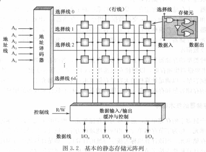
> * 用一个锁存器作为存储元
> * 三组信号线:地址线,数据线,控制线

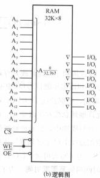
> * 控制信号中CS是片选信号,OE为读出使能信号

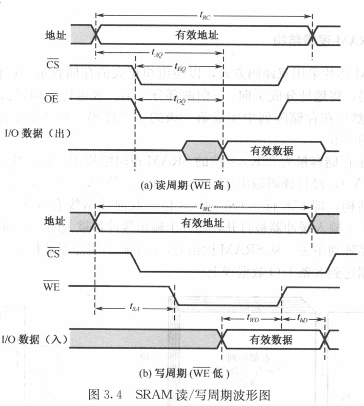
> 在读周期中,地址线先有效,片选信号CS和读出使能信号OE信号也必须有效,其中$t_{RC}$为读周期时间
> 在写周期中, 地址线先有效,接着CS有效,WE有效,其中$t_{WC}$为写周期.
#### DRAM存储器
* 存储元由一个MOS晶体管和电容器组成的记忆电路
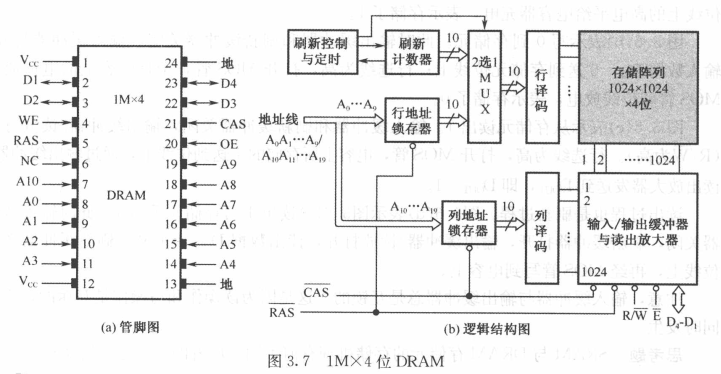
> * 相比与SRAM,增加了行地址锁存器和列地址锁存器.由于DRAM存储器容量很大,在不增加地址线宽度的情况下,采用分时传送地址码: 若地址总线宽度为10位,则先传十位地址码到行地址锁存器;然后再传后十位地址码到列地址锁存器,再将这两者合并.
> * 增加了刷新计时器和相应的控制电路.DRAM在读出后必须刷新,二维读写的存储元也定时刷新且按行刷新

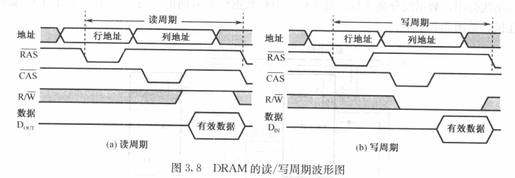
> 刷新:由于DRAM存储位元是基于电容器上的电荷量存储,这个电荷量随着时间温度而减少,必须定期刷新  
> 刷新方式:集中式刷新,分散式刷新和异步式刷新:
>   * 集中式刷新:所有航在每一个刷新周期中都被刷新;刷新周期分为两部分:前一部分正常的读/写操作,后一部分为集中刷新时间
>   * 分散式刷新: 每一行的刷新插入到正常的读/写周期之中

#### 高级DRAM结构
* FPM-DRAM
  > 快速页模式动态存储器  
  > 页: 一个唯一的行地址和该行中所有的列地址确定的若干存储单元组合  
  > 快速页模式允许在选定行中对每一个列地址进行连续快速的读操作或写操作
* CDRAM
  > 带高速缓冲存储器,在通常的DRAM中集成一个小容量的SRAM  
  > 猝发式读取  
  > 优点:
  >   1. SRAM读出期间可同时对DRAM阵列刷新
  >   2. 芯片内的输出输出路径与数据输入路径是分开的,允许在写操作完成同时来通同一行的读操作
* SDRAM 
  > 同步型动态存储器,SDRAM的操作与系统时钟同步

#### DRAM读/写校验
> 奇偶校验,只检错不纠错
#### ROM(只读存储器)
* 掩模ROM
  > 一旦做成芯片不能改变其中的存储内容
* PROM
  > 一次性编程
* EPROM
  > 光擦除可编程可读存储器
* EEPROM
  > 电擦除可编程只读存储器
* FLASH
#### 并行存储器
* 双端口存储器

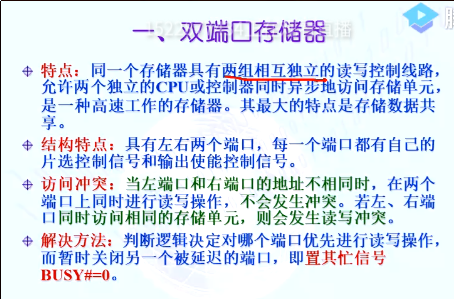
  > 同一个存储器具有两组相互独立的读写控制电路,事实上双端口存储器可以由DRAM构成  
  > 冲突解决: CE判断;地址判断
* 多模块交叉存储器

  
  > τ: 总线传送周期; m = T/τ : 交叉存取度
  
### Cache
> 为解决CPU和主存之间速度不匹配的问题
* 基本原理
  > CPU与cache之间的数据交换是以字为单位,为cache与主存之间的数据交换是以块为单位  
  > CPU读取字时,若cache中有,则从cache读取,若不在则从主存中读取,并且cache从内存读取该字的相关块(通常为16W)
  * cache命中率
  > 命中率h=$N_c / (N_m+N_c)$ ,其中$N_c$代表cache完成存取的总次数; $N_m$代表主存完成存取的总次数
  * cache/主存系统的平均访问时间
  > $t_a=ht_c+(1-h)t_m$
  * 访问效率
  > $e=t_a/t_c$
* 主存与cache的地址映射
  * 全相联映射方式

  > cache的数据块大小称为行,$L_i$表示,共有$m=2^r$行  
  > 主存的数据块大小称为块,$B_j$表示,共有$n=2^k$  
  > 行与块是等长的,等字 
    * 检索过程
    > 将访存地址的块号与行标记快速比较,若块号命中,则按字地址从Cache中读取一个字;若不命中,则从主存中读取  
  * 直接方式

  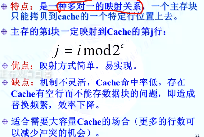

  * 组相联方式

  

#### cache替换算法
* 随机替换算法
  
* 先进先出算法
> 先装入cache的主存块,替换时先被淘汰
* 最近最少使用算法(LRU)
> 统计哪一个Cache行是最近时间内次数最少的行数,替换时就将它替换出去
* 最不经常使用算法(LFU)

#### 写操作
* 写回法
> 当CPU写Cache命中时候,只修改Cache内容,而不修改驻村,只当该行被替换时写回主存  
> 每行配置修改为M,有存储单元被修改,则M=1  

* 全写法
> 命中时,主存和Cache同时修改,不命中则写入主存

* 写一次法
> 当第一次写Cache命中才要同时写入主存,以后就与写回法一致

#### Cache多层次设计
* 容量
* 行大小
* 组织
* 指令和数据是否共用
* 层次

### 虚拟存储器
* 概念
> 指容量非常大的存储器的逻辑模型,借助于磁盘等辅存来扩大主存容量
| 名              | 义                               | 补充 |
|-----------------|----------------------------------|------|
| 虚地址/逻辑地址 | 虚拟存储器所提供的地址           |      |
| 虚拟地址空间    | 程序的逻辑地址空间               |      |
| 物理地址/实地址 | CPU访问主存的地址                |      |
| 物理地址空间    | 物理地址所包含的存储空间         |      |
| 再定位          | 程序进行虚地址到实地址转换的过程 |      |

  * 虚地址空间可远大于实地址空间
    > 提高存量为目的
  * 虚地址空间可远小于实地址空间
    > 多出现在多用户或多任务系统中,较小的虚存空间则可以缩短指令中地址字段的长度  
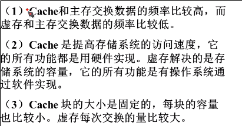
* 管理方式
  * 页式虚拟存储系统
    | 名               | 义                           | 补充 |
    |------------------|------------------------------|------|
    | 逻辑页           | 虚地址空间被分成等长大小的页 |      |
    | 物理页           | 主存空间被分为登场大小的页   |      |
    | 逻辑/物理页号    | 虚/实地址的高字段            |      |
    | 页内地址(偏移量) | 虚/实地址的低字段            |      |
    * 每个进程对应一个页表,页表中对应每一个虚存页面有一个表项(主存页面地址(物理页号)+判断有效位)
    * 地址变换:用虚页号找到相应的物理页号,并将物理页号作为实存地址高字段,最后与虚地址的页内偏移量拼接
    * 为避免对主存访问次数增多,将页表中最活跃的部分存放在高速存储器中(快表TLB,类似cache),而主存中完整页则称为慢表
    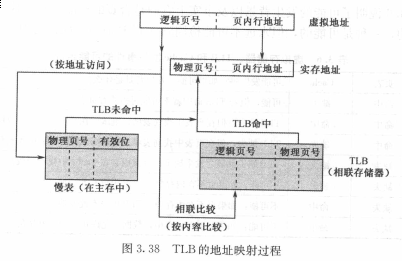
    * 内页表:虚地址到主存地址的变换表; 外页表:虚地址与辅存地址的变换
    * 优点: 便于构造页表,易于管理,且不存在外碎片
    * 缺点: 页长与程序的逻辑大小不相关,给换入换出处理,存储保存和存储共享等操作造成麻烦
  * 段式虚拟存储器
    
    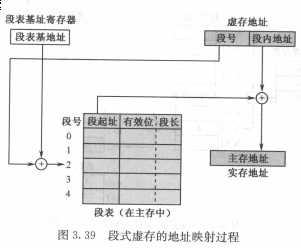
    > * 按段号访问段表中的表项
    > * 若有效位为1,则将虚拟地址的偏移量与段长比较,若大于则地址越界;否则将表项的段起址与偏移量相加
    > * 若有效位为0,则中断,并从辅存调入该页,并修改段表
    * 段是按照程序自然分界划分的长度可以动态改变的区域
    * 虚地址:段号+段内地址组成
    * 每个程序设置一个段表,其中每一个表项: 有效位+段起址(实存中的首地址)+段长
    * 优点: 段的逻辑独立性是其易于编译,管理,修改和保护,便与多道程序共享; 段长动态改变,有效利用主存空间
    * 缺点:主存分配比较麻烦; 容易在段间留下许多外碎片,存储空间利用率降低; 段长不一定是2的整数次幂,不能像简单分页那样拼接
  * 段页式虚拟存储器
    * 段式和页式的结合
    * 实存被分为页,每个程序则先按逻辑结构分段,每段再按照实存的页大小分页,程序按页进行调入和调出操作
* 替换算法
  * FIFO算法
  * LRU算法
  * LFU算法
