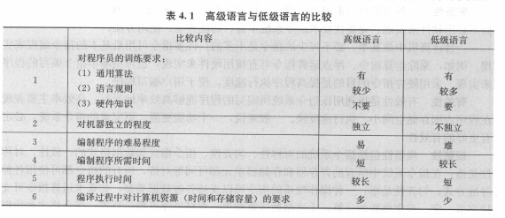
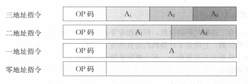
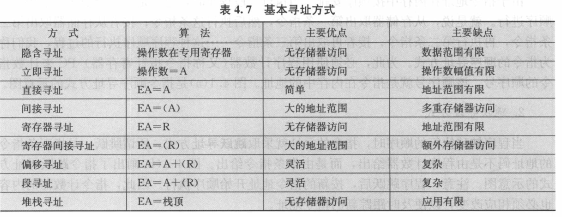
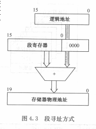

# 指令
### 指令系统发展
> 指令系统: 一台计算机中所有的机器指令的集合
* 分类:
  * 微指令
    > 微程序级的命令(硬件)
  * 机器指令
    > 介于微指令和宏指令之间
  * 宏指令
    > 若干机器指令组成的软件指令(软件)
* 指令系统分类:
  * 复杂指令系统(CISC)
  * 精简指令系统(RISC)
    * 选取使用频率最高的一些简单指令,指令数少
    * 指令长度固定,指令格式种类少,寻址方式种类少
    * 只有取数/存数指令访问存储器,其他指令都在寄存器之间进行
### 指令系统的性能要求
* 完备性
  > 指汇编语言编写各种程序时,指令系统直接提供的指令足够使用,而不必用软件来实现
* 有效性
  > 指该指令系统所编写的程序能够高效率的运行  
  > 表现在: 存储空间少, 执行速度快
* 规整性
  * 对称性:
    > 指令系统中所有的寄存器和存储单元可同等对待
  * 匀齐性:
    > 一种操作性质的指令可以支持各种数据类型
  * 指令格式和数据格式的一致性
    > 指令长度和数据长度有一定的关系,以方便处理和存取
* 兼容性
  > 系列机种之间具有相同的基本结构和共同的基本指令集.
### 高级语言与低级语言

## 指令格式
* 组成
  > 操作字段OP + 地址码字段 A
  > * 操作码表征指令的操作特定与功能
  > * 地址码指定参与操作的操作数的地址
* 地址码

  > * 零地址指令: 只有操作码而没有地址码
  > * 一地址指令: 制定一个操作数,另一个操作数地址是隐含的
  > * 二地址指令: 有两个地址码$A_1$和$A_2$,结果保存于$A_1$
  > * 三地址指令: 有三个地址码$A_1$, $A_2$和$A_3$, $A_3$为保存结果
  * 二地址指令格式中,按操作数的物理位置而言,分为三类:
    * 存储器-存储器(SS)型指令: 访问内存格式指令
    * 寄存器-寄存器(RR)型指令: 访问寄存器的指令格式
    * 寄存器-存储器(RS)型指令: 既要访问内存单元,又要访问寄存器
* 指令字长
  > 一个指令字中包含二进制代码的位数
  * 单字长指令
    > 指令字长度等于机器字长的指令
  * 半字长指令
    > 指令字长等于半个机器字长度的指令
  * 双字长指令
    > 字长等于两个机器字长度的指令
  * 等长指令字结构
    > 各种指令字长度相等
  * 变长指令字结构
    > 指令字长度因功能而异
* 指令助记符
  > 指令用缩写码(字母)表示

### 操作数类型
* 一般数据类型
  * 地址数据
  * 数值数据
  * 字符数据
  * 逻辑数据

### 指令和数据的寻址方式
* 指令寻址方式
  * 顺序寻址方式
    > 逐条指令顺序读取进行,用程序计数器(PC)来计数指令的顺序号(地址)
  * 跳跃寻址方式
    > 下条指令的地址码不是由程序计数器给出,而是由本条指令给出
* 操作数基本寻址方式
  > 形成操作数的有效地址的方法  
  > 有效地址: 真实地址  
  > 形式地址(偏移量): 指令中给出的地址

  
  * 隐含寻址
    > 不明显给出操作数地址,而是在指令中隐含着操作数的地址.
  * 立即寻址
    > 地址字段指出的不是操作数的地址,而是操作数本身  
    > 节省了访问内存时间
  * 直接寻址
    > 在指令格式的地址字段中直接指出操作数在内存的地址
  * 间接寻址
    > 指令地址字段中的形式地址A不是真正的地址,而是操作数地址的指示器  
    >   
    > 若寻址特征为I=0, 表示直接寻址; 若1, 则间接寻址
  * 寄存器寻址
    > 操作数不在内存中,而是在寄存器中
  * 寄存器间接寻址
    > 指令格式中的寄存器内容不是操作数,而是操作数地址,该地址指明的操作数在内存
  * 偏移寻址
    >  寻址方式是直接寻址和寄存器的间接寻址方式的结合  
    > 公式: EA = A + (R)
    * 相对寻址
      > EA = A + (PC)
    * 基址寻址
      > 被引用的专用寄存器含有一个存储器地址, 地址字段含有一个相对于该地址的偏移量, 寄存器的引用可以是显式的,夜歌可以隐式的
    * 变址寻址
      > 地址域引用一个主地址,被引用的专用寄存器含有对主地址的正偏移量
  * 段寻址方式
    
  * 堆栈寻址
### 典型指令
* 数据传送指令
* 算术运算指令
* 逻辑运算指令
* 程序控制指令(转移指令)
* 输入输出指令
* 字符串处理指令
* 特权指令

### CISC 和 RISC
* CISC
> 具有大量的指令和寻址方式  
> 8-2原则  
> 大多数程序只使用少量的指令就能运行
* RISC
> 数据通道中只包含最有用的指令
  * 优点:
  > 充分利用VLSI芯片面积  
  > 可以调高计算机运算速度  
  > 设计容易,可降低成本,提高可靠性
