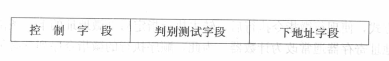
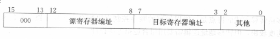
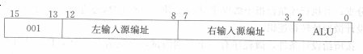
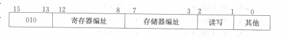
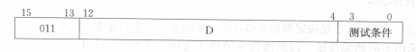
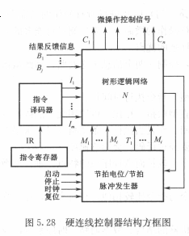
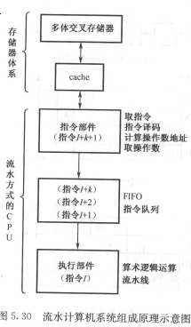
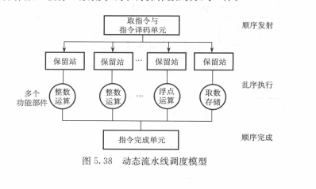

# CPU
## 功能和组成
* 四个基本功能
  * 指令控制
  > 程序的顺序控制(首要任务)
  * 操作控制
  > 管理并产生各种操作信号,且把各种操作信号送到相应的信号
  * 时间控制
  > 对各种操作实施时间上的定时
  * 数据加工
  > 对数据进行运算处理(根本任务)
* 基本组成
  * 控制器
    > 由程序计数器,指令寄存器,指令译码器,时序产生器和操作控制器组成
    * 功能
      1. 从指令cache取出一条指令,并指出下一条指令在指令cache中的位置
      2. 对指令进行译码或测试,并产生相应的操作控制信号,以便启动规定的动作
      3. 指挥并控制CPU,数据cache和I/O设备之间的数据流动方向
  * 运算器
    > 由算术逻辑单元(ALU),通用寄存器,数据缓冲寄存器DR和状态条件寄存器PSW组成.
    * 功能:
      1. 执行所有的算术运算
      2. 执行所有的逻辑运算,并进行逻辑测试
  * cache
* 主要寄存器
  * 数据缓冲寄存器DR 
  > 暂时存放ALU的运算结果/数据存储器读出的一个数据字/外部接口的一个数据字
    * 作用:
    > 作为ALU运算结果和通用寄存器之间信息传送中时间上的缓冲  
    > 补偿CPU和内存,外围设备之间在操作速度上的缓冲
  * 指令寄存器IR
  > 用来保存当前正在执行的一条指令  
  > 指令寄存器中操作字段的输出就是指令译码器的输入,操作码一经译码后,即可向操作控制器发出具体操作的特定信号.
  * 程序计数器/指针计数器(PC)
  > 保存下一条指令的地址  
  > 一般具有寄存器和计数两种功能
  * 数据地址寄存器(AR)
  > 保存当前CPU所访问的数据cache存储器(数存)单元的地址  
  > 信息的存入一般采用电位-脉冲方式,即电位输入端对应数据信息位置,脉冲输出端对应控制信号
  * 通用寄存器
  * 状态字寄存器(PSW)
  > 保存由算术指令和逻辑指令运算或测试结果建立的各种条件代码  
  > 标志位通常分别由1位触发器保存
* 操作控制器和时序产生器
  * 操作控制器
    * 硬布线控制器(时序逻辑型)
      > 时序信号往往采用主状态周期- 节拍电位- 节拍脉冲三级体制
    * 微程序控制器(存储逻辑性)
      > 采用节拍电位 - 节拍脉冲二级体制
## 指令周期

> 取出一条指令并执行这条指令的时间  
> 指令周期通常用若干个CPU周期(机器周期)表示,一般用内存中度与一个指令字的最短时间来规定
CPU周期  
> * 单周期: 一个CPU周期中完成取指和执行操作

* 控制方式
> 控制不同操作序列时序信号的方法
  * 同步控制
    > 在任何情况下,已定的指令在执行时所需的机器周期数和时钟周期数都是固定不变的
    1. 采用完全统一的机器周期周期执行不同的指令
    2. 采用不定长机器周期
      > 大多操作安排在一个较短的机器周期内完成,对某些时间紧张的操作采用延长机器周期的方法解决
    3. 中央控制与局部控制结合
      > 中央控制: 将大部分指令安排在固定的机器周期完成  
      > 局部控制: 对少数复杂指令采用另外的是时序定时
  * 异步控制
   > 每条指令,每个操作控制信号需要多少时间就占用多少时间  
   > "应答式"信号控制
  * 联合控制

## 微程序控制器
> 利用软件方法来设计硬件的技术  
> 仿照通常的结题程序的方法,把操作控制信号编成所谓的"微指令",存放在一个只读存储器中.
* 微命令
  > 控制部件通过控制线向执行部件发出的各种控制命令
* 微操作
  > 执行部件接受微命令后的所进行的操作
* 相容性的微操作
  > 指在同时或同一个CPU周期内可以并行执行的微操作
* 相斥性的微操作
  > 不能在同时或不能在同一个CPU周期内并行执行的微操作

* 微指令
  > 在机器一个CPU周期中,一组实现一定操作的微指令的组合
* 微程序
  > 多条微指令组成的序列

* 微程序控制器

  * 控制存储器
    > 用来存放实现全部指令系统的微程序  
    > 微指令周期: 读出一条微指令时间+执行该条微指令的时间
  * 微指令寄存器
    > 用来存放控制存储器读出的一条微指令信息  
    > 微地址寄存器:决定下一条微指令的地址  
    > 微命令寄存器: 保存一条微指令的操作控制字段和判断测试字段信息
  * 地址转移逻辑
    > 修改微地址寄存器的内容

* 微程序设计
> * 目标
>   * 有利于缩短微指令字长度
>   * 有利于减小控制存储器的容量
>   * 有利于提高微程序的执行速度
>   * 有利于对微指令的修改
>   * 有利于调高微程序设计的灵活性
  * 微命令编码
    * 直接表示法
      > 操作控制字段的每一位代表一个微命令  
      > 优点:简单直观,输出直接用于控制  
      > 缺点:微命令字比较长
    * 编码表示法
      > 把一组相斥性的微命令信号组成一个小组(字段),通过小组(字段)译码器对每一个微命令信号进行译码  
      > 优点:可使微指令字大大缩短  
      > 缺点:由于译码器的存在,微程序的执行速度稍微减慢
    * 混合表示法
  * 微地址的形成方法
    * 计数器方式
      > 与PC产生机器指令地址的方法类似  
      > 特点:微指令的顺序控制字段较短,微地址产生的机构简单  
      > 缺点:多路并行转移功能较弱,速度较慢,灵活性较差
    * 多路转移方式
      > 根据操作码OP产生多路微程序分支而形成多个微地址
      >   * 若不产生分支,后继微地址直接由微指令的顺序控制字段给出
      >   * 若出现分支,根据顺序控制字段的"判别测试"标志和"状态条件"信息来选择微地址  
      
      > 优点: 能以较短的顺序控制字段配合,实现多路并行转移,灵活性号,速度较快
  * 微指令格式
    * 水平型微指令
      > 一次能定义并执行多个并行操作微命令的微指令

      
      * 全水平型(不译法)微指令
      * 字段译码法水平微指令
      * 直接和译码向混合水平型微指令
    * 垂直型微指令
      > 微指令中设置微操作码字段,采用微操作码编译法,有微操作码规定微指令的功能
      * 寄存器-寄存器传送型微指令  
        
        > 把源寄存器数据送到目标寄存器
      * 运算控制型微指令  
        
        > 选择ALU的左,右两输入源信息
      * 访问主存微指令   
        
        > 将主存中的一个单元的信息送入寄存器或者寄存器的数据送往主存
      * 条件转移微指令  
        
        > 根据测试对象的状态决定是转移到D所指定的微地址单元,还是顺序执行下一条微指令
    * 两者比较
      * 水平型微指令并行操作能力强,效率高,灵活性强,垂直型微指令则较弱
      * 水平型微指令执行一条指令的时间短,垂直型微指令执行时间长
      * 水平型指令解释指令的微程序,有微指令字较长而微程序段的特点,而垂直型则相反
      * 水平型微指令用户难以掌握,而垂直型微指令与指令比较,相对容易掌握
## 硬连线控制器
  
## 流水CPU
* 并行性
  * 时间并行
    > 时间重叠,容纳更多个处理过程在时间上相互错开,轮流重叠地使用同一套硬件设备的各个部分
  * 空间并行
  * 时间+空间并行
* 流水CPU结构  
  
  * 指令部件
  * 指令队列
  * 执行部件
* 流水线分类
  * 指令流水线
    > 指令步骤的并行  
    > 标量流水计算机:只有一条指令流水线  
    > 超标量流水计算机:具有两条以上指令流水线
  * 算术流水线
    > 运算操作步骤的并行
  * 处理机流水线(宏流水线)
    > 程序步骤的的并行
* 流水线中的问题
  * 资源相关
    > 多条指令进入流水线后在同一机器时钟周期内争用同一个功能部件所发生的冲突
  * 数据相关
    > 在一个程序中,如果必须等前一条指令执行完毕后,才能执行后一条指令,那么这两条指令就是数据相关
  * 控制相关
    > 由转移指令引起的,当执行转移指令时,转移条件产生的结果可能为下调至零,也可能为新的木雕地址取指令,使流水线发生断流
    * 延迟转移法
      > 由编译程序重排序列来实现.先执行再转移
    * 转移预测法
      > 硬件方法实现,依据指令过去的行为来预测将来的行为
## RISC CPU
  * 有限的简单指令集
  * CPU配置大量的通用寄存器
  * 强调对指令流水线的优化
* 动态流水线调度
> 对指令进行重新排序以避免处理器阻塞的硬件支持

  
