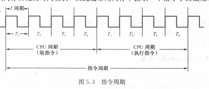
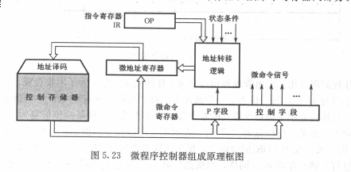

# CPU
## 功能和组成
* 四个基本功能
  * 指令控制
  > 程序的顺序控制(首要任务)
  * 操作控制
  > 管理并产生各种操作信号,且把各种操作信号送到相应的信号
  * 时间控制
  > 对各种操作实施时间上的定时
  * 数据加工
  > 对数据进行运算处理(根本任务)
* 基本组成
  * 控制器
    > 由程序计数器,指令寄存器,指令译码器,时序产生器和操作控制器组成
    * 功能
      1. 从指令cache取出一条指令,并指出下一条指令在指令cache中的位置
      2. 对指令进行译码或测试,并产生相应的操作控制信号,以便启动规定的动作
      3. 指挥并控制CPU,数据cache和I/O设备之间的数据流动方向
  * 运算器
    > 由算术逻辑单元(ALU),通用寄存器,数据缓冲寄存器DR和状态条件寄存器PSW组成.
    * 功能:
      1. 执行所有的算术运算
      2. 执行所有的逻辑运算,并进行逻辑测试
  * cache
* 主要寄存器
  * 数据缓冲寄存器DR 
  > 暂时存放ALU的运算结果/数据存储器读出的一个数据字/外部接口的一个数据字
    * 作用:
    > 作为ALU运算结果和通用寄存器之间信息传送中时间上的缓冲  
    > 补偿CPU和内存,外围设备之间在操作速度上的缓冲
  * 指令寄存器IR
  > 用来保存当前正在执行的一条指令  
  > 指令寄存器中操作字段的输出就是指令译码器的输入,操作码一经译码后,即可向操作控制器发出具体操作的特定信号.
  * 程序计数器/指针计数器(PC)
  > 保存下一条指令的地址  
  > 一般具有寄存器和计数两种功能
  * 数据地址寄存器(AR)
  > 保存当前CPU所访问的数据cache存储器(数存)单元的地址  
  > 信息的存入一般采用电位-脉冲方式,即电位输入端对应数据信息位置,脉冲输出端对应控制信号
  * 通用寄存器
  * 状态字寄存器(PSW)
  > 保存由算术指令和逻辑指令运算或测试结果建立的各种条件代码  
  > 标志位通常分别由1位触发器保存
* 操作控制器和时序产生器
  * 操作控制器
    * 硬布线控制器(时序逻辑型)
      > 时序信号往往采用主状态周期- 节拍电位- 节拍脉冲三级体制
    * 微程序控制器(存储逻辑性)
      > 采用节拍电位 - 节拍脉冲二级体制
## 指令周期

> 取出一条指令并执行这条指令的时间  
> 指令周期通常用若干个CPU周期(机器周期)表示,一般用内存中度与一个指令字的最短时间来规定
CPU周期  
> * 单周期: 一个CPU周期中完成取指和执行操作

* 控制方式
> 控制不同操作序列时序信号的方法
  * 同步控制
    > 在任何情况下,已定的指令在执行时所需的机器周期数和时钟周期数都是固定不变的
    1. 采用完全统一的机器周期周期执行不同的指令
    2. 采用不定长机器周期
      > 大多操作安排在一个较短的机器周期内完成,对某些时间紧张的操作采用延长机器周期的方法解决
    3. 中央控制与局部控制结合
      > 中央控制: 将大部分指令安排在固定的机器周期完成  
      > 局部控制: 对少数复杂指令采用另外的是时序定时
  * 异步控制
   > 每条指令,每个操作控制信号需要多少时间就占用多少时间  
   > "应答式"信号控制
  * 联合控制

## 微程序控制器
> 利用软件方法来设计硬件的技术  
> 仿照通常的结题程序的方法,把操作控制信号编成所谓的"微指令",存放在一个只读存储器中.
* 微命令
  > 控制部件通过控制线向执行部件发出的各种控制命令
* 微操作
  > 执行部件接受微命令后的所进行的操作
* 相容性的微操作
  > 指在同时或同一个CPU周期内可以并行执行的微操作
* 相斥性的微操作
  > 不能在同时或不能在同一个CPU周期内并行执行的微操作

* 微指令
  > 在机器一个CPU周期中,一组实现一定操作的微指令的组合
* 微程序
  > 多条微指令组成的序列

* 微程序控制器

  * 控制存储器
    > 用来存放实现全部指令系统的微程序  
    > 微指令周期: 读出一条微指令时间+执行该条微指令的时间
  * 微指令寄存器
    > 用来存放控制存储器读出的一条微指令信息  
    > 微地址寄存器:决定下一条微指令的地址  
    > 微命令寄存器: 保存一条微指令的操作控制字段和判断测试字段信息
  * 地址转移逻辑
    > 修改微地址寄存器的内容

* 微程序设计
  
