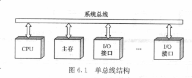
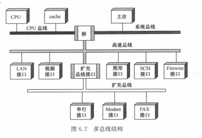
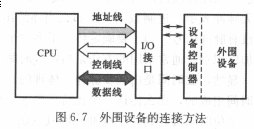
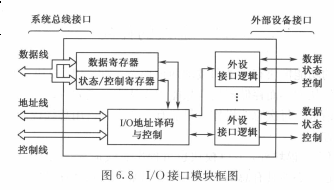
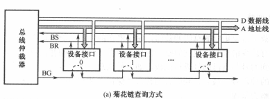
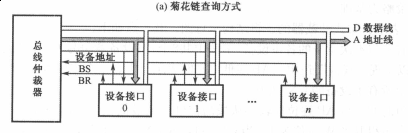
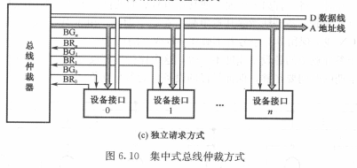

# 总线系统
> 总线: 是计算机系统的互联结构,是多个系统功能部件之间进行数据传送的公共通路  
> 借助总线连接,计算机在各系统部件之间实现地址,数据和控制信息的交换
## 概念
* 总线分类
  * 内部总线
  > CPU内部连接各寄存器及运算部件之间的总线
  * 系统总线
  > CPU同计算机系统的其他告诉功能部件
  * I/O总线
  > 中,低速I/O设备之间互相连接的总线
* 特性
  * 物理特性
  > 总线的物理连接方式
  * 功能特性
  > 总线中每一根线的功能
  * 电气特性
  > 一根线上信号的传递方向及有效电平范围
  * 时间特性
  > 每根线在什么时间有效
* 连接方式
  * 单总线结构
  
  > 使用单一的系统总线来连接CPU,主存和I/O设备
  * 多总线结构
  
  > 桥:将CPU总线,系统总线,高速总线彼此相连
* 内部结构
  * 早期内部结构
  > * CPU是总线上唯一的主控者,不能满足多CPU环境的要求
  > * 总线信号是CPU引脚信号的延伸,故总线结构紧密与CPU相关,通用性较差
  * 当代总线结构
  
    * 数据传送总线
    > 由地址线,数据线,控制线组成
    * 仲裁总线
    > 包括总线请求线和总线授权线
    * 中断和同步总线
    > 用于处理带优先级的中断操作
    * 公用线
    > 包括时钟信号线,电源线,地线,系统复位线以及加电或断电的时序信号线
## 总线接口
* 信息传送方式
  * 串行传送
  > 单传输线,逐位传送,采用脉冲传送  
  > * 拆卸: 传送的数据在发送部件进行并-串变换
  > * 装配: 接收部件进行串-并变换
  * 并行传送
  > 多条传输线,采用电位传送
  * 分时传送
    * 总线复用方式
    > 某个传输线上既传送地址信息,有传送信息
    * 共享总线的部件分时使用总线
* 接口概念
> I/O功能模块(I/O接口,适配器): CPU、主存和外围设备之间通过系统总线进行连接的标准化逻辑不见  

  * 功能
    * 控制
    > 控制外围设备动作
    * 缓冲
    > 补偿不同设备在速度上的差异
    * 状态
    > 监视外围设备的工作状态并保存状态信息
    * 转换
    > 数据转换
    * 整理
    > 完成一些特别的功能,如修改字计数器或当前内存地址寄存器
    * 程序中断

## 总线的仲裁
* 集中式仲裁
> 每个功能模块有两条线连到总线控制器,一条为总线请求信号线(BR),另一条为总线授权信号线(BG)
  * 链式查询方式
  > 减少总线授权线数量,采用菊花链查询方式  

  
  > 离总线仲裁器越近优先级越高
  * 优点
  > 很少几根线就能按一定优先次序实现仲裁,且容易扩充设备  
  * 缺点
  > 对询问链的电路故障很敏感,且优先级固定会导致优先级较低的设备可能长期不能使用总线
  * 计数器定时查询方式

  
  > 根据计数器的值决定总线使用权
  * 缺点
  > 如果从0来时计数,优先级固定;如果从中止点开始计数,每个设备的优先级相等

  * 独立请求方式

  

  > 仲裁器有一个排队电路,按一定优先次序决定响应哪个设备请求
  * 优点
    > 响应快,优先次序的控制灵活

* 分布式仲裁
> 不需要总线仲裁器,每个潜在的主方功能模块都有自己的仲裁号和仲裁器,当有总线请求时,把总裁号发到共享的总裁总线上,每个仲裁器的仲裁号都与线上的仲裁号比较,号大可留存在线上

## 总线的定时和数据传送模式
> 信息传送过程:请求总线-> 总线仲裁-> 寻址-> 信息传送 -> 状态返回(错误报告)
* 总线的定时
  * 同步定时
  * 异步定时
