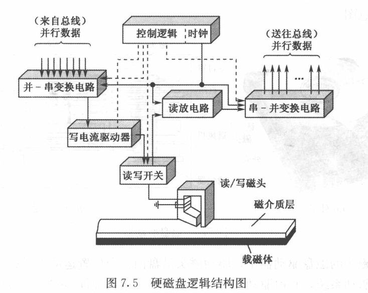

# 外存与I/O设备
## 概述
* 外设
  * 组成
    * 存储介质
    * 驱动装置
    * 控制电路
  * 分类
    * 输入设备
    * 输出设备
    * 外存设备
    * 数据通信设备
    * 过程控制设备
## 磁盘存储设备
* 外存储器(磁表面存储设备/磁表面存储)
  * 优点
  > 1. 量大价低
  > 2. 记录介质可以重复使用
  > 3. 记录信息可以长期保存而不丢失,可脱机存档
  > 4.非破坏性读出,读出时不需要再生信息
  * 缺点
  > 存取速度慢,机械结构复杂,对工作环境要求较高
* 磁盘组成和分类
  
  
  * 存取功能组成
    * 磁记录介质
    * 磁盘控制器
      * 控制逻辑与时序
      * 数据并-串交换电路和数据串-并交换电路
    * 磁盘驱动器
      * 写入电路与读出电路
      * 读写转换开关
      * 读写磁头
      * ...
  * 分类
    * 可移动磁头固定盘片的磁盘机
    > 一片或一组盘片固定在主轴上,盘片不可更换,盘片每面只要一个磁头,存取数据时磁头沿盘面径向移动
    * 固定磁头磁盘机
    > 磁头位置固定,磁盘的每一个磁道对应一个磁头,盘片不可更换.优点:存取速度快;缺点:结构复杂
    * 可移动磁头可换盘片的磁盘机
    > 盘片可以更换,磁头沿径向移动,优点:盘片可脱机保存
    * 温彻斯特磁盘机(温盘)
    > 优点:防尘性能号,可靠性高,对使用环境要求不高
* 磁盘上信息的分布
  > * 每个盘片上下两面都记录信息(记录面),上面的一系列同心圆称为磁道,由圆心外到圆心内开始编号,每个磁道分为若干个扇区
  > * 磁道上,信息按区存放,每个区中存放一定数量的字或字节
* 技术指标
  * 存储密度
    * 道密度
    > 沿磁盘半径方向单位长度上的磁道数
    * 位密度
    > 磁道单位长度上能记录的二进制代码位数
    * 面密度
    > 位密度和道密度的乘积
  * 存储容量
    * 格式化容量
    > 按照某种特定记录格式所能存储的信息总量,用户可以真正使用的容量
    * 非格式化容量
    >磁记录表面可以利用的磁化单元总数
  * 平均存取时间
  > 从发出读写指令后，磁头从某一其实位置移动到新的记录位置，到开始从盘片表面读出或写入信息加上传送所需要的时间
    * 找道时间
    > 磁头定位至所要求的磁道上所需的时间
    * 等待时间
    > 找道完成后至磁道上需要访问信息到达磁头下的时间
  * 数据传输率
  > 单位时间内向主机传送数据的字节数

# 磁盘存储设备的技术发展
* 磁盘cache
* 磁盘阵列RAID
  * RAID0
  > 低成本,未采用奇偶校验等冗余技术,用于高速数据传输和高速I/O请求  
  > 数据分布在阵列所有的磁盘上,如果请求的两个或多个数据在不同的磁盘上,可并行发出
