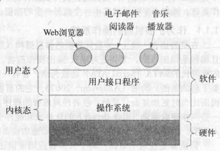

# 引论
## 概念
* shell: 基于文本的用户与操作系统交互的程序  
* 用户图形界面(GUI):基于图标的用户与操作系统交互的程序
* 计算机有两种运行模式: 内核态(管态,核心态)和用户态

  > * 软件的最基础的部分---操作系统运行在内核态,操作系统具有对所有硬件的完全访问权,可以执行机器能够运行的任何指令.  
  > * 软件的区域部分运行在用户态,用户态只是用了机器指令中的一个子集,此时是禁止影响机器的控制或可进行I/O操作指令
  > * shell或GUI处于用户态程序中最低层次  
  > * 用户程序必须使用系统调用(system call)以陷入内核并调用操作系统; trap指令可以把用户态切换成内核态,并启用操作系统.
  * 单道批处理系统
  * 多道批处理系统
  * 分时系统
    * 哑终端
    * 虚拟终端
    * 远程终端
    * 图形终端
    * 伪终端
## 操作系统概念
| 名       | 义                       | 补充                                         |
|----------|--------------------------|----------------------------------------------|
| 进程     | 本质上正在执行的一个程序 | 基本上是容纳运行一个程序所需要所有信息的容器 |
| 地址空间 | 一段存储位置的列表       |                                              |
| 进程表   |                          | 容纳一个进程有关的所有信息                   |

##系统调用

