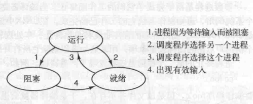
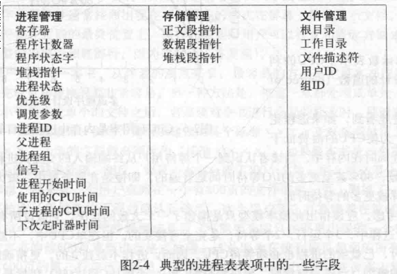
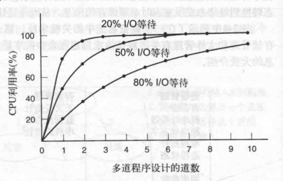
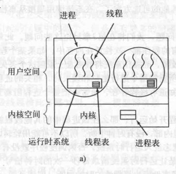
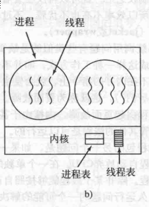
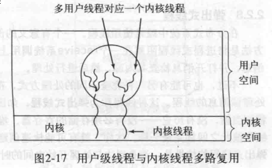
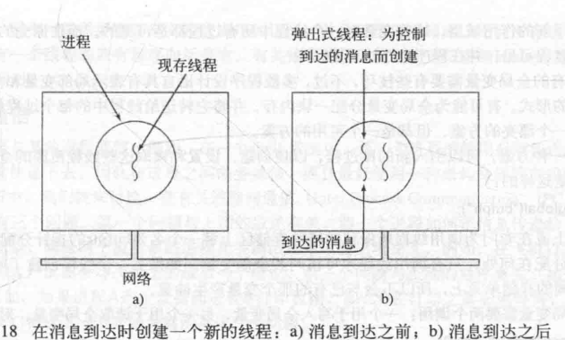
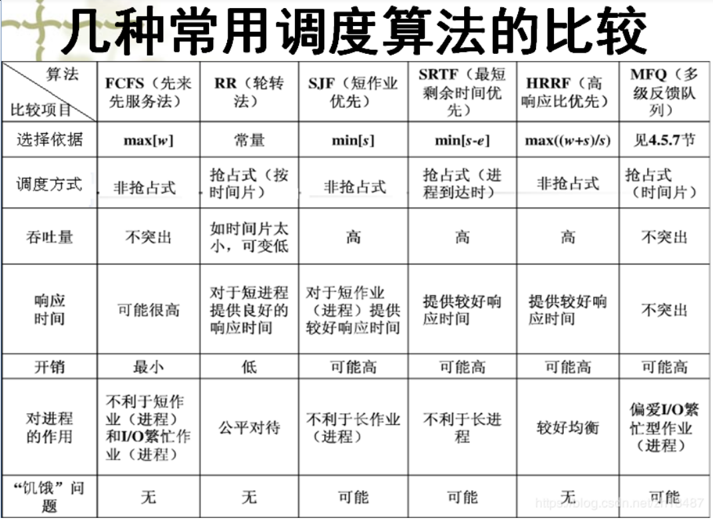

# 进程
> 进程：操作系统正在运行程序建立一个管理实体  
> 进程调度等同于CPU调度  
> 计算机上所有可运行的软件被组织成若干顺序进程
### 进程
* 进程模型
> 关键思想：一个进程是某种类型的一个活动，它有程序，输入，输出以及状态。单个处理器可以被若干进程共享，它使用某种调度算法决定何时停止一个进程工作，并转而为另一个进程提供服务
* 进程的创建
> 技术上看,新进程都是由于一个已存在的进程执行了一个用于创建进程的程序调用而创建的.

> 4种主要事件会导致进程的创建：
> 1. 系统初始化
> > 守护进程: 停留在后台处理的进程,且这些进程与特定的用户没有关系,却具有某些专门的功能
> 2. 正在运行的程序执行了创建进程的系统调用
> 3. 用户请求创建一个新进程
> 4. 一个批处理作业的初始化
* 进程的终止
> 进程的终止通常由下列条件引起:
> 1. 正常退出(自愿)
> 2. 出错退出(自愿)
> 3. 严重错误(非自愿)
> 4. 被其他进程杀死(非自愿)
* 进程的层次及结构
> 进程只能有一个父程序,但可有零个或多个子程序
* 进程的状态

> 1. 运行态: 该时刻进程实际占用CPU
> 2. 就绪态: 可运行,但因其他进程正在运行而暂时停止
> 3. 阻塞态: 除非某种外部事件发生,否则进程不能运行  

> 处于前两种状态的的进程都可以运行,但第三种状态的进程不能运行,即使是CPU空闲也不行

* 进程的实现

> 进程表/进程控制块(PCB) : 每个进程占用一个表项,该表项包含了进程状态的重要信息,其中包括:
> * 程序计数器
> * 堆栈指针
> * 内存分配情况
> * 所打开文件的状态,账号和调度信息
> * 其他在进程由运行态转到就绪态或阻塞态时必须保存的信息

* 多道程序设计模型

> $CPU利用率=1-p^n$  
> 其中p: 一个进程等待I/O操作的时间与其停留在内存中时间比; n:内存中的n个进程
### 线程
> * 主要原因: 通过将应用程序分解成可以准并行运行的多个顺序线程,从而提高进程效率  
> 并行实体拥有共享同一个地址空间和所有可用数据的能力,而这些是多进程是无法实现的,因为不同进程的地址空间是不同的
> * 线程比进程更轻量级,它们比进程更容易创建,也更容易撤销
> * 若存在大量的计算和大量的I/O处理,拥有多个线程允许这些活动彼此重叠进行,从而加快应用执行效率

### 经典线程模型
> 进程用于把资源集中在一起,而进程则是在CPU上被调度执行的实体  
> * 多线程共享同一个地址空间和其他资源, 而多个进程共享物理内存,磁盘,打印机和其他资源

* 线程和进程的内容

> * 每个线程都有属于自己的堆栈,堆栈有一帧供各个被调用但是还没有从中返回的过程使用

### 用户空间中实现线程

> * 内核对线程包一无所知,内核按单线程进程方式管理
> * 每个进程有专用的线程表,用来跟踪进程中的线程
* 优点
  * 用户级的线程包可以在不支持线程的操作系统实现  
  * 线程切换无需陷入内核,高效率
  * 允许每个进程有自己定制的调度算法,具有较好的扩展性
* 缺点
  * 其他被阻塞的线程可能会影响到其他的线程
  * 线程调度问题
### 在内核中实现线程

* 每个进程中没有进程表,而在内核中用来记录系统中所有线程的进程表
* 线程回收
* 内核线程不需要新的,非阻塞系统调用,但系统调用的开销比较大
* 多线程创建新的进程时候的问题
* 信号问题
  > 信号是发送给进程,而非线程

### 混合实现

* 内核只识别内核级别线程,一些内核级别线程会被多个用户线程多路复用

### 调度程序激活机制
> 目标是模拟内核线程功能,通常在用户空间实现
* 机制
  > 内核给每一个进程安排一定数量的虚拟处理器,并且让用户空间运行时系统将线程分配到处理器上。当内核了解到一个线程被阻塞之后,内核通知该进程的运行时系统,并且在堆栈中以参数形式传递有问题的线程编号和所发生时间的一个描述。(上行调用)

### 弹出式线程

> 在一个消息的到达导致系统创建一个处理该消息的线程  
* 优点
  > 这种线程没有历史,没有必须存储的寄存器,堆栈等内容,消息到达与处理开始之间的时间非常短

## 进程间通信(IPC)
* 竞争条件
* 临界区
  > 共享内存进行访问的程序片段
* 互斥
    > 以某种手段确保一个进程在使用一个共享变量或文件时候,其他进程不能做同样的操作
* 解决竞争条件方案
  1. 任何两个进程不能同时处于临界区(互斥性)
  2. 不应对CPU的速度和数量做任何假设(通用性)
  3. 临界区外运行的进程不得阻塞其他进程
  4. 不得使进程无限期等待进入临界区(合理性)

### 忙等待互斥方案
> 缺点:
> * 浪费了CPU时间
> * 优先级反转问题:H优先级高,L优先级低,当L处于临界区时,H处于就绪态,由于H优先级高,当H就绪时,L不会被调度,所以L无法离开临界区,而H就会永远等待下去
  1. 屏蔽中断
  > 每个进程刚进入临界区后立即屏蔽所有中断(包括时钟中断),并在就要离开之前再打开中断.  
  > 在多核(处理器)系统中,屏蔽一个CPU的终端不会阻止其他CPU干预另一个CPU所做的操作
  2. 锁变量
  > 当锁的值为0,进程设置为1并进入临界区;若为1,则等待锁变为0  
  > 当一个进程读取锁的值为0时,另一个进程恰好将其设置为1,这样同时有两个进程进入临界区
  3. 严格轮换法
  > turn(自旋锁)变量初始为0,进程0检查turn,其值为0,则进入临界区.而进程1发现其值为0,进入等待循环中不断测试turn,(忙等待:连续测试一个变量直到某个值出现为止)  
  > 会出现违反条件3的情况.
  4. Peterson解法
  5. TSL指令(硬件)
    * TSL RX, LOCK
      > 测试并加锁:将一个内存字lock读到寄存器RX中,然后在该内存地址上存一个非零值,读字和写字操作保证是不可分割的,即该指令结束之前其他处理器均不允许访问该内存字.  
      > 执行TSL指令的CPU将锁住内存总线,防止其他CPU在本指令结束之前访问内存  
      > 不同于屏蔽中断,屏蔽中断对其他CPU没有任何影响.

### 睡眠(Sleep)与唤醒(Wakeup)
* 有界缓冲区问题(生产者-消费者问题)
  > 当生产者要唤醒消费者,而消费者处于将睡而未睡的状态导致唤醒(wakeup)丢失.  
  > 补救方法:添加一个唤醒等待位
* 信号量(P V)
  > 累计唤醒次数
  * down(Sleep)操作
    > 若值大于0,则减1并继续;  
    > 若该值为0,则进入睡眠,且此时down操作并未结束.  
    > 检查数值,修改变量和可能发生睡眠的操作均为原子操作(在该操作完成或阻塞之前,其他进程均不允许访问该信号量)
  * up(Wakeup)操作
    > 信号量增1,如果一个或多个进程在该信号量上睡眠,无法完成一个先前的down操作,则由操作系统选择其中一个并允许其完成down操作,于是其信号量仍为0

### 互斥量
> 信号量(简化版),不需要信号量的计数能力; 仅适用于管理共享资源或一小段代码(用户空间线程包)
  * 义
  > 处于两态变量:加锁和解锁.0表示解锁,其他值为加锁;  
  > 当一个线程(进程)需要访问临界区时,调用mutex_lock,如果互斥量是解锁,即临界区可用;  
  > 如果互斥量为加锁,调用线程阻塞,直到临界区中线程完成并调用mutex_unlock;   
  > 如果有多个线程被阻塞在该互斥量上,随机选择一个线程允许他获得锁
  * 与忙等待的区别
  > 忙等待在进入临界区失败后会进入试图获取进程的循环,而该方案在进程获取锁失败后就会将CPU给另一个进程

### 管程
> 一个管程是一个由过程,变量及数据结构等组成的一个集合  
> 任一时刻管程中只能有一个活跃进程

### 屏障
> 用于进程组而非双进程的生产者-消费者类情形

## 调度
> * 计算密集型: 进程具有较长时间的CPU集中使用和较小频度的I/O等待
> * I/O密集型: 进程具有较短时间的CPU集中使用和频繁的I/O等待

* 调度算法分类
  * 批处理
    > 非抢占式算法
  * 交互式
    > 抢占式算法
  * 实时
  * 算法:
    * 先来先服务(非抢占式算法)FCFS
      * 优点
        > 易于理解且便于程序中使用
      * 缺点
        > 不利于I/O繁忙的进程和短作业
    * 最短作业优先((非)抢占式算法)SJF/SPF
      > 适用于运行时间可以预知的
    * 高优先权优先调度算法HPF
      * 静态优先权
      * 动态优先权
        > 高响应比优先调度算法(HRRN)
    * 基于时间片的轮转调度算法(RR)
      * 时间片轮转算法
      * 多级反馈队列算法(FB)

    

    * 实时系统调度
      > 硬实时: 必须满足绝对的截止时间  
      > 软实时: 可以容忍偶尔错失的截止时间
      * 相应方式
        * 周期性
          > 可调度满足:$\sum_{i=1}^m\frac{C_i}{P_i}\leqslant 1$
### 经典IPC问题
* 哲学家就餐问题
* 读者-写者问题
