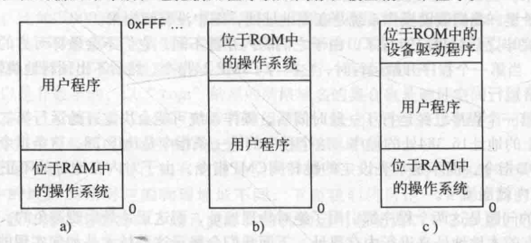
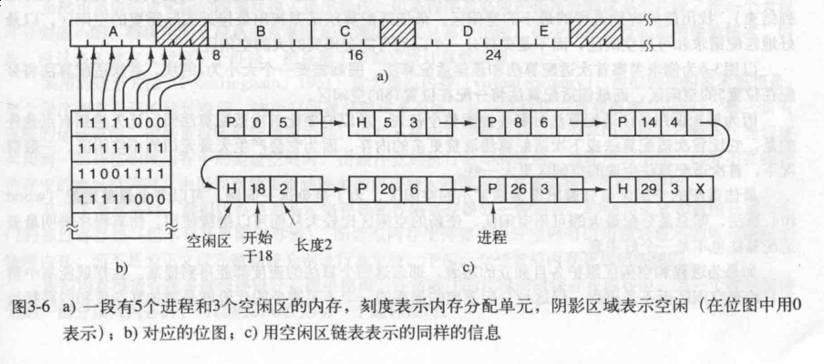
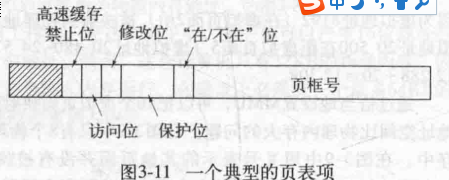
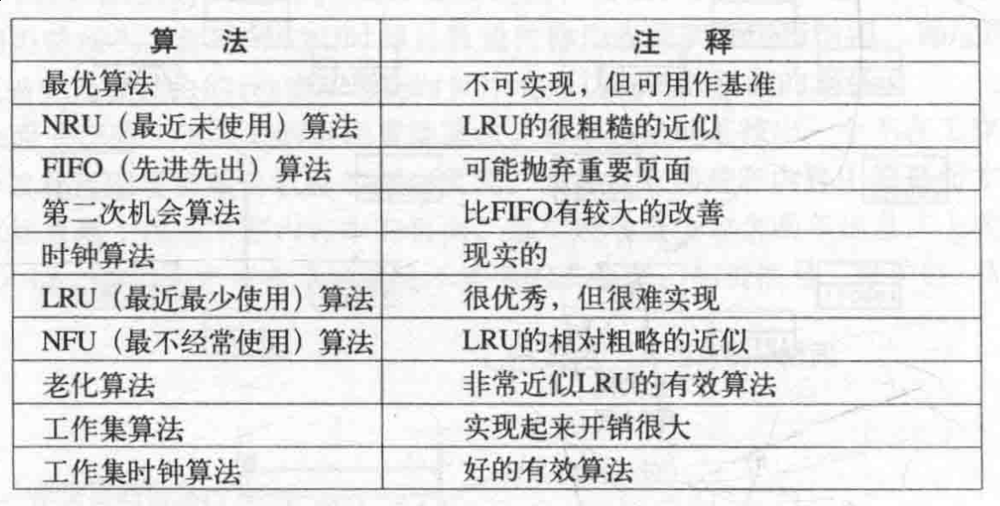

# 内存管理
### 无存储器抽象

  

### 存储器抽象
* 地址空间
  > 是一个进程可用于寻址寻址内存的一套地址集合
  * 基址寄存器与界限寄存器
    * 动态重定位
      > 把每个进程的地址空间映射到物理内存的不同部分
      * 缺点
        > 每次重定位都需要进行加法和比较运算,如果么有特殊的电路下，效率比较慢
  * 交换技术
    > 内存不足问题
    * 交换
      > 把一个进程完整调入内存,使该进程运行一段时间,然后把它存回磁盘
      * 内存紧缩
        > 交换使得内存产生多个空闲区(空洞),通过把所有进程尽可能下下移动,把小的空闲区合成一大块
    * 虚拟内存
      > 程序能在只有一部分被调入内存的情况下运行
  * 空闲内存管理
    * 使用位图的存储管理
        
      > 内存的大小和分配单元的大小决定的位图的大小
    * 使用链表的内存管理
      * 首次适配算法
        > 遍历段链表,直至找到足够进程使用的空闲区
      * 下次适配算法
        > 和首次适配算法类似,但每次的结束点为下一次的起始点
      * 最佳适配算法
        > 遍历整段链表,找出能够容纳进程的最小空闲区
      * 最差适配算法
        > 遍历整段链表,找出能够容纳进程的最大空闲区
      * 快速适配算法
        > 创建常用大小的空闲区维护单独的链表(n项表),例如第一项指向大小4KB的空闲区链表表头指针,第二项指向8KB空闲区链表表头指针,... 
        * 缺点
          > 一个进程终止或被换出时候,合并相邻块耗时,如果不合并机会分裂大量进程无法利用的小空闲区
  * 虚拟内存
    > 每个程序拥有自己的地址空间,每个空间被分割多个个块,每一块称作一页(页面),每一页有连续的地址范围,这些页被映射到物理内存.当程序引用到一部分在物理内存中的地址空间时,硬件立刻执行必要的映射,若引用的那部分不在物理内存中时,有操作系统负责将缺失的部分装入物理内存
    * 分页
      > * 虚拟地址:由程序产生的地址,虚拟地址不是直接送到内存总线上,而是送到内存管理单元(MMU),MMU把虚拟地址映射为物理内存地址
      > * 页面: 虚拟地址空间按照固定大小划分的单元
      > * 页框: 物理内存中对应于页面的单元
      > * 缺页中断/缺页错误:调用未映射的虚拟页面
    * 页表
      * 页表项

      
      > * 保护位:一个页允许什么类型的访问(读/写/执行)  
      > * 修改位:如果一个页面修改过,必须把它写会磁盘  
      > * 访问位:用来帮助在发生缺页终端时选择要被淘汰的页面  
      > * 高速缓存禁止位:用于禁止该页面被告诉缓存
    * 加速分页过程
      1. 转换检测缓冲区/相联存储器/快表(TLB)
    * 针对大内存的项表
      1. 多级页表
      > 避免全部页表一直保存在内存中
      2. 倒排页表
    * 页面置换算法

    
      * 最优页面置换算法(无法实现)
      > 每个页面用在该页面首次被访问前所要执行的指令数作为标记,每次置换标记最大的页面
      * 最近未使用页面置换算法
      > R位定时清零  
      > NRU算法随机地从类编好最小的非空类中挑选一个页面淘汰  
      > 在最近一个时钟(20ms)淘汰一个没有被访问的已修改页面
      * 先进先出页面置换算法
      * 第二次机会页面算法
      > 在先进先出的基础上,修改:检查最老页面R位,如果R位是0,则置换;如果为1,将R位置0,并放到链表的尾部
      * 时钟页面置换算法
      > 发生缺页中断时,首先检查表针(指向最老的页面),如果R位为0,置换,然后将表针向前移动一位;如果R位为1,清除R位,指针向前移动一位
      * 最近最近最少使用页面置换算法
      > 置换未使用时间最长的页面
      * 工作集页面置换算法
      * 工作集时钟页面置换算法
## 分段

## 分页系统中的设计问题
* 局部分配策略与全局分配策略
> 相互竞争的可运行进程
  * 局部页面置换算法
  > 仅对本进程进行置换
  * 全局页面置换算法
* 负载控制
* 页面大小
* 分类的指令空间和数据空间
* 共享页面
* 共享库
* 内存映射文件
* 清除策略
* 虚拟内存借口
