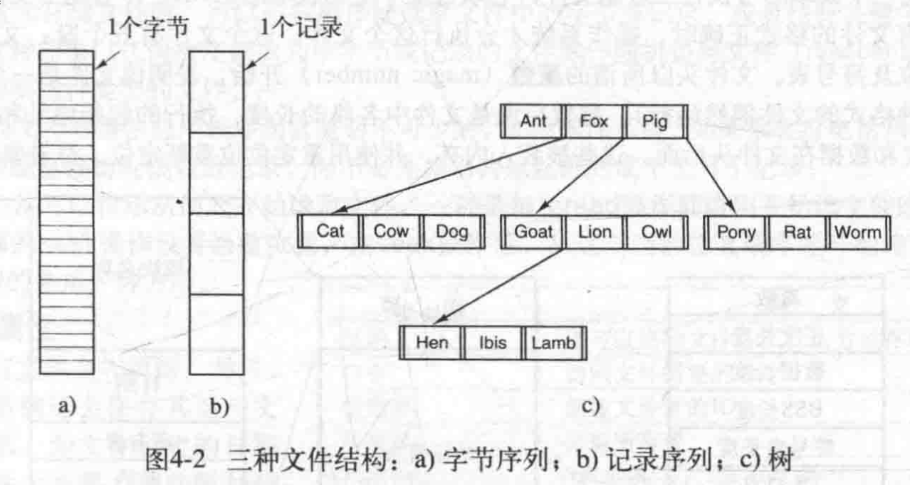
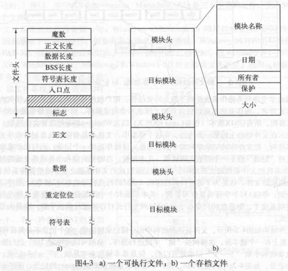
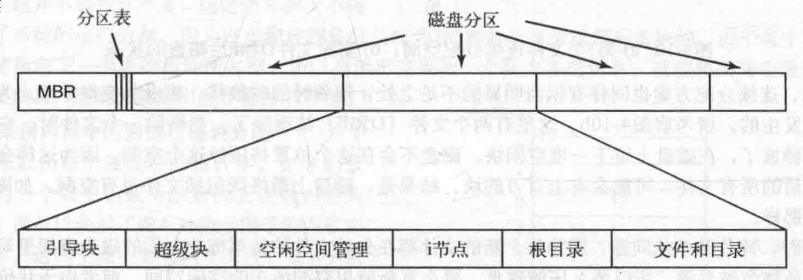

# 文件系统
> * 文件:进程创建的信息逻辑单元
## 文件
* 文件命名
* 文件结构

* 文件类型
  * UNIX
    * 字符特殊文件
    > 和输入/输出有关,用于串行I/O类设备
    * 块特殊文件
    > 用于磁盘类设备
    * 普通文件
    > 包含用户信息的文件
      * ASCII文件
      > 可以显示,打印,编辑
      * 二进制文件  
    * 文件格式

    
* 文件访问
  * 顺序访问
  * 随机访问
* 文件属性
> 元数据
* 文件操作
## 目录
* 一级目录系统
> 一个目录包含所有文件(根目录)  
> 简单,并能够快速定位文件
* 层次目录系统
> 树状结构
* 路径名
  * 绝对路径
  * 相对路径
* 目录操作

## 文件系统实现
* 文件系统布局

  * 主引导记录(MBR)
  > 0号扇区  
  > 结尾是分区表,给出了每个分区的起始和结束地址
  * 引导块
  > 每个分区的第一个块  
  > 引导块中的程序将装载该分区中的操作系统.
  * 超级块
  > 包含文件系统所有关键参数
  * 空闲块
* 文件的实现
  * 连续分配
  > 每个文件作为一连串连续数据块存储在磁盘上  
  > 实现简单;读操作性能好  
  > 碎片空间难以利用
  * 链表分配
  > 可以充分利用每个磁盘块  
  > 顺序读文件方便,但随机访问相当缓慢
  * 采用内存中的表进行链表分配  
  > 内存中有一个文件分配表(FAT)  
  > 整个块可以存放数据,随机访问容易得多  
  > 缺点: 必须把整个表都存放在内存中
* i节点
> 
