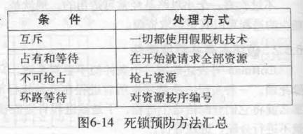

# 死锁
> 如果一个进程集合中的每个进程都在等待只能由该进程集合中的其他进程才能引发的事件,那么,该进程集合就是死锁的
* 资源
> 排他性使用的对象
  * 可抢占资源
  > 抢占后不会产生副作用
  * 不可抢占资源
  > 不引起相关的计算失败的情况下,无法把它从占有它的进程处抢占过来

* 资源死锁的条件
  * 互斥条件
    > 每个资源要么已经分配给了一个进程,要么可用
  * 占有和等待条件
    > 已经得到某个资源的进程可以在请求新的资源
  * 不可抢占条件
    > 已经分配给一个进程的资源不能强制性地抢占,它只能被占有它的进程显式释放
  * 环路等待条件
    > 死锁发生时,系统中一定有由两个或两个以上的进程组成的一条环路,该环路中的每个进程都在等待下一个进程所占有的资源
* 解决死锁算法
  * 鸵鸟算法
    > 不管
* 死锁检测和死锁恢复
  * 每种类型一个资源的死锁检测
    > 深度优先搜索,若存在环则死锁
  * 每种类型多个资源的死锁检测
    > 1. 寻找一个没有标记的的进程Pi,对于它而言R矩阵的第i行向量小于等于A  
    > 2. 如果找到这样一个进程,那么将C矩阵的第i行向量加到A中,标记该进程,转到第一步  
    * 算法结束时候,如果存在没有标记过的进程,就是死锁进程
  * 死锁恢复 
    * 利用抢占恢复
    * 利用回滚恢复
    * 通过杀死进程恢复
* 死锁避免
  * 资源轨迹图
  * 单个资源的银行家算法
  * 多个资源的银行家算法
* 死锁预防

  
  * 破坏互斥条件
    * 避免分配那些不是绝对必需的资源,尽量做到尽可能少的进程可以真正请求资源
  * 破坏占有并等待条件
    * 规定所有进程在开始执行前请求所需的全部资源
    * 当一个进程请求资源时候,先暂时释放其当前占用的所有资源,然后再尝试一次获得所需的全部资源
  * 破坏不可抢占条件
  * 破坏环路等待条件
    * 保证每一个进程在任何时刻只能占用一个资源,如果请求另一个资源必需先释放第一个资源
    * 将所有资源统一编号,进程在任何时刻提出资源请求必须按照资源编号顺序提出.

* 其他问题
  * 两阶段加锁
  * 通信死锁
  * 活锁
  * 饥饿
