# 2 软件生存期模型
### 瀑布模型
* 理论模型

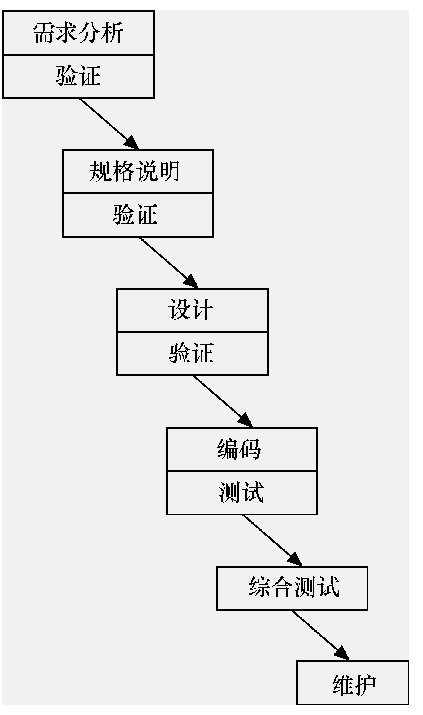
* 实际模型

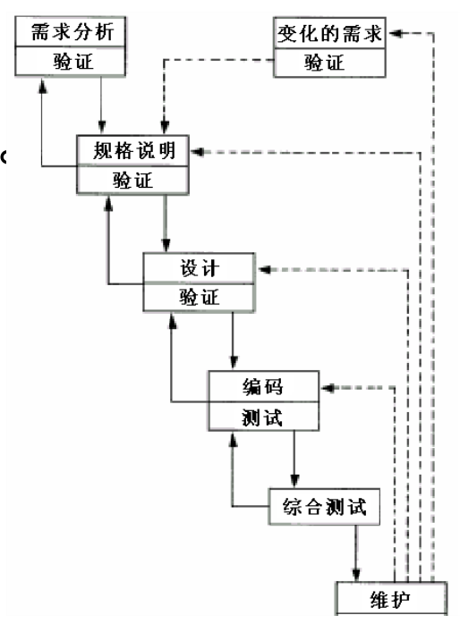
> 实线箭头表示开发过程, 虚线箭头表示维护过程

* V模型

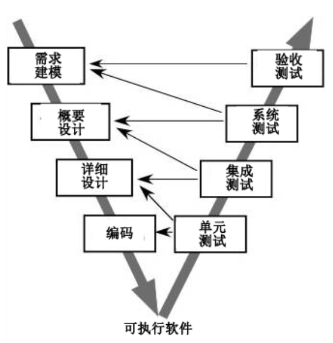

> 瀑布模型的变体  
> V模型描述了测试阶段的活动与开发阶段活动之间的关系

##### 特点
* 阶段间具有顺序性和依赖性
  * 必须等前一阶段的工作完成后才能开始后一阶段的工作
  * 前一阶段的输出文档技术后一阶段的输入文档
* 推迟实现的观点
  * 编码之前设置了系统分析和系统设计的各个阶段,分析与设计阶段的基本任务规定,主要考虑目标系统的逻辑模型,不涉及物理实现(重要指导思想)
* 质量保证的观点
  * 每个阶段就必须完成规定的文档,没有交出合格的文档就没有完成该阶段的任务
  * 各个阶段结束前都要对所完成的文档进行评审
    > 评审贯穿整个阶段
##### 优点
* 强迫开发人员采用规范化的方法
* 严格规定每个阶段必须提交的文档
* 要求每个阶段交出的所有产品都要验证

##### 缺点
* 完全依赖于规格说明可能导致产品不能真正满足用户的需要
* 只适合项目开始时需求已确定的情况

### 快速原型模型
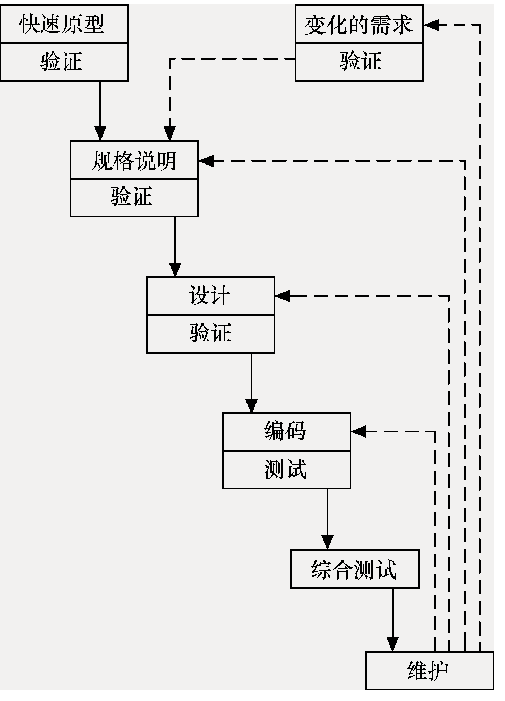

> 快速建立起来的可以在计算机上运行的程序,完成的功能往往是最终产品能完成的功能的子集  
> 原型的用途是获知用户的真正需求,一旦需求确定,原型可以抛弃,也可以在原型的基础上进行开发

##### 优点
* 有助于满足用户的真实需求
* 原型系统已经通过与用户的交互而得到验证,据此产生的规格说明文档能够正确地描述用户需求
* 开发基本上是线性顺序
* 因为文档正确描述用户需求,开发后续不会因为发现文档错误而大量返工
* 通过原型系统已经学到了许多东西,所以在设计和编码阶段产生的错误可能性降低
* 开发人员尽可能快地建造出原型系统,加速软件开发过程,节约成本

### 增量模型(渐增模型)

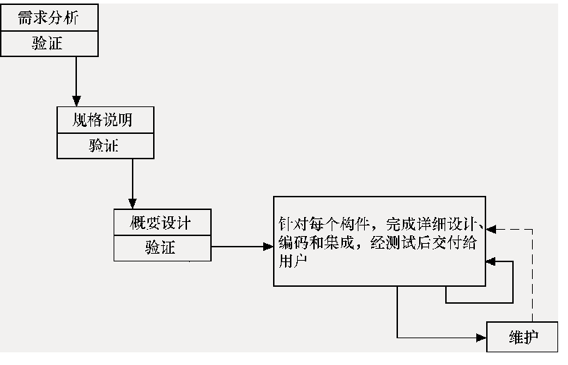

> * 把软件作为一系列的增量构件来设计,编码,集成和测试  
> * 每个构件由多个相互作用的模块构成,并且能够完成特定的功能
> * 增量构件的开发可以使用瀑布模型的方式

##### 优点
* 短时间内向用户提交一些有用的产品
* 逐步增加产品的功能可以使用户有充裕时间学习和适应产品,减少一个全新软件可能给用户组织带来的冲击
* 项目失败的风险较低
* 优先级最高的服务首先交付,然后再将其他增量构件逐次集成进来

##### 注意问题
* 新增的构件不能破坏已经开发的产品
* 软件体系的结构必须开放,即向现有产品加入新构件的过程必须简单,方便

### 螺旋模型

> 该模型将瀑布模型与快速模型结合起来,并加入两种模型均忽略的风险分析  
> 思想:使用原型及其他方法来尽量降低风险

完整螺旋模型

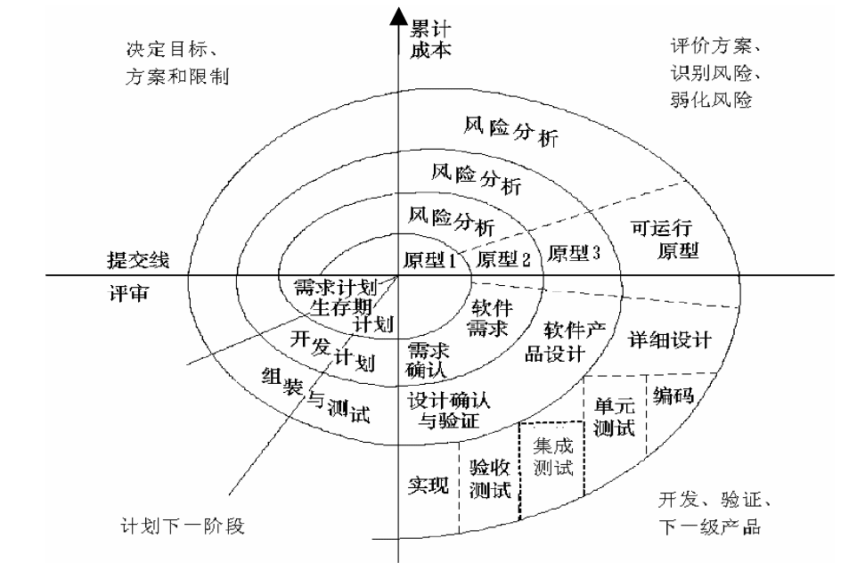

> * 软件过程表示为一个螺线
> * 螺线上的每一个循环表示过程的一个阶段

##### 四项活动
螺线上的每一个循环可划分为四个象限(四项活动)

* 目标设定
* 风险估计与弱化
* 开发和验证
* 计划

##### 优点
* 对可选方案和约束条件的强调有利于已有软件的重用,也有助于把软件质量作为软件开发的一个重要目标
* 减少了过多的测试或测试不足所打来的风险
* 在螺旋模型中维护只是模型的另一周期

##### 缺点
* 风险驱动,要求开发人员必须有风险评估经验和相关知识
### 喷泉模型
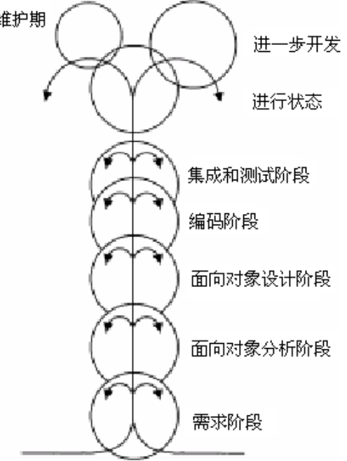

> 面向对象生命周期模型

### 统一过程

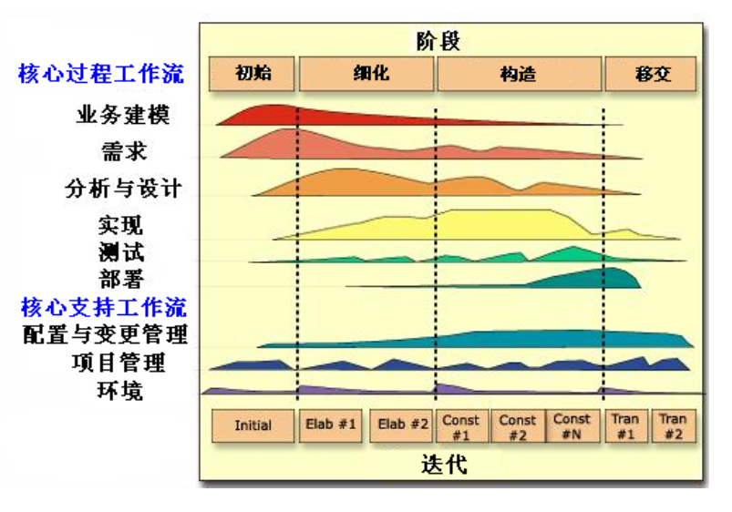
* 业务建模工作流
* 需求工作流
* 分析和设计工作流
* 实现工作流
* 测试工作流
* 部署工作流
##### 阶段

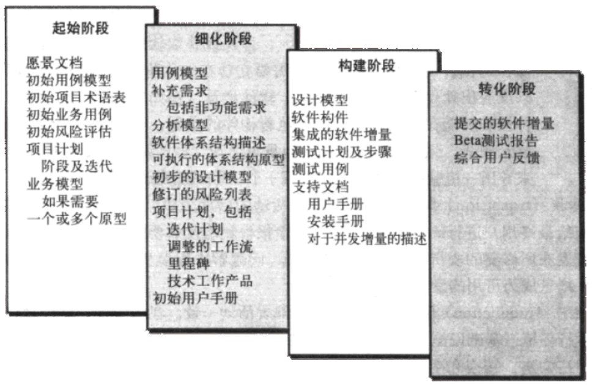
* 初始阶段
* 细化阶段
* 构造阶段
* 移交阶段

### 基于构件的开发模型

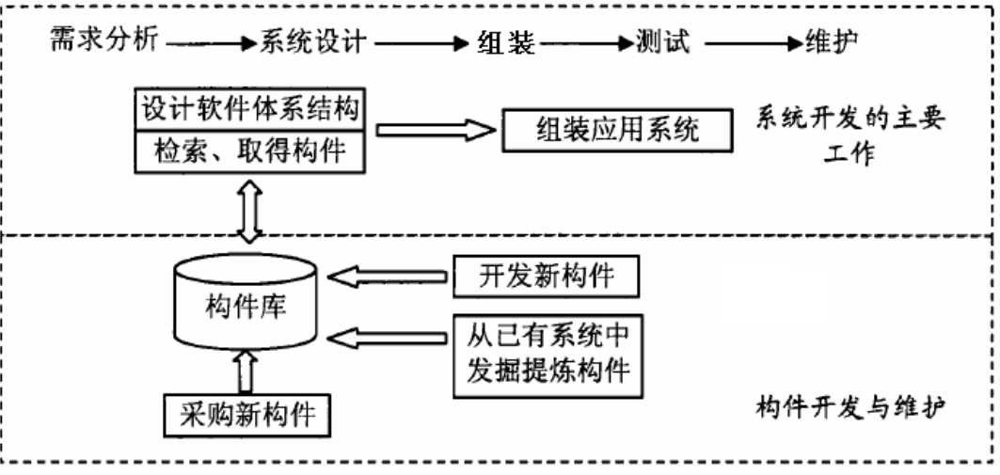

> 强调使用可复用的软件构件来设计和构造基于计算机的系统过程  
> 考虑的重点是集成,而不是实现

##### 开发步骤
1. 对于该问题领域的基于构件的可用产品进行研究和评估
2. 考虑构件集成的问题
3. 设计软件架构以容纳你这些构件
4. 将构建集成到架构中
5. 进行充分的测试以保证功能正常

### 敏捷过程
* 个体和交互胜过过程和工具
* 可工作软件胜过宽泛的文档
* 客户合作胜过合同谈判
* 响应变化胜过遵循计划
> 注重时效

##### 三个假设
* 提前预测那些需求是稳定的,哪些是困难的
* 对很多软件,设计和构建是交错进行
* 分析,设计,构建和测试并不容易预测

##### 敏捷原则
* 优先做通过尽早,持续交付有价值的软件使用户满意
* 在开发后期,也应根据需求变更
* 经常交付可运行软件,时间间隔越短越好
* 开发过程,业务人员和开发人员天天在一起工作
* 围绕有积极性的个人构建项目
* 面对面交谈
* 可运行软件是进度的首要度量标准
* 保持可持续,长期稳定的开发速度
* 不断关注优秀技能和好的设计
* 保持简单
* 好的架构,需求和设计出自于自组织团队
* 每隔一定时间进行团队反省

##### 极限编程
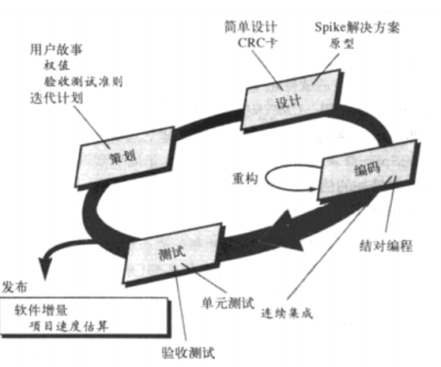
> 包含了策划,设计,编码和测试4个框架活动规则和实践

* 解释
  * 结对编程
  > 一人coding,一人testing
##### 自适应软件开发模型
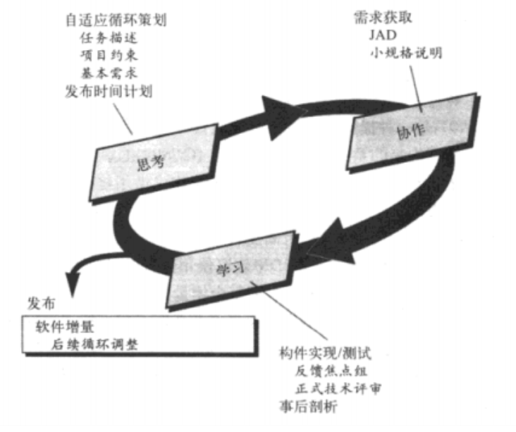

