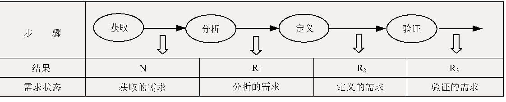
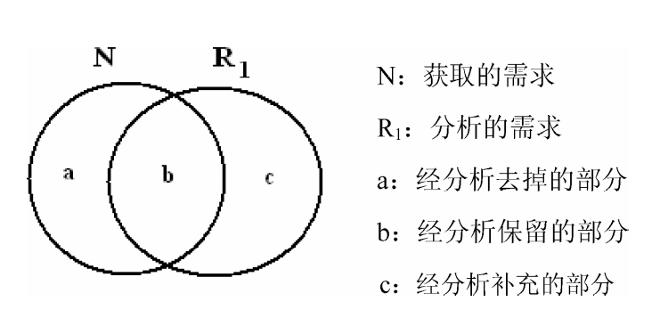
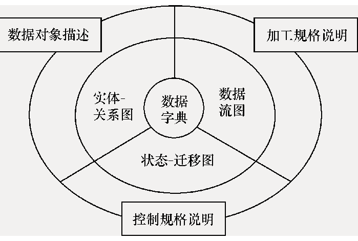
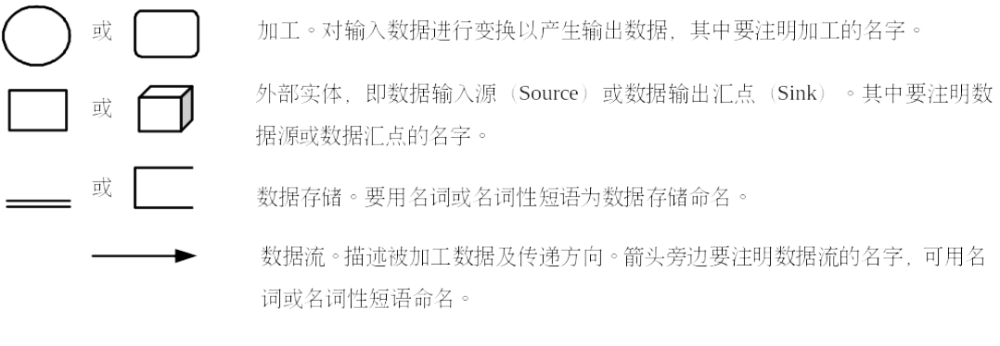
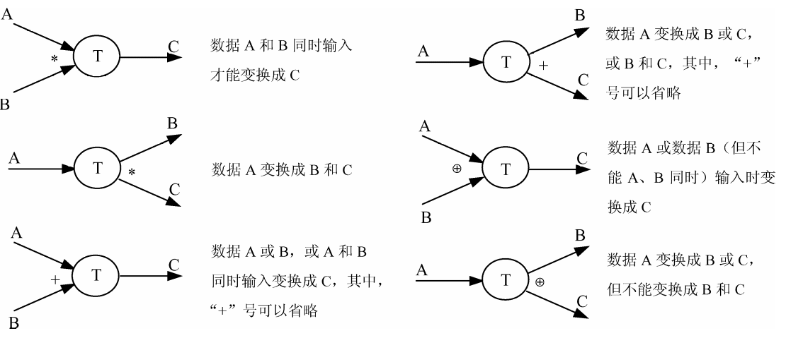
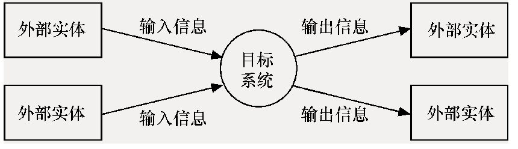
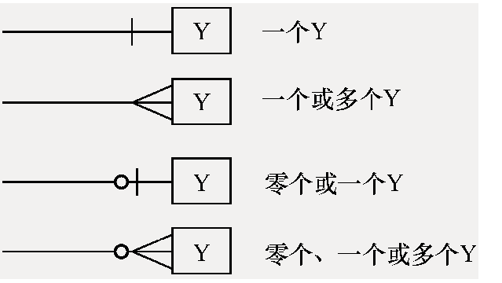
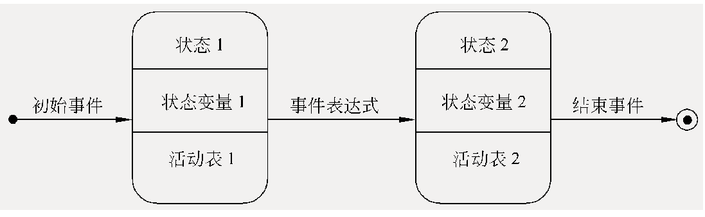
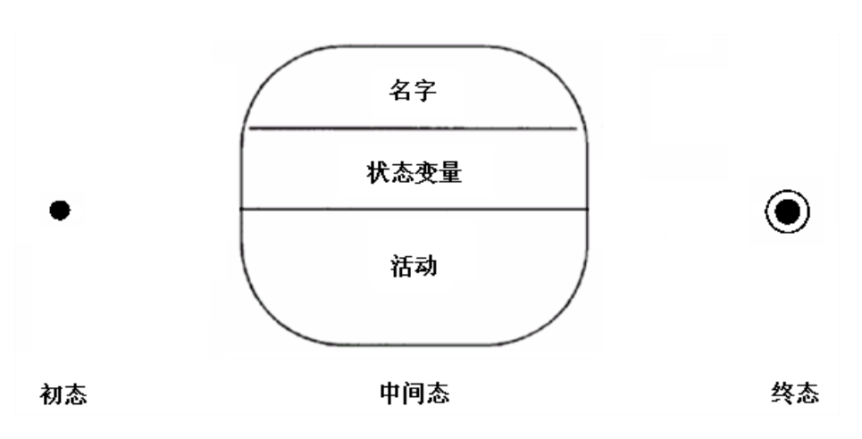
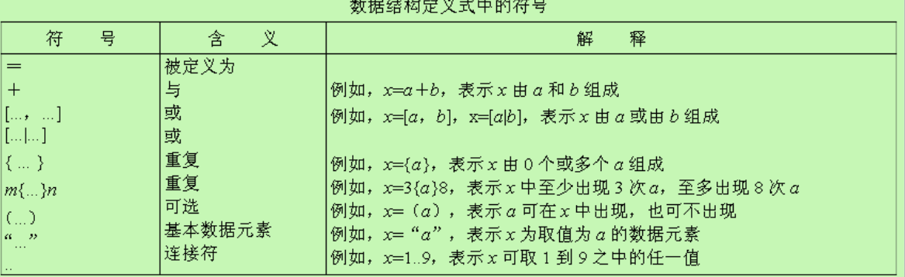

# 3 软件需求获取与结构化分析方法
### 需求获取与需求分析阶段的任务
##### 需求获取的任务和原则
任务
> 与客户或用户沟通,了解系统或产品的目标,业务需求等  
> 最困难任务之一: 获取并理解用户的需求

困难的原因:
* 系统的目标或范围目标
* 需求不准确问题
* 需求的易变问题

需求获取的任务:
1. 发现并分析问题,并分析问题的原因/结果关系
2. 与用户交流,调查收集信息
3. 从三个成分观察问题:数据,过程和接口
4. 需求文档化
  > 用例,决策表,需求表等

遵循原则:
* 深入浅出原则
  > 获取的需求是个全集,目标系统真正实现的是个子集
* 以流程为主线为原则
  > 与用户交流过程中,用流程将所有的内容串起来
##### 需求获取的过程
1. 开发高层的业务
  > 高层为抽象
2. 定义项目范围和高层需求
3. 识别用户类和用户代表
4. 获取具体需求
    * 与用户交流
      > 重要
    * 现有产品或竞争产品的描述文档
    * 系统需求规格说明
    * 当前系统的问题报告和改进需求
    * 市场调查和用户问卷调查
    * 观察用户如何工作
5. 确定目标系统的业务工作流
   > 具体到当前待开发的应用系统,确定系统的业务工作流和主要业务规则,采取需求调研的方法获取所需要信息
    * 调研用户的组织结构,岗位设置,职责定义
    * 调研每个子系统的工作流程,功能和处理规则
    * 对调研内容事先准别,针对不同管理层次的用户询问问题,列出清单
6. 需求整理与总结
    * 对上面步骤取得需求资料进行整理和总结,确定对软件系统的综合要求(软件需求)
    * 提出需求实现条件以及需求应达到的标准
##### 软件需求分析阶段的任务
需求分析阶段的工作步骤

1. 需求获取
  > 通过启发,引导从客户那里得到的原始需求是他们的业务要求(needs:N)
2. 需求分析
  > 研究获取的需求

  
  * 完整性
    > 每项获取的需求都应给出清楚的描述,使得软件开发工作能够取得设计和实现该功能所需要的全部必要信息
  * 正确性
    > 获取的每项需求必须是准确无误,并且需求描述无歧义性
  * 合理性
    > 各项需求之间,软件需求与系统需求之间应是协调一致的,不存在矛盾与冲突
  * 可行性
    > 技术可行性,经济可行性,社会可行性
  * 充分性
    > 获取的需求是否全面,周到
3. 需求定义
  > 将已经过分析的需求清晰,全面,系统,准确地描述称为正式的文档  
  > 编写需求规格说明
4. 需求验证
  > 为了确保已定义的需求(需求规格说明)准确无误,并能为客户理解和接受,需要对其进行严格的评审
### 结构化分析方法(Structured Analysis)
##### 结构化分析模型

> 需求模型,内核是数据字典

##### 功能建模(DFD)
> 用抽象模型的概念,按照软件内部数据传递,变换的关系,自顶向下逐层分解,直到找到满足功能要求的所有可实现的软件为止  
> 用数据流图来描述
* 基本图形符号

* 数据流之间的关系

* 环境图(顶层数据流图/0层数据流图)

  > 仅包括一个数据处理过程  
  > 确定系统在其环境中的位置,通过确定系统的输入和输出的外部实体的关系确定其边界

* 数据流图的分层
  > 按照系统的层次结构进行逐步分解,并以分层的数据流图反映这种结构关系,能清楚地表达和容易理解整个系统

##### 数据建模
实体关系图(E-R图)
> 在较高的抽象层(概念层)上对数据库结构进行建模的流行技术
* 数据对象(实体)
  > 目标系统所需要的复合信息(具有若干不同属性的信息)的表示
* 属性
  > 定义对象的特征  
  > 用椭圆或圆角矩阵表示
* 关系
  > 不同数据对象的实例之间是有关联的关系  
  > 用无向边表示  
  * 关联的重数
    * 一对一(1:1)关联
    * 一对多(1:m)关联
    * 多对多(m:n)关联
  * 数量的表示
    
  * 属性
    * 表示
      > 无向边上再加一个菱形框,在菱形框中标明关系的名字  
      > 关系的属性同样用椭圆形或圆角矩形表示
##### 行为建模
状态转移图(状态图)

> 通过描绘系统的状态及引起系统状态转移的事件
* 状态
  > 状态是任何被观察到的系统行为模式,一个状态代表系统的一种行为模式,状态规定了系统对事件的响应方式
  * 可能存在初态,终态和中间态
    > 一张状态图只能有一个初态,终态可以有多个,也可以没有
  * 表示
    
    * 初态为实心圆
    * 终态为牛眼图形
    * 中间态为圆角矩阵
* 状态转移
  * 表示
    * 状态转换: 状态图中两个状态之间带箭头的连线
    * 若状态的变迁是由事件触发的,应在转换的箭头线上标出触发转换的事件表达式
    * 如果在箭头线上未标明事件,则表示在源状态的内部活动执行完之后自动触发转换
* 事件
  > 事件是在某个特定时刻发生的事情,它是对引起系统做动作或从一个状态转换到另一个状态的外部事件的抽象
    * 表达语法:
      > 事件说明(守卫条件) / 动作表达式
      * 时间说明语法:
        > 事件名(参数表)
      * 守卫条件
        > 是一个布尔表达式,如果同时使用守卫条件和条件说明,则当且仅当事件发生且布尔表达式成立时,状态才会发生
      * 动作表达式
        > 动作表达式是一个过程表达式,当状态转换开始时执行该表达式
##### 数据字典
数据字典以词条方式定义在数据模型,功能模型和行为模型中出现的数据对象及控制信息的特性,给出它们准确定义
> 数据字典是3种分析模型的粘合剂,是分析模型的核心
* 词条描述
  > 对于在数据流图中每一个被命名的图形元素均加以定义,包括图形元素名字,别名或编号,类别,描述,定义,位置等
  * 数据流词条
    > 数据流是数据结构在系统内传播的路径
    * 包括:  

    | 名       | 义                                             |
    |----------|------------------------------------------------|
    | 数据流名 | 要求与数据流图中该图形元素的名字一致           |
    | 简述     | 简要介绍它产生的原因和结果                     |
    | 组成     | 数据结构                                       |
    | 来源     | 数据流来自哪个加工或作为哪个数据源的外部实体   |
    | 去向     | 数据流流向哪个加工或作为哪个数据汇点的外部实体 |
    | 流通量   | 单位时间数据的流通量                           |
    | 峰值     | 流通量的极限值                                 |
  * 数据元素词条
    > 数据元素是数据处理中最小的,不可分的单位,直接反映事物的某一特征
    * 类型
      * 数字型
        > 分为离散值和连续值
      * 文字性
        > 用编码类型和长度区分
    * 取值范围
      * 离散值
        > 枚举的或介于上下界的一组数
      * 连续值
        > 有取值范围的实数值
    * 相关的数据元素及数据结构
  * 数据存储文件词条
    > 数据保存的地方
    * 文件名
      > 要求与数据流图中该图形元素的名字一致
    * 简述
      > 简要介绍存放的数据
    * 组成
      > 文件的数据结构
    * 输入
      > 从哪些加工获取数据
    * 输出
      > 有哪些加工使用数据
    * 存取方式
      > 分为顺序,直接,关键码等不同存取方式
    * 存取频率
      > 单位时间存取的次数
  * 加工词条
    > 可以使用诸如判定表,判定树,机构化语言等形式表达
    * 加工名
      > 与数据流中图形名一致
    * 编号
      > 反映该加工的层次和父子关系
    * 简述
      > 加工逻辑及功能简述
    * 输入
      > 输入的数据流
    * 输出
    * 加工逻辑
      > 简述加工程序和加工顺序
  * 数据源点及数据汇点词条
    * 名称
    * 简述
      > 简要描述是什么外部实体
    * 有关数据流
      > 该实体与系统交互时涉及哪些数据流
    * 数目
      > 实体与系统交互的次数
* 数据结构描述
  * 定义式
    
    > 数据流图中,数据流和数据文件都具有一定的数据结构
  * Warnier图
    > 树形结构来描述数据结构
* 加工规格说明
  > 在对数据流图的分解中,位于层次数最低层的加工称为基本加工(原子加工),对于每一个基本加工的进一步说明就是加工规格说明  
  > 做什么 而不是怎么做
  * 满足要求
    * 对数据流图的每一个基本加工必须有一个加工规格说明
    * 加工规格说明必须描述基本加工如何把输入数据流变换为输出数据流的加工规则
    * 加工规格说明必须描述实现加工的策略而不是加工的细节
    * 加工规格说明中包含的信息应是充足的,完备,有用的,没有重复的多余信息
  * 决策表
    * 条件茬
      > 左上部分,列出了各种可能的单个条件
    * 动作茬
      > 左下部分,列出了各种可能采取的单个动作
    * 条件项
      > 右上部分,列出了针对各种条件的每一组条件取值的组合
    * 动作项
      > 右下部分, 动作项与条件项紧密相关,指出了在条件项的各组取值的组合情况下应采取的动作
    * 建立步骤
      1. 列出与一个具体过程(或模块)有关的所有处理
      2. 列出过程执行期间的所有条件(或所有判断)
      3. 将特定条件取值组合与特定的处理相匹配,消去不可能发生的条件取值组合
      4. 将右部每一纵列规定为一个处理规则
  * 决策树
### 系统需求规格说明
  P60
### 需求评审
### 需求管理
