# 4.结构化设计方法
### 软件设计的概念及原则
##### 原则
1. 分而治之

  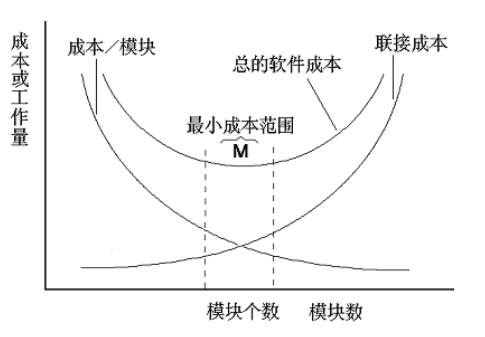
  > 大变小,但并非越小越好  
2. 模块独立性
  > 软件系统中每个模块只涉及软件要求的具体的子功能,而和软件系统中其他模块的接口是简单的
  * 有效的模块化使软件便于分工协作开发
  * 独立的模块比较容易测试和维护
  * 度量标准:
    * 耦合
      
      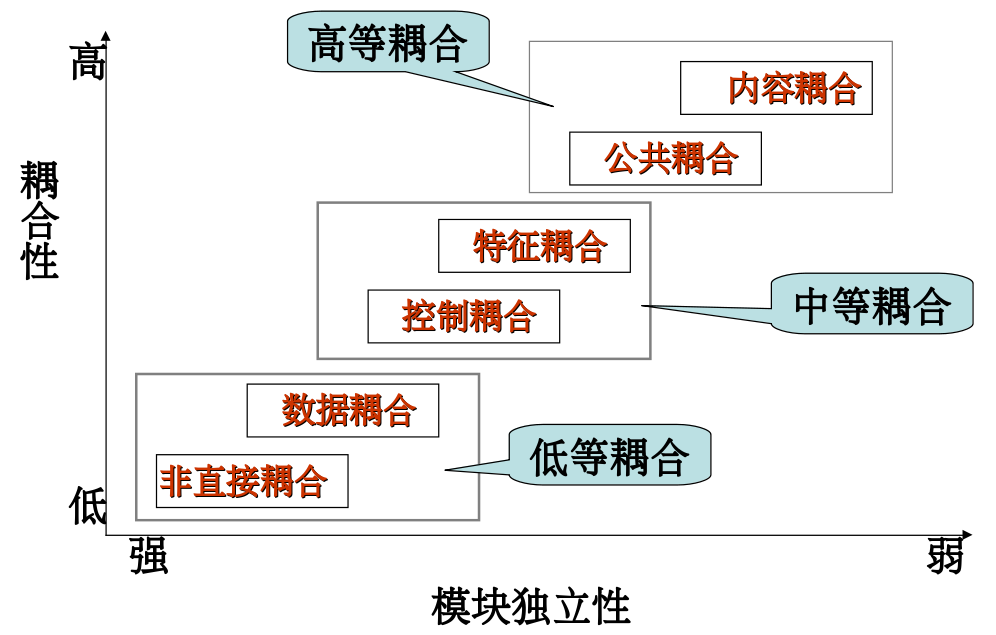
      > 模块之间的互相连接的紧密程度的度量
      * 非直接耦合
        
        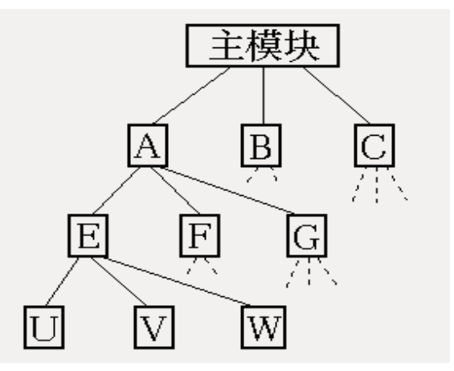
        > 两个模块之间是没有直接关系,它们之间的联系完全是通过主模块的控制和调用来实现的
      * 数据耦合
        > 一个模块访问另一个模块时,彼此之间是通过简单数据参数(不是控制参数,公共数据结构或外部变量)来交换输入,输出信息
      * 特征耦合
        > 一组模块通过参数表传递记录(某一数据结构的子结构)信息
      * 控制耦合

        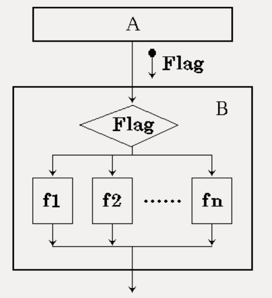
        > 如果一个模块通过传送开关,标志,名字等控制信号明显控制另一模块的功能
      * 公共耦合

        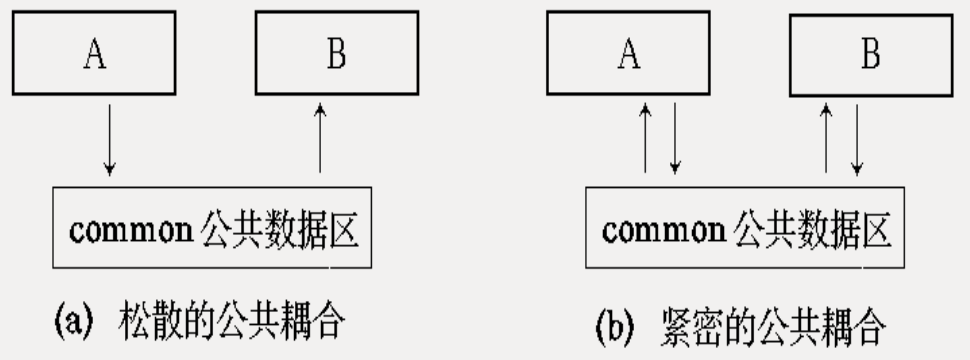
        > 一组模块都访问同一个公共数据环境(全局数据结构,共享通信区,内存的公共覆盖面),它们之间的耦合就是公共耦合
      * 内容耦合
        > 一个模块直接访问另一个模块的内部数据  
        > 一个模块不通过正常入口转到另一模块内部  
        > 两个模块有一部分程序代码重选  
        > 一个模块有多个入口
      * 原则
        * 尽量使用数据耦合
        * 少用控制耦合
        * 限制使用公共耦合(除非传递大量数据)
        * 完全不用内容耦合
    * 内聚

      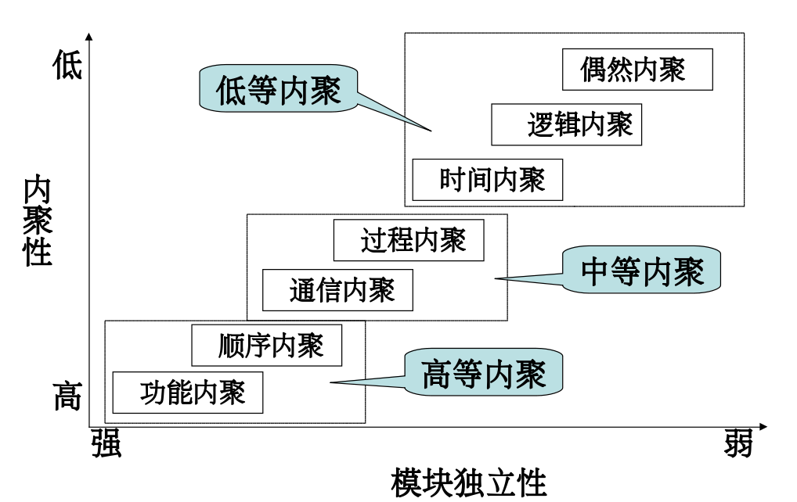
      > 模块功能强度的度量
      * 偶然内聚
        > 当模块内各部分之间没有联系,或者即使有联系,这种联系也很松散
        * 内容不易理解,河南描述其功能
        * 把完整的程序分隔到多个模块中,在程序运行时会频繁地互相调用
      * 逻辑内聚
        > 把几种相关的功能组合在一起,每次被调用时,由传送给模块的判定参数来确定该执行哪个功能
        * 不易修改,包含多个功能
        * 需传递控制参数(控制耦合)
        * 未用部分调入内存,影响效率
      * 时间内聚
        > 大多为多功能模块,但模块的各个功能的执行与时间有关,通常要求所有功能必须在同一时间段执行
      * 过程内聚
        > 如果一个模块内的处理是相关的,而且必须以特定次序执行
      * 顺序内聚
        > 一个模块中处理元素和统一功能密切相关,而且这些处理必须顺序执行
      * 功能内聚
        > 一个模块中各个部分都是完成某一具体功能必不可少的组成部分,或者说该模块中所有部分都是为了完成一项具体功能而协同工作
        * 容易修改和维护
    * 模块独立性应该是高内聚低耦合
3. 提高抽象层次
  > 抽象: 忽略一个主题中与当前目标无关的那些方面
  * 设计开始时,尽量提高软件的抽象层次
4. 复用性设计
  > 复用: 同一事物不做修改或稍加修改就可以多次重复使用
### 结构化设计
##### 设计的任务
  解决如何做的的问题,在需求分析的基础上,建立各种设计模型,并通过对设计模型的分析和评估来确定这些模型是否能够满足需求
* 体系结构设计
  > 体系结构设计定义软件的主要结构元素及其之间的关系
* 接口设计
  > 接口设计描述用户界面,软件和其他硬件设备,其他软件系统及使用人员的外部接口,以及各种构建之间的内部接口
* 数据设计
  > 根据需求阶段所建立的ER图来确定软件涉及的文件系统的结构及数据库的表结构
* 过程设计
  > 确定软件各个组成部分内的算法及内部数据结构,并选定某种过程的表达形式来描述各种算法

##### 结构化设计与结构化分析的关系

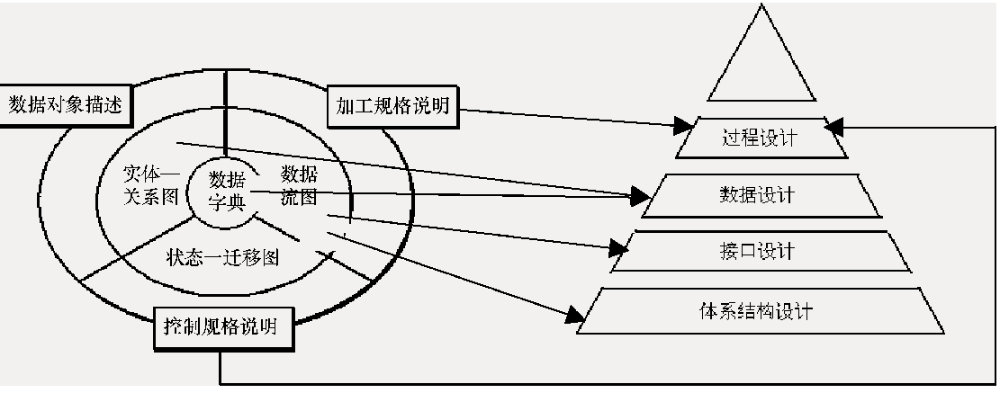

设计方法的实施要点
1. 研究,分析和审查数据流图
2. 根据数据流图决定问题的类型(变换型和事物型),针对不同的类型分别进行分析处理
3. 有数据流图推导出系统的初始结构图
4. 利用一些启发式原则来改进系统的初始结构图,知道得到符合要求的结构图为止
5. 根据分析模型中的实体关系图和数据字典进行数据设计,包括数据库设计或数据文件的设计
6. 在上面设计基础上,并根据分析模型中的加工规格说明,状态转移图进行过程设计
7. 制定测试计划

##### 模块结构及表示
> 一般通过功能划分过程来完成软件结构设计,功能划分过程从需求分析确立的目标系统的模型出发,对整个问题进行分割,使其每一部分用一个或几个软件模块加以解决

模块
> 结构化程序程序设计中的函数和子程序  
> 是程序语句按逻辑关系建立起来的组合体  
* 表示
  > 用矩形框表示
* 分类
  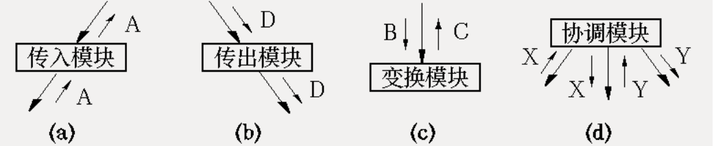
* 结构
  > 树状和网状

  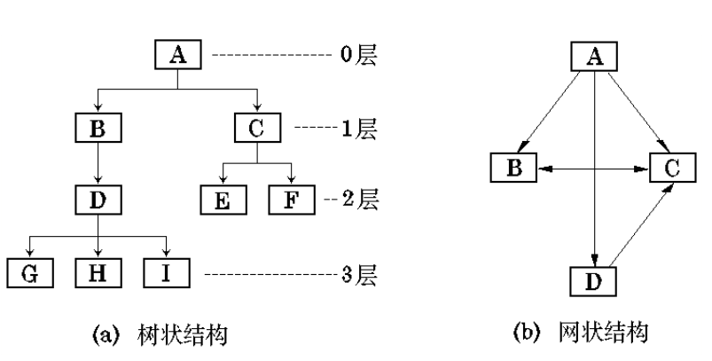
* 结构图
  > 精确到表达模块结构的图形表示工具
  * 调用关系和接口
    > 两个模块之间用单向箭头连接

    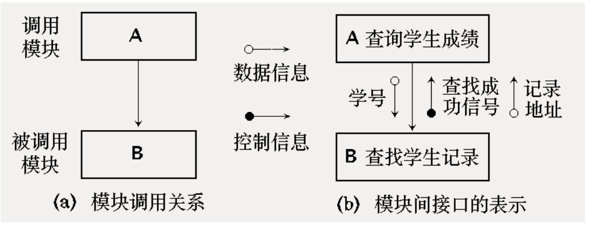
  * 信息传递
    > 当一个模块调用另一个模块时,调用模块把数据或控制信息传送给被调用模块,以使被调用模块能够云信
  * 条件调用和循环调用
    > 当模块A有条件地调用另一个模块B时,在模块A的箭头尾部标以一个菱形符号  
    > 当模块A反复地调用模块C和D时,在抵用箭头尾部标以一个弧形符号

    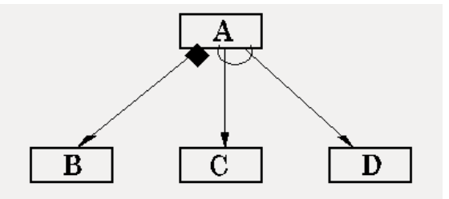
  * 形态特征
    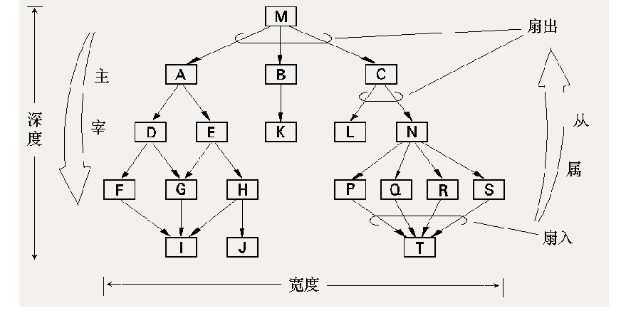

##### 数据结构及表示
> 数据各个元素之间逻辑关系的一种表示   
> 确定数据的组织,存取方式,相关程度,以及信息的不同处理方法

### 体系结构设计
##### 基于数据流方法的设计过程(过程驱动)
> 与软件需求分析阶段的结构化分析方法衔接,可以很方便地将用数据流图表示的信息转换成程序结构的设计描述

设计过程

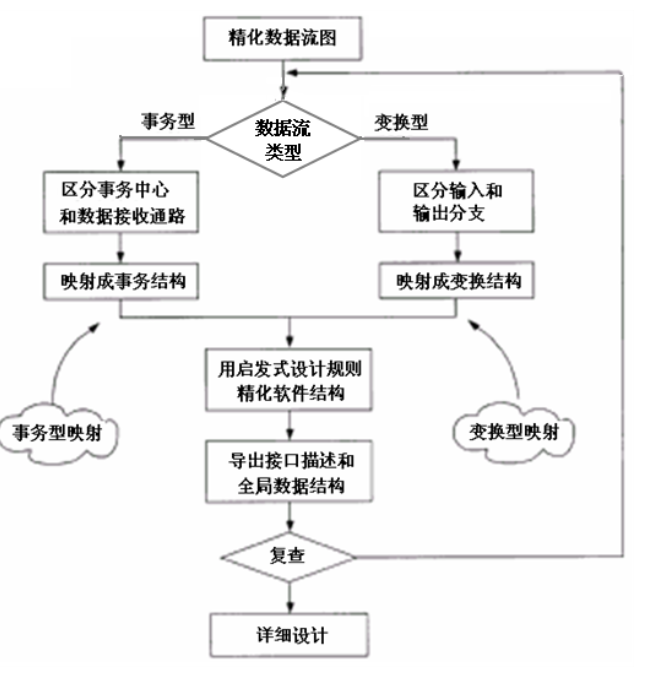
##### 典型的数据流类型和系统结构
> 一个系统中的所有数据流都可以认为是变换流,但当有明显事物特性的数据流时,建议用事物型映射方法

变换型数据流
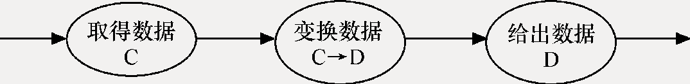
变换型系统结构图
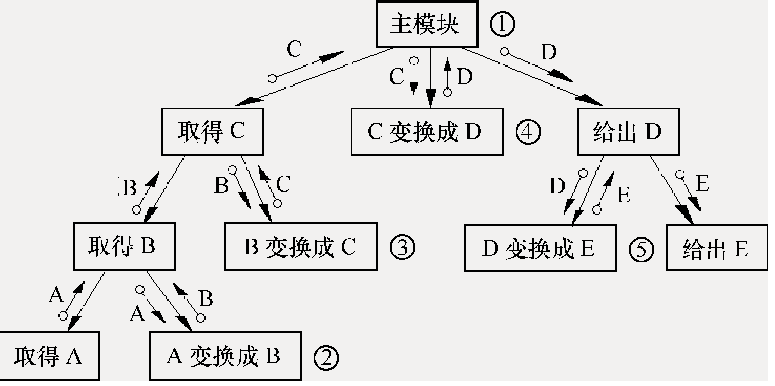

事物型数据流
> 通常接受一项事物,根据事物的特点和性质选择分派一个适当的处理单元,然后给出结果

> 事物处理中心(分派部件): 完成选择分配任务的部分

事务型系统结构图
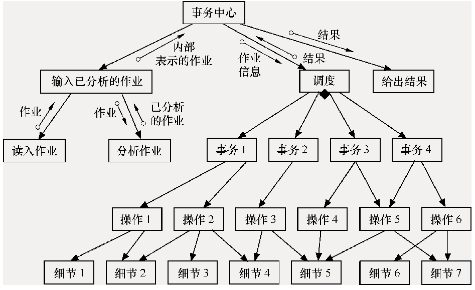

简化的事物型结构图
> 如果调度模块不复杂,可将其归入事物中心模块

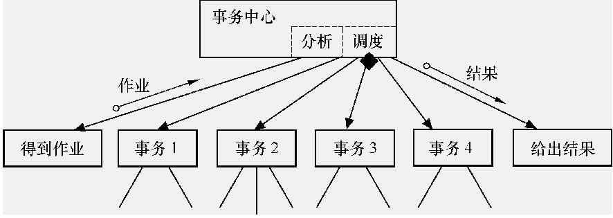
##### 交换型映射方法
> 系统数据处理问题的处理流程总能表示为交换型数据流图, 进一步可采用变换型映射方法建立系统的结构图

步骤:
1. 重数据流图
  > 在需求分析阶段得到的数据流图侧重于描述系统如何加工数据,而重画数据流图的出发点是描述系统中的数据如何流动
2. 在数据流图上区分系统的逻辑输入,逻辑输出和中心变换部分

  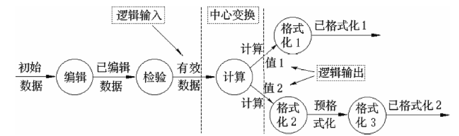
3. 进行一级分解,设计系统模块结构的顶层和第一层
  > 自顶向下设计关键是找出系统树形结构图的根或顶层模块
  * 首先设计主模块,并用程序的名字命名,然后画在中心变换相对的位置上
  * 第一层设计:
    > 为每个逻辑输入设计一个输入模块,功能是为主模块提供数据  
    > 为每个逻辑输出设计一个输出模块,功能是为主模块输出数据  
    > 为中心变换设计一个变换模块, 功能是将逻辑输入转换成逻辑输出

4. 进行二级分解,设计中,下层模块
  > 工作是自顶向下,逐层细化,为每一个输入模块,输出模块,变换模块设计它们的模块  
  > 顺序是任意的,但一般是先设计输入模块的下层模块
##### 事务型映射方法
事务分析方法的步骤
1. 识别事务源
  > 利用数据流图和数据词典,从问题定义和需求分析的结果中,找出各种需要处理的事务
2. 规定适当的事务型结构
  > 确定了该数据流图具有事务型特征后,根据模块划分理论,建立适当的事务型结构
3. 识别各种事务和它们定义的操作
4. 注意力用公用模块
5. 建立事务处理模块
  > 对每一事务,或对联系密切一组事务,建立一个事务处理模块
6. 对事物处理模块规定它们全部的下层操作模块
7. 对操作模块规定它们的全部细节模块
##### 软件模块结构的改进方法
1. 模块功能的完善化
  * 执行规定的功能部分
  * 出错处理的部分
  * 如果需要返回一系列数据给它的调用者,在完成数据加工或结束时,返回调用者一个结束标志
2. 消除重复功能,改善软件结构
  * 完全相似(只在数据类型上不一致)
    > 完全合并
  * 局部相似
  * 模块的作用范围应在控制范围之内
    > 作用范围: 模块内一个判定的作用范围,凡是受这个判定影响的所有模块都属于这个判定的作用范围  
    > 控制范围包括它本身及其所有的从属模块
    * 处理方法:
      * 将判定所在模块合并到父模块中,使判定处于较高层次
      * 将受判定影响的模块下移到控制范围内
      * 将判定上移到层次中较高的位置
3. 尽可能减少高扇出结构,随着深度增大扇入
  > 扇出数: 模块调用子模块的个数,数目过大意味着需要协调和控制过多的下属模块,应适当增加中间层次的控制模块  
  > 扇入数过大说明共享该模块的上级模块数目多
4. 避免或减少使用病态连接

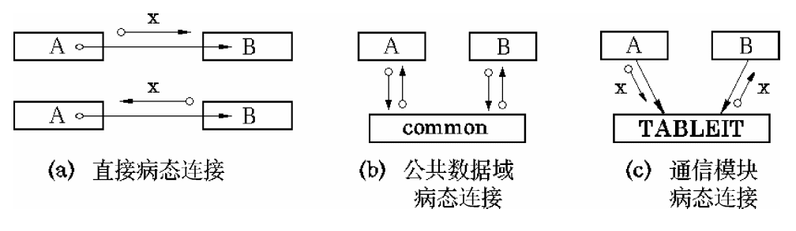

5. 模块大小要适中
  > 模块中所含语句数量的多少来权衡

##### 接口设计
> 依据是数据流图中的自动化系统边界  

3方面:
* 模块或软件构件间的接口设计
* 软件与其他软硬件系统之间的接口设计
* 软件与人之间的交互设计

设计详细的交互
* 一致性
* 操作步骤少
* 不要哑播放
* 提供Undo功能
* 减少人脑的记忆负担
* 调高学习效率
### 数据设计
文件设计
  * 适用情况:
    * 数据量较大的非结构化数据
      > 多媒体信息
    * 数据量大,信息松散
      > 历史记录,档案文件
    * 非关系层次化数据
      > 系统配置文件
    * 对数据的存取速度要求极高的情况
    * 临时存放数据
  * 组织方式
    * 顺序文件
      > 连续文件,串联文件
    * 直接存取文件
      > 根据记录关键字的值,通过计算直接得到记录的存放地址
    * 索引顺序文件
      > 基本数据记录按顺序文件组织,记录排列顺序按关键字值升序或降序安排,且具有索引部分
    * 分区文件
      > 存放程序,有若干称为成员的顺序组织的记录组和索引组成
    * 虚拟存储文件
      > 基于操作系统的请求页式存储管理功能而建立的索引顺序文件

数据库设计
  * 数据对象实体的映射
    > 一个数据对象(实体)可以映射为一个表或多个表,采用横切和竖切的方法
    * 横切
      > 用于记录与时间相关的对象 
    * 竖切
      > 用于实例较少而属性较多的对象
  * 关系的映射
    * 一对一
    * 一对多
    * 多对多

### 过程设计(详细设计阶段)
> 决定各个模块的实现算法,并使用过程描述工具精确地描述这些算法

##### 过程描述工具
* 图形工具
  > 把过程的细节用图形的方式描述出来
* 表格工具
  > 用一张表来表达过程的细节
* 语言工具

##### 设计的概念
结构化: 如果一个程序的代码块仅仅通过顺序,选择和循环这三种控制结构进行连接,并且每个代码块只有一个入口和出口

##### 主要原则
* 使用语言中的顺序,选择,重复等有限的基本控制结构表示程序逻辑
* 选用的控制结构只准许有一个入口和一个出口
* 程序语句组成容易识别的块,每块只有一个入口和一个出口
* 复杂结构应该用节本控制接口进行组合嵌套来实现
* 语言中没有控制接口,可用一段等价的程序段模拟,但要求程序段在整个系统中应前后一致
* 严格控制goto语句
* 在程序设计过程中,尽量采用自顶向下,逐步细化的原则

##### 程序流程图
基本控制结构

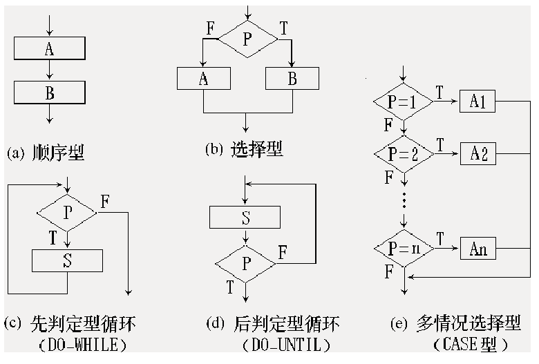

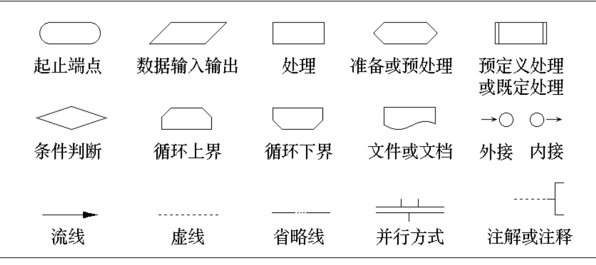

* 顺序型
* 选择型
* 先判定型循环
  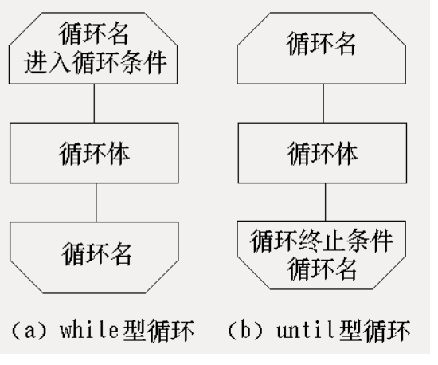
  > 条件成立时,重复执行
* 后判定型循环
  > 重复执行某些特定加工,直至控制条件成立
* 多情况型选择
  > case

##### N-S图(盒图)
基本控制结构
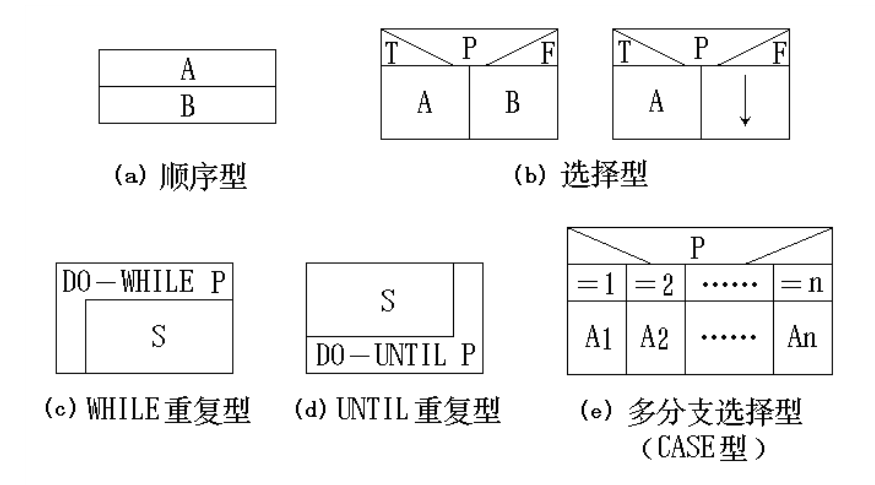

特点
* 每个矩形框明确定义功能域(除了case)
* 控制转移不能任意规定
* 很容易确定局部数据和全局数据域
* 很容易表现嵌套关系和模块层次结构

##### PAD图
基本控制结构
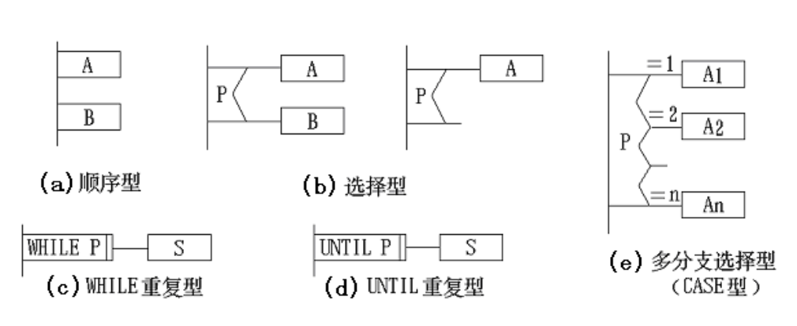

优点
* 使用PAD符号设计出来的程序必定是结构化程序
* 程序结构清晰,图中的竖线总条数就是程序的层次数
* 程序逻辑易读,易懂,易记
* 容易将PAD图自动转换为高级语言源程序
* 既表示程序逻辑,也用于描绘数据结构
* 支持自顶向下,逐步求精方法使用

##### 伪代码

##### 自顶向下,逐步细化设计过程
两个方面:
* 将复杂问题的解法分解和细化成由若干个模块组成的层次结构
* 将每个模块的功能逐步分解细化为一系列的处理

优点:
* 自顶向下,逐步求精方法符合人们解决复杂问题的普遍规律,可提高软件开发的成功率和生产率
* 先全局后局部,先整体后细节,先抽象后具体的逐步求精的过程开发具有清晰的层次结构,程序易读
* 程序自顶向下,逐步细化,分解成树形结构,在同一层的节点上做细化工作,相互之间没有关系,因此它们之间细化工作相互独立.
* 程序清晰,模块化
* 有利于组织分工
### 软件设计规格说明
