# 面向对象方法与UML
### 面向对象的概念与开发方法
#### 对象
> 包含现实世界物体特征的抽象实体,反映了系统为之保存信息和与它交互的能力

概念
* 现实生活中对象指的是可观世界的实体
* 程序中对象是一组变量和相关方法的集合,其中变量表明对象的状态,方法表明对象所具有的行为
  * 程序中对象
    * 物理对象
      > 最易识别的对象,通常可以在问题领域的描述中找到
    * 角色
      > 一个实体的角色也可以抽象成以个单独的对象  
      > 角色对象操作是由角色提供的技能
    * 事件
      > 某种活动的一次"出现"  
      > 事件对象的操作主要用于对数据的存取
    * 交互
      > 表示在两个对象之间的关系
    * 规格说明

对象名格式
> 均带下划线
* 对象名:类名
* :类名
* 对象名

#### 类
> 将现实生活中的对象经过抽象,映射为程序中的对象

#### 封装
> 利用抽象数据类型将数据和基于数据的操作封装在一起  
> 信息隐蔽技术
* 定义
  * 清楚的边界
    > 所有对象的内部信息被限定在某个边界内
  * 接口
    > 对象向外界提供的方法,外界可以通过这些方法与对象进行交互
  * 受保护的内部实现
    > 软件对象功能的实现细节

#### 继承
> 为类的重用提供了方便,提供了明确表述不同类之间共性共性的方法  
> 一种联结类的层次模型

#### 多态
> 根据为请求提供服务的对象不同可以得到不同的行为
* 动态绑定(后期绑定,运行时绑定)
  > 在运行时对类进行实例化,并调用与实例化对象相应的方法
* 通常在子类中覆盖父类的方法实现多态

#### 消息通信
* 发送给一个对象的信息定义了一个方法名和一个参数表,并指定某一个对象
* 一个对象接收到信息,则调用信息中指定的方法,并将形式参数与参数表中的值结合起来

#### 面向对象的开发方法
特征:
* 方法的唯一性
  > 方法是对软件开发过程所有阶段进行综合考虑而得到的
* 从生存期的一个阶段到下一个阶段的高度连续性
  > 生存期后一阶段的成果只是在前一阶段成果的补充和修改
  * 将面向对象分析(OOA),面向对象设计(OOD)和面向对象程序设计(OOP)集成到生存期的相应阶段

方法:
* Rumbaugh方法
  > 用于分析,系统设计和对象级设计
  * 对象模型
    > 描述对象,类,层次和关系
  * 动态模型
    > 描述对象和系统的行为
  * 功能模型
    > 描述穿越系统的信息流
* Coad和Yourdon方法
* Booch方法
  > 包含微开发过程和宏开发过程两个过程
* Jacobson方法
  > 特别强调使用用例--用以描述用户和产品或系统间如何交互的场景
  
### UML(Unified Modeling Language)简介
#### UML特点
* 统一标准
  > 统一了Booch,OMT和OOSE等方法中的基本概念,还吸取了面向对象技术领域中其他流派的长处
* 面向对象
  > 支持面向对象技术的主要概念,提供了一批基本的表示模型元素的图形和方法,简洁明了地表达面向对象的各种概念和模型元素
* 可视化,表达能力强大
  > 图形化语言
* 独立于过程
  > UML是系统建模的语言,不依赖于特定的开发过程
* 容易掌握使用
  > 概念明确,建模表示法简介明了,图形结构清晰,容易掌握使用
* 与编程语言的关系
  > 可以根据UML所建立的系统模型自动产生Java,C++等代码框架
### UML的基本模型

#### UML事物
> 事物是对模型中最具代表性成分的抽象

四类事物:
* 结构事物
  > UML模型的静态部分,主要用来描述概念的或物理的元素
  * 类

    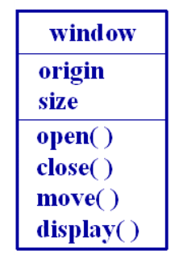
    > 带有类名,属性和操作的矩形框表示
  * 主动类
    
    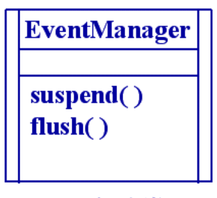
    > 实例应具有一个或多个进程或线程,能够启动控制活动
  * 接口

    
    > 描述了一个类或构件的一组外部可用的服务(操作)集   
    > 是一组操作的描述,而不是操作的实现
  * 对象

    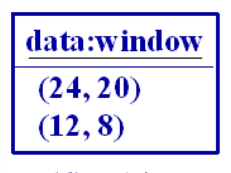
    > 对象是类的实例,名字下边加下划线,对象的属性值需明确给出
  * 用例(用况)
    
    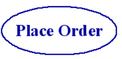
    > 用于表示系统想要实现的行为,即描述一组动作序列(即场景)
  * 参与者
    
    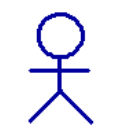
    > 指与系统有信息交互关系的人,软件系统或硬件设备
  * 协作

    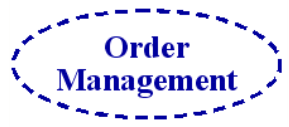
    > 协作定义交互,描述一组角色实体和其他实体如何通过协同工作来完成一个功能或行为
  * 构件(组件)
  
    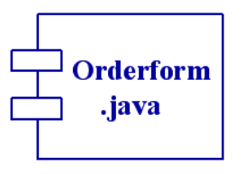
    > 系统中物理的,可替代的部件,通常是描述一些逻辑元素的物理包
  * 节点
    
    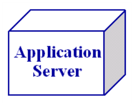
    > 运行时存在的物理元素,代表一种可计算的资源,具有一定的记忆能力和处理能力
* 行为事物
  > 动态部分
  * 交互

    
    > 交互由特定的上下文环境中共同完成一定任务的一组对象之间传递的消息组成  
    > 涉及的元素包括消息,动作序列和链
  * 状态机
    
    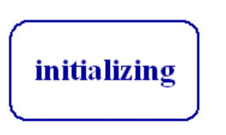
    > 描述了一个对象或一个交互在生存周期内响应事件所经历的状态序列,
* 分组事物
  > 是UML的组织部分,作用是为了降低模型复杂度

  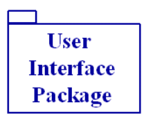
  > 把模型元素组织成组的机制,结构事物,行为事物甚至其他分组事物都可以放进包内
* 注释事物
  > UML的解释部分,描述和标注模型的任何元素

  
#### UML关系
* 依赖
  > 一个事物发生变化会影响到另一个事物的语义 

  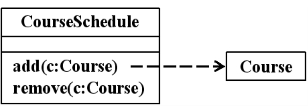
  > 虚线箭头的方向从源事物指向目标事物,表示源事物依赖于目标事物
* 关联
  > 描述了两个或多个类的实例之间的连接关系,是一种特殊的依赖
  * 普通关联
    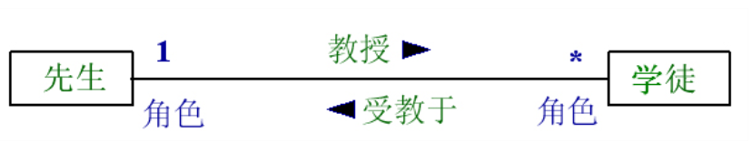
    * 多重性
      > 表明在一个关联的两端连接的类实例个数的对应关系,即一端的类的多少个实例对象可以与另一端的类的一个实例相关
    * 多重关联
      > 指3个或3个以上类之间的关联
  * 限定关联
    > 通常在一对多或多对多的关联关系中,可以把模型中的多重性从一对多变成一对一或将多对多简化为多对一

    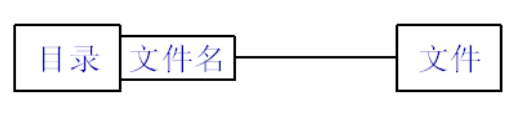
  * 关联类
    > 在某些情况下,需要对关联关系的语义做详细的定义,存储和访问,为此可建立关联类,用来描述关联的属性

    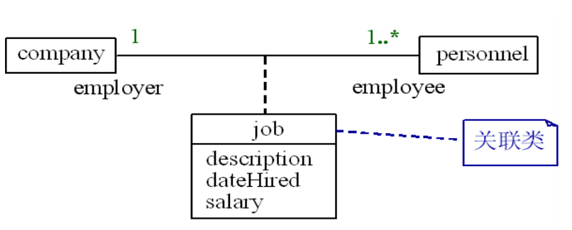
  * 聚合(聚集)
    > 描述了整体和部分之间的关系
    * 共享聚合
      > 如果在聚合关系中处于部分方的实例可同时参与多个处于整体方实例的构成,则该聚合称为共享聚合

      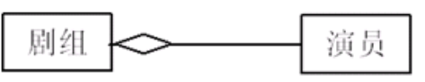
    * 复合聚合
      > 如果部分类完全隶属于整体类,部分类需要与整体类共存,一旦整体类不存在了,则部分类也会消失
      
      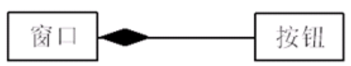
  * 导航
    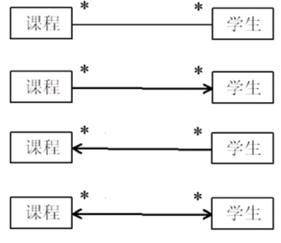
* 泛化
  > 类和特殊类之间的继承关系,泛化针对类型而不针对实例  
  > 一般类:泛化类; 特殊类:特化类
  * 普通泛化
    > 与之前的继承基本相同,但常遇到抽象类
    * 多重继承
    * 单继承
  * 受限泛化
    > 泛化具有约束条件
    * 4种约束
      * 交叠
      * 不相交
      * 完全
      * 不完全
* 实现关系
  > 泛化关系和依赖关系的结合,也是类之间语义关系
  * 出现实现关系的情况
    * 接口和实现它们的类或构件之间
    * 用例和时间它们的协作之间
#### UML图
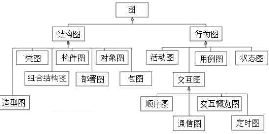

* 用例图
  > 描述的是外部执行者所理解的系统功能  
  > 用例模型用于需求分析阶段,它的建立是系统开发者和用户反复讨论的结果,描述了开发者和用户对需求规格达成的共识
  * 主要元素
    > 用例+执行者
* 类图
  > 描述类和类之间的静态关系  
  > 是构建其他图的基础
* 交互图
  * 顺序图
    > 描述对象之间的动态交互关系,着重表现对象间消息传递的时间顺序
    * 三种消息
      * 简单消息
        > 简单的控制流,只是表示控制从一个对象传给另一个对象,没有描述通信的任何细节
      * 同步消息
        > 表示嵌套的控制流,操作的调用是一种典型的同步消息,调用者发出消息后必须等待信息返回,只有当处理消息的操作执行完毕后,调用者才可以继续执行自己的操作
      * 异步消息
        > 表示异步控制流,发送者发出消息后不用等待消息处理玩既可以继续执行自己的操作
  * 协作图
* 通信图
  > 用于描述相互协作的对象间的交互关系和链接关系
* 状态图
* 活动图
  > 捕捉用例的活动  
  > 是一个流图,是另一种描述交互的方式
* 构件图
  > 描述软件构件及构件之间的依赖关系,显示代码的静态结构
* 部署图
  > 描述处理器,设备和连接,显示系统硬件的物理的拓扑结构在此结构上执行的软件
### 使用和扩展UML
#### 使用UML的准则
* 不要试图使用所有的图形和符号
* 不要为每个事物画一个模型
* 应该分层次地画模型图
* 模型应该具有协调性
* 模型和模型元素的大小应该适中
#### 扩展UML
* 构造型
  > 在一个已定义的模型元素的基础上构造一种新的模型元素
* 标记值
  > 用来存储元素的任意信息
* 约束
  > 文字表达式表达语义限制
