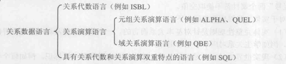
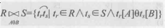

# 关系数据库
## 2.1 关系
#### 域
> 一组具有相同数据类型的值的集合  
> 一个域允许的不同取值的个数称作这个域的**基数**
#### 笛卡儿积
> 定义在域上的一种运算  
> $D_1 \times D_2 \times ... \times D_n =\{(d_1,d_2,...,d_n) |d_i \in D_i, i=1,2,...,n\}$  
> 其中：$(d_1,d_2,...,d_n)$ 称作n元组（简称元组），$d_i$称作该元组的分量
#### 关系
> $D_1 \times D_2 \times ... \times D_n$的**子集**叫做在域$D_1, D_2,...,D_n$上的**关系**,表示为$R(D_1, D_2,...,D_n)$,其中n是关系的**目**或**度**; n目关系必定有n个属性  
> **候选码**—— 关系中的某一属性组的值能唯一表示一个元组,而其子集不能,则该属性组则为候选码  
> **主属性/非主属性(非码属性)**—— 候选码的各个属性,否则称为非主属性(非码属性)  
> **全码**—— 所有属性都是关系的候选码
> **主码**—— 若一个关系中有多个候选码,则选定其中一个为主码
##### 关系类型
> 关系分为:基本关系(基本表或基表),查询表和视图表,其中
> * 基本关系 —— 实际存在的表,实际存储数据的逻辑表示,性质如下:
> 1. 列是同质的,即同一属性的值同域
> 2. 不同列可出自同一个域,不同的属性要给予不同的属性名
> 3. 行列的次序无关紧要
> 4. 任意两个元组的候选码不能取相同的值
> 5. 分量必须为原子值
#### 关系模式
> 关系的描述成为关系模式,它可以形式化地表示为R(U,D,DOM,F),简记R(U),其中  
> R表示关系名,U为组成该关系的属性名集合,D为U中属性所来自的域,DOM为属性向域的影响集合,F为属性间数据的依赖关系  
> **关系是关系模式在某一时刻的状态或内容,即关系是动态的,而关系模式是静态的**
#### 关系数据库
> 关系数据库的型称为关系数据库模式,是对关系数据库的描述  
> 关系数据库的值是某一时刻对应的关系集合
## 2.2 关系操作
> 关系操作分为查询操作和插入,删除,修改操作**两大操作**  
> 关系操作的特点是集合操作方式,操作的对象和结果都是集合,这种操作方式也称作一次一集合的方式
#### 查询操作
> 查询的操作分为:选择(select),连接(join),除(divide),差(except),并(union),交(intersection),笛卡儿积等  
> 基本操作为: 选择,投影,并,差,笛卡儿积这五种
#### 关系数据语言的分类

> 关系数据语言分为**关系代数**和**关系演算**  
> **关系代数** —— 对关系的运算表达查询要求  
> **关系演算** —— 用谓词来表达查询要求;关系演算又可按谓词变元的基本对象分为元组关系演算和域关系演算
## 2.3 关系的完整性
> 关系模型中三类完整性约束: **实体完整性**, **参照完整性**, **用户定义完整性**。其中：实体完整性和参照完整性是必须满足的两个完整性约束,被称作**关系的两个不变性**
#### 实体完整性
> **实体完整性规则: 若属性(指一个或一组属性)A是基本关系R的主属性，则A不能取空值**  
> 空值 --- 指"不知道"或"不存在"或"无意义"的值
#### 参照完整性
> 设F是基本关系R的一个或一组属性,但不是关系R的码,$K_s$是基本关系S的主码。如果F和$K_s$相对应,则称F是R的外码,并称基本关系R为参照关系,基本关系S为被参照关系或目标关系  
> 参照完整性规则 --- 若属性(或属性组)F是基本关系的外码,它和基本关系S的主码$K_s$相对应(R和S不一定是不同关系),则对于R中每个元组在F上的值必须:
> * 取空值
> * 等于S中某个元组的主码值
#### 用户定义的完整性
> 用户自定规则 
## 2.4 关系代数
* 关系代数运算
> 传统的集合运算和专门的关系运算两类
* 传统集合运算

| 运算符             | 含义                                                    |
|--------------------|---------------------------------------------------------|
| 并($\cup$)         | $R\cup S=\{t\mid t\in R\vee t\in S\}$                   |
| 交($\cap$)         | $R\cap S=\{t\mid t\in R\land t\in S\}$                  |
| 差($-$)            | $R-S=\{t\mid t\in R\land t\notin S\}$                   |
| 笛卡儿积($\times$) | $R\times S=\{t_{r}t_{s}\mid t_r \in R \land t_s\in S\}$ |
* 专门关系运算

> 设关系模式R($A_1,A_2,\dots ,A_n$),它的一个关系设为R,其中R为n目关系,S为m目关系  
>* $t\in R$表示t是R的一个**元组**  
>* $t[A_i]$表示元祖t中相应于属性$A_i$的一个**分量**  
>* 若$A=\{A_{i1},A_{i2},\dots ,A_{ik}\}\subseteq R$,则A称为**属性列或属性组**
>* $t[A]=(t[A_{i1}],t[A_{i2}],\dots ,t[A_{ik}])$表示元组t在属性列A上各个分量的集合
>* $\bar{A}=R-A$表示**剩余的属性组**
>* 若$t_r\in R,t_s\in S , \overset{{\frown}}{{t_r}{t_s}}$称为元组的**连接或串接**
>* 给定一个关系R(X,Z),X和Z为属性组。当$t[X]=x$时,$x$在R中的象集定义为$Z_x=\{t[Z]\mid t\in R
,t[X]=x
\}$

| 运算符              | 含义                                                                                       | 补充                                                                   |
|---------------------|--------------------------------------------------------------------------------------------|------------------------------------------------------------------------|
| 选择/限制($\sigma$) | $\sigma_F(R)=\{t\mid t\in R\land F(t)=True\}$                                              | F的基本形式为$X_1\theta Y_1$,其中$\theta$表示逻辑运算符                |
| 投影($\prod$)       | $\prod_A(R)=\{t[A]\mid t\in R\}$                                                           | 投影后不仅取消了原关系中的某些列,同时也会将重复的元组合并成一个        |
| 连接/$\theta$连接   |                                                                      | A和B分别为R和S上列数相等且可比的属性组;                                |
| 等值连接            | $\theta$为"="                                                                              |                                                                        |
| 自然连接            | 特殊的等值连接                                                                             | 比较的分量必须是同名的属性组,并且结果中把重复的属性列去掉              |
| 外连接              | 把悬浮元组保存在结果关系中,缺失的属性设为NULL                                              | 外连接                                                                 |
| 左外连接            | 只保留左边关系R中的悬浮元组                                                                |                                                                        |
| 右外连接            | 只保留右边关系S中的悬浮元组                                                                |                                                                        |
| 除运算$\div$        | $R\div S=\{t_r[X]\mid t_r\in R\land \prod_\gamma(S) \subseteq Y_x\},其中Y_x未x在R中的象集$ | R(X,Y)和S(Y,Z),其中R中的Y与S中的Y可以有不同的属性名,但必须出自相同域集 |

