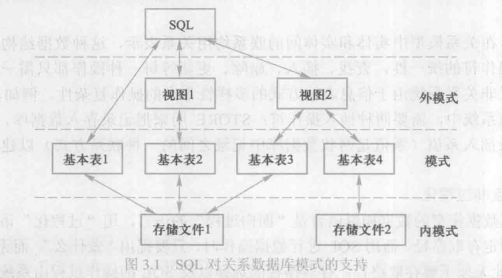
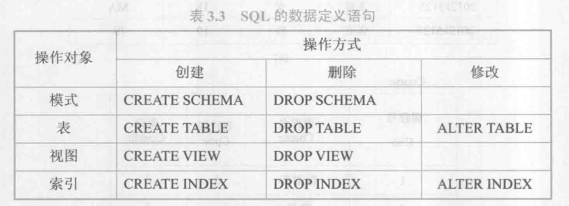
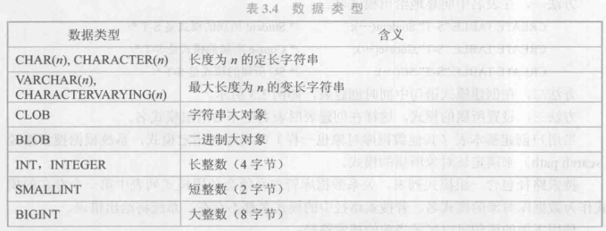
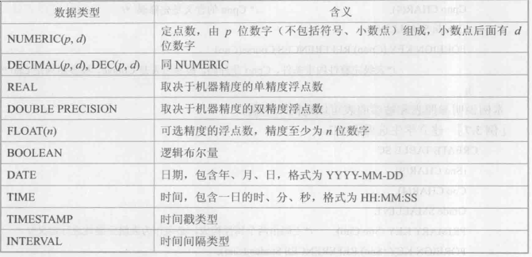
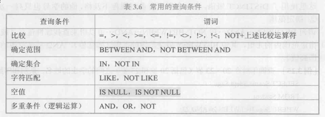
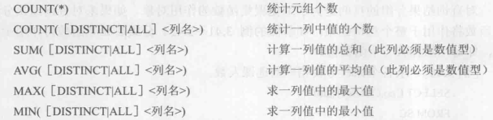
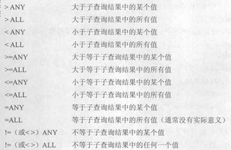
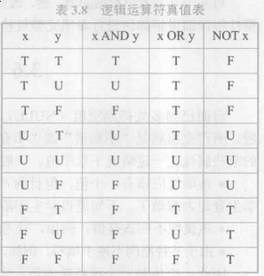

# 关系数据库标准语言SQL
> SQL(Structured Query Language) --- 结构化查询语言
## 3.1.2 SQL特点
1. 综合统一
> SQL集数据定义语言,数据操纵语言,数据控制语言的功能于一体,语言风格统一,可独立完成数据库生命周期中的全部活动
2. 高度非过程化
> 只要提出"做什么",无需指明"怎么做",因此无须了解存取路径.存取路径的选择以及SQL的操作过程由系统自动完成
3. 面向集合的操作方式
4. 以同一种语法结构提供多种使用方式
> 不仅作为独立语言能够独立地用于联机交互使用方式;还能作为嵌入式语言嵌入高级语言程序中,且SQL的语法结构基本上一致
5. 语言简洁,易学易用

## 3.1.3 SQL基本概念

>* 基本表是本身独立的表,一个或多个基本表对应一个存储文件,一个表可以带若干索引,索引也存在存储文件中  
>* 存储文件的逻辑结构组成了关系数据库的内模式,存储文件的物理结构对最终用户是隐蔽的
>* 视图是由一个或几个基本导出的表,本身不存储在数据库中;数据库值存放视图的定义而不是对应的数据,是虚表
## 3.3 数据定义 

> SQL标准不提供修改模式定义和修改视图定义操作,如果想修改这些对象,只能先将它们删除再重建  
> SQL标准没有提供索引相关的语句  
> 一个关系数据库管理系统的实例中可以创建多个数据库,一个数据库可以建立多个模式,一个模式下通常包括多个表,视图和索引等数据库对象
#### 具体定义
* 定义模式
~~~language
CREATE SCHEMA <模式名>AUTHORIZATION<用户名> [<表定义字句>|<视图定义字句>|<授权定义字句>]
~~~
> 若没有指定模式名,模式名隐含为用户名  
> 定义模式实际上定义了一个命名空间
* 删除模式
~~~language
DROP SCHEMA <模式名><CASCADE|RESTRICT>
~~~
> CASCADE(级联),表示在删除模式的同时把该模式中所有的数据库对象全部删除  
> RESTRICT(限制),表示该模式已经定义了下属的数据库对象(如表,视图),则拒绝该删除语句执行
* 定义基本表
~~~language
CREATE TABLE<表名> (<列名> <数据类型> [列级完整性约束条件],
[<列名> <数据类型> [列级完整性约束条件]]
...
[,<表级完整性约束条件>]);
~~~
> 如果完整性约束条件涉及该表多个属性列,则必须定义在表级上
* 数据类型

* 修改基本表
~~~language
ALTER TABLE<表名>
[ADD [COLUMN] <新列名><数据类型> [完整性约束]]
[ADD <表级完整性约束>]
[DROP [COLUMN] <列名> [CASCADE|RESTRICT]]
[DROP CONSTRAINT<完整性约束> [CASCADE|RESTRICT]]
[ALTER COLUMN <列名><数据类型>];
~~~
> 当删除列时,如果参数为RESTRICT且该列被其他对象引用,则拒绝删除;如果为CASCADE,则自动删除该列的其他对象
* 删除基本表
~~~language
DROP TABLE <表名> [RESTRICT|CASCADE];
~~~
> 如果选择RESTRICT,该表不能被其他约束所引用(如CHECK,FOREIGN KEY等约束),不能有视图,不能有触发器,不能有存储过程或函数等  
> 若选择CASCADE, 在删除该表的同时,相关的依赖对象也会被删除
* 索引的建立与删除
> * 顺序文件索引: 针对制定属性值升序或降序存储关系,在该属性上建立一个顺序索引文件  
> * B+树索引(动态平衡):将索引属性组织成组织成B+树形式,B+树的叶结点为属性值和对应的元祖指针  
> * 散列索引(查找速度快): 建立若干个桶,将索引属性按照其散列函数数值映射到相应桶中,桶中存放索引属性值和相应的元祖指针  
> * 位图索引: 用位向量记录索引属性中可能出现的值

1. 建立索引
~~~language
CREATE [UNIQUE] [CLUSTER] INDEX <索引名>
ON <表名>(<列名> [<次序>] [, <列名>[<次序>]] ...);
~~~
> * <表名>是要建索引的基本表的名字  
> * <次序>制定索引值的排序次序,其中ASC为升序,DESC为降序
> * UNIQUE 表明此索引的每一个索引值只对应唯一的数据记录
> * CLUSTER 表示建立的索引是聚簇索引

2. 修改索引
~~~language
ALTER INDEX <旧索引名> RENAME TO <新索引名>
~~~

3. 删除索引
~~~language
DROP <索引名>
~~~

* 数据查询

~~~language
SELECT [ALL|DISTINCT] <目标列表达式> [,<目标列表达式>] ...
FROM <表名或视图名> [,<表名或视图名>]|(<SELECT 语句>)[AS]<别名>
[WHERE<条件表达式>]
[GROUP BY <列名1> [HAVING <条件表达式>]]
[ORDER BY <列名> [ASC|DESC]];
~~~
> * ALl(默认):不去重; DISTINCE:去重  
> * BETWEEN ... AND ...  :查找属性在指定范围内的元组,若取反,前面加NOT  
> * IN(): 查找属性值属于集合的元组,若取反,前面加NOT  
> * [NOT] LIKE '<匹配串>' [ESCAPE '<换码字符>']: 
>   >查找指定的属性列值与<匹配串>相匹配的元组,其中<匹配串>可以是完整的字符串,也可以是含通配符%和_其中
>   > * %代表任意长度的字符串
>   > * _代表任意单个字符
>   > ESCAPE 指定某个字符为换码字符
> * ORDER BY: 查询结果按照一个或多个属性列的升序(ASC)或降序(DESC)排列,默认升序
>   * 如果是多个属性列,会先比较第一个属性然后再依次比对剩下的属性
> * 聚集函数  
> 
>   >当聚集函数遇到空值时候,除了COUNT(*)外,都跳过空值  
>   >WHERE字句中不能使用聚集函数,聚集函数只能用于SELECT子句和GROUP BY中的HAVING子句
> * GROUP BY 将查询结果按一列或多列的值分组,值相等的一组

* 连接查询
  1. 等值与非等值连接查询
    > WHERE子句中用连接两个表的条件称为连接条件或连接谓词
    ~~~language
    [<表名 1>.] <列名1><比较运算符> [<表名2>.] <列名2>
    ~~~
    >当连接运算符为=时,称为等值连接,否则为非等值连接; 连接谓词中的列名称称为连接字段
  2. 自身连接
  3. 外连接
      1. 左外连接
        ~~~language
        FROM <table1> LEFT OUTER JOIN <table2> 
        ON [条件语句]
        ~~~
        
      2. 右外连接
        ~~~language
        FROM <table1> RIGHT OUTER JOIN <table2> 
        ON [条件语句]
        ~~~
  4. 多表连接
* 嵌套查询
  > 将一个查询块嵌套在另一个查询块WHERE子句或HAVING短语条件中
    1. 带有IN谓词的子查询
        * 不按相关子查询
          > 子查询的查询条件不依赖于父查询
        * 相关子查询
          > 子查询的查询条件依赖于父查询
    2. 带有比较运算符的子查询
    > 内层查询返回单值
    3. 带有ANY(SOME)或ALL谓词的子查询

    

    > 内层查询返回多值  
    > 使用ANY或ALL谓词时必须同时使用比较运算符
    4. 带有EXISTS谓词的子查询
    > 带有EXISTS谓词的子查询不返回任何数据,只产生逻辑真"true"或逻辑假"false"  
    > 若内层查询结果非空,则外层WHERE返回true,否则返回false
* 集合查询
 ~~~language
 [SELECT....] UNION/INTERSECT/EXCEPT [SELECT ...]
 ~~~
> UNION(并集),INTERSECT(交集),EXCEPT(差集)  
> UNION ALL: 不去掉重复元组
* 基于派生表的查询
> 派生表: 出现在FROM的子查询  
> 派生表必须别名

* SELECT语句一般格式
~~~language
SELECT [ALL|DISTINCT] <目标列名表达式> [别名] [,<目标列表达式> [别名]] ...
FROM <表名或视图名> [别名] [,<表名或视图名> [别名]] ... | (SELECT 语句>) [AS] <别名>
[WHERE <条件表达式>]
[GROUP BY <列名1> [HAVING<条件表达式>]]
[ORDER BY <列名2> [ASC|DESC]];
~~~

* 数据更新
~~~language
INSERT
INTO <表名> [(<属性列1> [,<属性列2>] ...)]
VALUES(<常量1> [,<常量2>] ...);
~~~
> INTO子句中没有出现的属性列,新元组在这些列上将取空值(默认值)  
  * 插入子查询结果
  ~~~language
  INSERT
  INTO<表名> [(<属性列1> [,<属性列2>])]
  子查询;
  ~~~
* 修改数据
~~~language
UPDATE<表名>
SET <列名> = <表达式> [,<列名>=<表达式>] ...
[WHERE<条件>];
~~~
* 删除数据
~~~language
DELETE
FROM <表名>
[WHERE<条件>];
~~~

* 空值的处理
> 空值的判断: IS NULL 或 IS NOT NULL  
> 空值的运算: 

> * 空值与另一个值的而运算为空值
> * 空值与另一个值的比较运算结果为UNKNOWN

### 定义视图
* 建立视图
~~~language
CREATE VIEW <视图名> [(<列名> [,<列名>] ...)]
AS <子查询>
[WITH CHECK OPTION] ;
~~~
> WITH CHECK OPTION 表示对视图进行UPDATE, INSERT 和 DELETE 操作时要保证更新, 插入或删除的行满足视图定义中的谓词条件  
> CREATE时不会执行其中的SELECT语句,只在视图查询才执行  

> * 行列子集视图:视图从单个基本表导出,并且只是去掉了基本表的某些行和某些列,但保留了主码,这类视图称为行列子集视图

* 删除视图
~~~language
DROP VIEW <视图名> [CASCADE];
~~~
* 查询视图
~~~language
类似基本表的操作
~~~

* 更新视图
> 由于视图是不实际存储数据的虚表,因此对视图的更新最终要转换为对基本表的更新  
> 以下视图不允许更新:
> * 视图由两个或以上的基本表导出
> * 若视图的字段来自字段表达式或常数,则不允许对此视图执行INSERT 和 UPDATE操作
> * 视图字段来自聚集函数
> * 若视图定义中含有GROUP BY中的HAVING子句
> * 视图定义含有DISTINCT
> * 视图定义中有嵌套查询,并且内层查询FROM子句中涉及的表也是导出该视图的基本表

* 作用
  * 视图能简化用户的操作
  * 视图使用户能以多种角度看待同一数据
  * 视图对重构数据库提供了一定程度的逻辑独立性
  * 视图能够对机密数据提供安全保护
  * 适当利用视图可以更清晰表达查询

