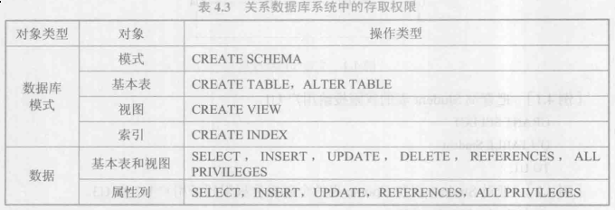
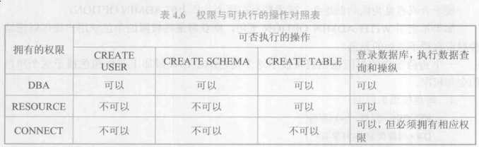
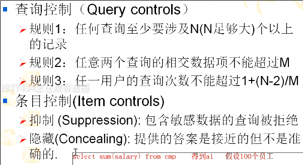

# 数据库安全性

### 不安全因素
* 非授权用户对数据库的恶意存取和破坏
* 数据库重要或敏感的数据被泄露
* 安全环境的脆弱性

### 数据库安全性控制
* 用户身份鉴别
  * 静态口令鉴别
  * 动态口令鉴别
  * 生物特征鉴别
  * 智能卡鉴别
* 存取控制
  > 包括定义用户权限和合法权限检查
  * 自主存取控制(DAC)
    > 对应C2级数据库管理系统; 用户对于不同数据库对象有不同的存取权限,不同用户对同一对象有不同权限; 用户的权限可以转授其他用户
  * 强制存取控制(MAC)
    > 对应B1级别的数据库管理系统; 每一个数据库对象被标以一定的密级,每一个用户也被授予某一个级别的许可证; 对于任意一个对象,只有合法许可证用户才可以存取
 
### 自主存取控制方法
> 用户权限由两个要素组成的: 数据库对象和操作类型  
> 授权: 定义存取权限

> * 对列的UPDATE权限是对于表中存在的某一列的值可以修改
> * 对列的INSERT权限指用户可以插入一个元组,对于授权用户可以插入制定的值,而其他列为默认值,同时要包含主码的INSERT权限,否则会因为主码为空而拒绝

* 授权: 授予和收回
  * GRANT: 向用户授予全向
  ~~~language
  GRANT<权限>,[<权限>] ...
  ON<对象类型><对象名>,[,<对象类型><对象名>] ...
  TO<用户> [,<用户>] ...
  [WITH GRANT OPTION];
  ~~~
  > WITH GRANT OPTION: 被授权的用户可以把该权限再授予其他用户  
  > 不允许循环授权
  * REVOKE: 收回权限
  ~~~language
  REVOKE <权限> [,<权限>]
  ON <对象类型> <对象名> [,<对象类型><对象名>]
  FROM <用户> [,<用户>] ... [CASCADE|RESTRICT];
  ~~~
  > 默认CASCADE(级联)
* 创建数据库模式的权限
  
  * 创建用户
  ~~~language
  CREATE USER <username> [WITH] [DBA|RESOURCE|CONNECT]
  ~~~
  > 只用系统的超级用户才有权创建一个新的数据库用户  
  > 新用户的权限默认CONNECT,该权限不能创建新用户,不能创建模式,也不能创建基本表,只能登陆再由其他用户授予权限  
  > RESOURCE: 用户能创建基本表和视图,成为所创建对象的属主,但不能创建新用户,不能创建新模式.  
  > DBA:超级用户
* 数据库角色
  > 角色是被命名为为一组与数据操作相关的权限,角色是权限的集合
  * 角色创建
  ~~~language
  CREATE ROLE <角色名>
  ~~~
  * 角色授权
  ~~~language
  GRANT <权限> [,<权限>]
  ON <对象类型> 对象名
  TO <角色>;
  ~~~
  * 将角色授予其他的角色或用户
  ~~~language
  GRANT<角色1> [,<角色2>]
  TO <角色3> [,<用户>]
  [WITH ADMIN OPTION];
  ~~~
  * 角色权限的收回
  ~~~language
  REVOKE <权限>[,<权限>]
  ON <对象类型> <对象名>
  FROM <角色> [,<角色>]
  ~~~
* 缺点
  > 可能会导致数据的无意泄露
### 强制存取控制方法
> 主体: 系统中的活动实体,包括实际用户,也包括代表用户各进程  
> 客体: 系统中的被动实体,受主体操纵,包括文件,基本表等  
> 对于主体和客体,数据库挂你系统为其每个实例指派一个密级/敏感度标记(绝密/TS,机密/S,可信/C,公开/P)  
> 数据与标记绑定
* 当主体的许可证级别大于或等于客体的密级,主体才能读取相应客体
* 当主体的许可证级别小于或等于客体密级时,主体才能写相应客体
### 视图机制
> 限制用户查看数据的部分
语法同表

### 审计
> 把用户对数据库的所有操作自动记录下来放入审计日志中.审计员可以利用审计日志监控数据库中的各种行为,重现导致数据库现有状况的一系列时间
* 审计事件
  * 服务器事件
  * 系统权限
  * 语句事件
  * 模式对象事件
* 审计功能
  * 提供多种审计查阅方式
  * 提供多套审计规则
  * 提供审计分析和报表功能
  * 审计日志管理功能
  * 系统提供查询审计设置及审计记录信息的专门视图
* AUDIT语句和NOAUDIT语句
  * AUDIT:设置审计功能
  * NOAUDIT: 取消审计功能

### 数据加密
* 存储加密
  * 透明加密(内核级机密)
    > 写到磁盘时候加密,读取数据时候解密
  * 非透明加密(多个加密函数实现)
* 传输加密
  * 链路加密
    > 对报头和报文加密
  * 端到端加密
    > 仅对报文加密

### 其他安全性保护
* 推理控制
  > 避免用户利用其能够访问的数据推知更高级的数据  
  
* 隐蔽信道
* 数据隐私保护
  
