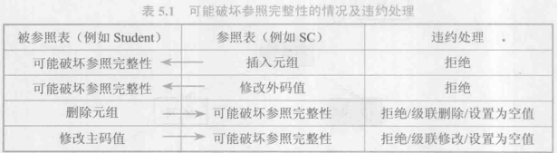

# 数据库完整性
> 完整性是指数据的正确性和相容性
> * 正确性: 数据是符合现实世界语义,反映当前实际状况
> * 相容性: 数据库同一对象在不同关系表中的数据符合逻辑
* 需实现以下功能:
  * 提供定义完整性约束条件的机制
  * 提供完整性检查的方法
  * 进行违约处理
### 实体完整性
* 定义实体完整性
  * 单属性构成码
    * 列级定义
    * 表级定义
  * 多个属性构成码
    * 表级定义
* 完整性检查和违约处理
  * 检查主码值是否唯一,如果不唯一,拒绝插入或修改
  * 检查主码属性是否为空,如果存在,拒绝
  * 检查方法
    * 全表扫描
    * 索引
### 参照完整性
  * 定义
    * 可在列级,也可以在表级
  * 完整性检查和违约处理
    

### 用户定义完整性
  * 属性上定义
    * 列值非空(NOT NULL)
    * 劣值唯一(UNIQUE)
    * 检查劣质是否满足一个条件表达式 (CHECK)
  * 元组上定义
    * CHECK()

### 完整性约束命名子句
* 完整性约束命名子句
  ~~~language
  CONSTRAINT<完整性约束条件名> <完整性约束条件>
  ~~~
  > 如果要删除该约束,可使用DROP CONSTRAINT <约束名>

### 域中的完整性限制
  ~~~language
  CREATE DOMAIN <域名> <被约束的类型> 
  CONSTRAINT <约束名> <约束条件>
  ~~~
### 断言

### 触发器
> 触发器是用户定义在关系表上的一类由事件驱动的特殊过程. 一旦定义就被保存在数据库服务器中, 由服务器自动触发  
> 类似于约束,但比约束更加灵活,可以实施更为复杂的检查和操作
  * 定义
  ~~~language
  CREATE TRIGGER <触发器名>
  {BEFORE|AFTER} <触发事件> ON <表名>
  REFERENCING NEW|OLD ROW AS <变量>
  FOR EACH{ROW|STATEMENT}
  [WITH<触发条件>] <触发动作体>
  ~~~
  > * 只有创建表上的所有者才能创建触发器,且数量有一定限制  
  > * 同一模式下,触发器必须是唯一的,并且触发器名和表名必须在同一模式下  
  > * 触发器只能定义在基本表上,不能定义在视图上  
  > * 触发事件可以是 INSERT , DELETE 或 UPDATE, 也可以是这几个事件的组合  
  > * 触发器按照所触发动作的间隔尺寸分为行级触发器和语句级触发器
  > * 只有触发条件为真的时候才触发动作, 如果省略触发条件,则在激活触发器后立即执行
  > * 触发动作体可以使一个匿名 PL/SQL 过程块,也可以是对已创建存储过程的调用
  * 激活触发器
    * 执行顺序:
      1. 执行该表上的BEFORE触发器
      2. 激活触发器的SQL语句
      3. 执行该表上的AFTER触发器
      > 如果同一表上的多个BEFORE(AFTER)触发器,遵循谁先创建谁先执行原则
  * 删除触发器
  ~~~language
  DROP TRIGGER <触发器名> ON <表名>;
  ~~~
  
