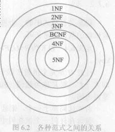
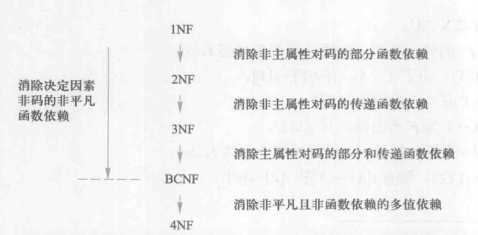

k 关系数据理论
* 数据依赖
  > 数据依赖是一个关系内部属性与属性之间一种约束关系
  * 函数依赖(FD)
    > 设R(U)是属性集U上的关系模式,X,Y是U的子集,若对于R(U)的任意一个可能的关系r,r中不可能存在两个元组在X上的属性值相等,而在Y上的属性值不等,则称X函数确定Y或Y函数依赖于X,记作$X\rightarrow Y$
    > * 其中X称作决定因素

    > 唯一映射  
    * 若$X\rightarrow Y ,Y\rightarrow X ,则记作X\leftarrow\rightarrow Y$
    * 非平凡函数依赖
      > $X\rightarrow Y, 但 Y\nsubseteq X$
    * 平凡函数依赖
      > $X\rightarrow Y, 但 Y\subseteq X$
    * 完全函数依赖
      > 在R(U)中,如果$X\rightarrow Y$, 并且对于X的任意一个真子集X',都有$X'\nrightarrow Y$  
      > 记作$X\stackrel{F}\rightarrow Y$
    * 部分函数依赖
      > 若$X\rightarrow Y$,但Y不完全依赖于X  
      > 记作$X\stackrel{P}\rightarrow Y$
    * 传递函数依赖
      > 在R(U)中,如果$X\rightarrow Y(Y\nsubseteq X),Y\nrightarrow X, Y\rightarrow Z, Z\nsubseteq Y是U的子集$  
      > 记作$X\stackrel{传递}\rightarrow Z$
  * 码
    * 候选码(简称码)
      > 设K为R<U,F>中的属性或属性组合,若$K\stackrel{F}\rightarrow U$,则K为R的候选码  
      > 候选码是最小的超码,即K的任意一个真子集都不是候选码  
      > 主码: 候选码多于一个时,任意其中一个为主码
    * 超码
      > 若$K\stackrel{P}\rightarrow U$,则称为超码
    * 外部码(外码)
      > 关系模式R中属性或属性组X并非R的码,但X是另一个关系模式的码
    * 主属性
      > 包含在任何一个候选码中的属性
    * 非主属性(非码属性)
      > 不包含在任何候选码中的属性
  * 多值依赖(MVD)
    > R(U)是属性集U上的一个关系模式.X,Y,Z是U的子集,并且Z=U-X-Y.关系模式中R(U)中多值依赖$X\rightarrow\rightarrow Y$成立,当且仅当对R(U)的任一关系r,给定一对(x,z)值,有一组Y的值,这组值仅仅决定于x值而与z无关  
    > 多值依赖具有对称性  
    > 多值依赖具有传递性  
    > 函数依赖可以看作是多值依赖的特殊情况
    * 与函数依赖的区别:
      * 多值依赖的有效性与属性集的范围有关
      * 若函数依赖在$X\rightarrow Y$在R(U)上成立,则对于任何$Y'\subset Y$均有$X\rightarrow Y'$成立.而多值依赖$X\rightarrow\rightarrow Y$若在R(U)上成立,却不能断言对于任何$Y'\subset Y$有$X\rightarrow\rightarrow Y'$成立
* 范式

  
  > 关系数据库中的关系是要满足一定要求的,满足不同程度要求的为不同范式,满足最低要求的为第一范式(1FN)  
  > R 为第几范式就可以写成$R\in x NF$  
  > 各种范式的包含关系有:$5NF\subset 4NF\subset BCNF\subset 3NF\subset 2NF\subset 1NF$  
  > 规范化: 一个低一级范式的关系模式通过模式分界可以转化为若干个高一级范式的关系模式集合
  * 第一范式
    > 作为一个二维表,关系符合一个最基本的条件: 每一个分量必须是不可分的数据项
  * 2NF
    > 若$R\in 1NF$,且每一个非主属性完全函数依赖于任何一个候选码,则$R\in 2NF$  
    > 若一个关系模式不属于2NF,就会产生如下问题:
    > * 插入异常
    > * 删除异常
    > * 修改复杂
  * 3NF
    > 设关系模式$R<U,F>\in 1NF$,若R中不能存在这样的码X,属性组Y及非主属性Z($Z\nsupseteq Y$使得$X\rightarrow Y, Y\rightarrow Z$成立, $Y\nrightarrow X$,则称$R<U,F>\in 3NF$  )
  * BCNF
    > 关系模式R<U,F>中,若每一个决定因素都包含码,则$R<U,F>\in BCNF$

  
## 数据依赖的公理系统
* F逻辑蕴含$X\rightarrow Y$
  > 对于满足一组函数依赖F的关系模式R < U,F> 其任何一个关系r,若函数依赖$X\rightarrow Y$都成立
* Armstrong公理系统
  > 设U为属性集总体,F是U上的一组函数依赖,对R< U,F>有如下推理规则:
  * 自反律
    > 若$Y\subseteq X\subseteq U$,则$X\rightarrow Y$为F所蕴涵
  * 增广律
    > 若$X\rightarrow Y$为F所蕴涵,且$Z\subseteq U$,则$XZ\rightarrow YZ$为F所蕴涵
  * 传递率
    > 若$X\rightarrow Y$及$Y\rightarrow Z$为F所蕴涵, 则$X\rightarrow Z$为F所蕴含
  * 推理规则
    * 合并规则
      > 由$X\rightarrow Y$,$X\rightarrow Z$ ,有$X\rightarrow YZ$
    * 伪传递柜台则
      > 由$X\rightarrow Y$,$WY\rightarrow Z$,有$XW\rightarrow Z$
    * 分解规则
      > 由$X\rightarrow Y$及$Z\subseteq Y$,有$X\rightarrow Z$
* 闭包
  > 在关系模式R< U,F>中为F所逻辑蕴涵的逻辑依赖的全体叫做F的闭包,记为$F^+$
  * 公理有效性
    > 由F出发根据公理推导出来的每一个函数依赖一定在$F^+$中
  * 公理完备性
    > $F^+中的每一个函数依赖,必定可以由F出发根据公理推导出来$
  * $X^+_F$属性集X关于函数依赖集F的闭包
    > 设F为属性集U上的一组函数依赖,$X,Y\subseteq U,X^+_F=\{A|X\rightarrow A能由F根据公理导出\}$
  * 引理
    > 设F为属性集U上的一组函数依赖,$X,Y\subseteq U$,$X\rightarrow Y$能由F根据公理导出的充要条件为$Y\subseteq X^+_F$
* 覆盖
  > 如果$G^+=F^+$就说函数依赖集F覆盖G(F是G的覆盖,或G是F的覆盖),或F与G等价
  * $F^+=G^+$的充分必要条件是$F^\subseteq G^+$和$G^+\subseteq F^+$
  * 最小依赖集或最小覆盖
    > 函数依赖集F满足如下条件:
    > * F中任一函数依赖的右部仅含有一个属性
    > * F中不存在这样的函数依赖$X\rightarrow A$,使得F与$F-\{X-A\}$
    > * F中不存在这样的函数依赖$X\rightarrow A$,X有真子集Z使得$F-\{X\rightarrow A\}\cup\{Z\rightarrow A\}$(对于F中的每个函数依赖的左部尽可能简)
  * 每一个函数依赖集F均等价于一个极小函数依赖集$F_m$
