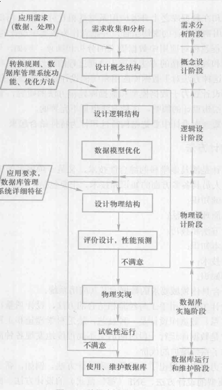
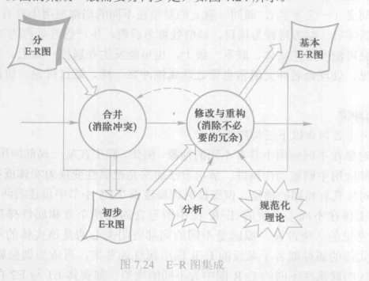

# 数据库设计
> 指对一个给定的应用环境,构造(设计)优化的数据库逻辑模式和物理结构,并据此建立数据库及其应用系统,使之能够有效地存储和管理数据,满足各种用户的应用需求,包括信息管理要求和数据操作要求

* 数据库设计的基本步骤
  

## 需求分析
> 调查的重点是"数据"和"处理",通过调查,收集和分析,获得用户对数据库的如下要求:
> * 信息要求
> * 处理要求
> * 安全性与完整性要求

* 数据字典
> 关于数据库中数据的描述(元数据),而不是数据本身
  * 数据项
    > 不可再分的数据单位  
    > 数据项描述={数据项名,数据项含义说明,别名,数据类型,长度,取值范围,取值含义,与其他数据项的逻辑关系,数据项之间的联系}
  * 数据结构
    > 反应数据之间的组合关系  
    > 数据结构描述={数据结构名,含义,组成:{数据项或数据结构}}
  * 数据流
    > 数据结构在系统内传输的路径  
    > 数据流描述={数据流名,说明,数据流来源,数据流去向,组成:{数据结构},平均流量,高峰期流量}
  * 数据存储
    > 数据结构停留或保存的地方  
    > 数据存储描述={数据存储名,说明,编好,输入的数据流,输出的数据流,组成:{数据结构},数据量,存取频度,存取方式}
  * 数据处理过程
    > 处理过程描述={处理过程名,说明,输入:{数据流},输出:{数据流},处理:{简要说明}}

## 概念结构

* 概念模型
  * 特点
    > 能真实,充分反映现实世界;易于理解;易于更改;易于向关系,网状,层次等各种数据模型转换
* E-R模型
  * 实体之间的联系
    1. 两个实体之间的联系(二元联系)
      * 一对一(1:1)
        > 对于实体集A中的每一个实体,实体集B中至多一个实体与之对应,反之亦然
      * 一对多联系(1:n)
        > 对于实体集A中的灭一个实体,实体集B中有n个实体与之联系,反之,对于实体集B中的每一个实体,实体集A中至多一个实体与之联系
      * 多对多的联系(m:n)
    2. 两个以上的实体型之间的联系(N元联系)
    3. 单个实体型内的联系
* E-R图
  * 实体型用矩形表示
  * 属性用椭圆形表示
  联系用另行表示

* E-R模型扩展
  * ISA联系
    > 子类继承了父类的所有属性
    * 分类属性
      > 根据分类属性的值把父实体型中的实体分派到子实体型中(三角形)
    * 不相交约束与可重叠约束
      > 父类中的实体最多属于一个子类实体集(三角形+x)
  * 基数约束
    * min .. max
  * Part-of联系
    > 表明某个实体型是另一个实体型的一部分
    * 非独占的Part-of联系
      > 整体实体被破坏,部分实体可以存在
    * 独占的Part-of联系
      > 整体实体被破坏,部分实体不可以存在
      * 弱实体型(双矩形框)
      > 一个实体型的存在依赖于其他实体型的存在

* E-R图的集成
  
  
  1. 合并E-R图,生成初步E-R图
    * 属性冲突
      * 属性域冲突
        > 属性值的类型,取值范围或取值的集合不同
      * 属性取值单位冲突
    * 命名冲突
      * 同名异义
      * 异名同义
    * 结构冲突
      * 同一对象在不同应用中具有不同的抽象
      * 同一实体在不同子系统的E-R图中所包含的属性个数和属性排列次序不完全相同
      * 实体间的联系在不同的E-R图中为不同的类型
    2. 消除不必要的冗余,设计基本E-R图
      > 冗余数据:可由基本数据导出的数据  
      > 冗余联系:可由其他联系导出的联系
      * 分析方法
        > 以数据字典和数据流图为依据,根据数据字典中关于数据项之间逻辑关系的说明来消除冗余
      * 规范化理论消除冗余
## 逻辑结构设计
> 把概念模型中的基本E-R图转换为与选用数据库管理系统产品所支持的数据模型相符合的逻辑结构

* E-R图向关系模型的转换
  * 转换的一般原则
    > 一个实体型转为一个关系模式,关系的属性就是实体的属性,关系的码就是实体的码

