# 1 引言

### 术语

高性能计算(HPC)
> 研究如何分解一个巨大规模的问题,并分配给多个计算机进行处理,并把这些结果综合起来得到最终结果

云计算
> 通过互联网将资源以按需服务的形式形式提供给客户

计算
> 数据处理的能力

存储
> 数据存储的能力

通信
> 数据通信的能力

IS(Instruction Stream) 
> 指令流

DS(Data Stream)
> 数据流

CU(Control Unit)
> 控制单元

PU(Processing Unit)
> 处理单元

MU(Memory Unit)
> 存储单元

PE(Processing Element)
> 处理模块

LM(Local Memory)
> 本地存储

VP(Vector Processor)
> 矢量处理器

SM(Shared Memory)
> 共享存储

P/C
> 微处理器和缓存

MB(Memory Bus)
> 存储总线

DIR(Cache Directory)
> 缓存目录

NIC(Network Interface Circuitry)
> 网络接口电路

LD(Local Disk)
> 本地硬盘

IOB(I/O Bus)
> I/O总线

SM(Streaming multiprocessor)
> 流多处理器

SP
> 流处理器
### 分类
基于指令(instruction)和数据流(data streams)分:
* SISD(单指令单数据流)
  * 通用串行机

    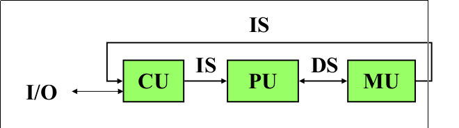
* SIMD(单指令多数据流)
  * 矢量机器
  * 专用计算机
  
* MISD(多指令单数据流)
  * 处理器阵列,脉动式阵列
  * 专用计算机
    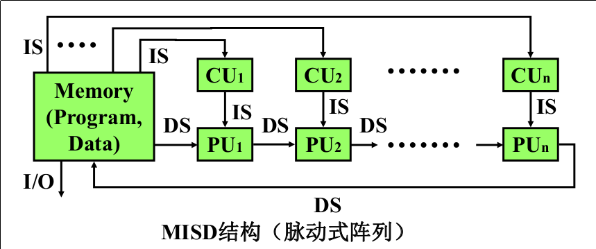
* MIMD(多指令多数据流)
  * 通用并行计算机
  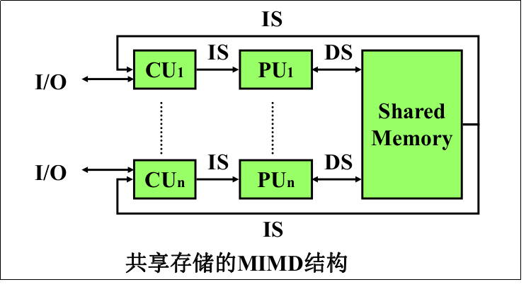

> MIMD > SIMD > MISD

### 体系结构
大部分并行计算机都是MIMD系统

##### 架构

多处理器架构
> 共享存储架构
  * PVP(Parellel Vector Processor)  
    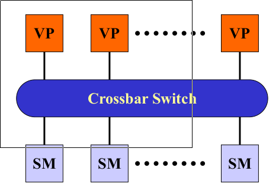
    > 矢量处理器通过高带宽的交叉开关(crossbar switch)连接在一起
  * SMP(Symmetric Multiprocessor)

    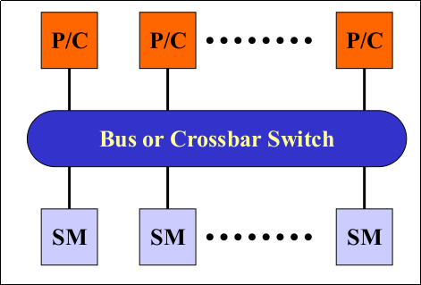
    > 商业微处理器(COTS: commercial off-the-shelf) 通过高速总线(bus)或交叉开关(crossbar switch)连接在一起
  * DSM(Distributed Shared Memory)
    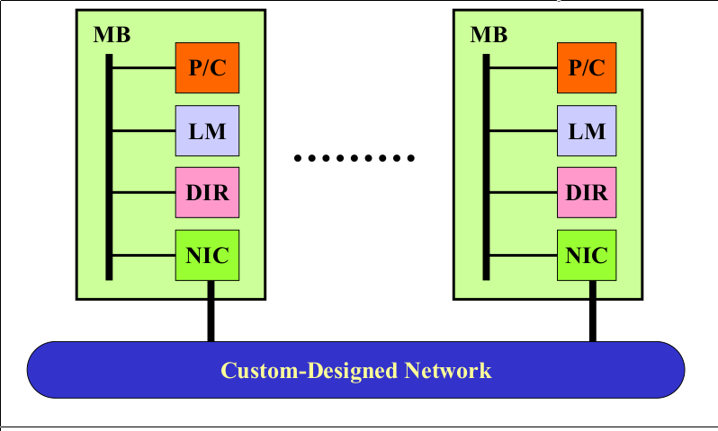
    > 类似SMP, 但存储是物理分布在每个节点

多计算机架构
> 分布存储架构
  * MPP(Massively Parallel Processing)

    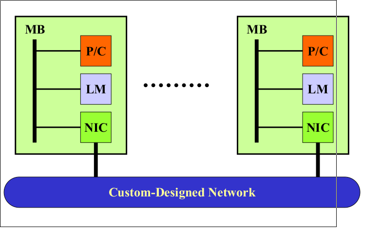
    > 处理器总数目 > 1000
  * Cluster
    
    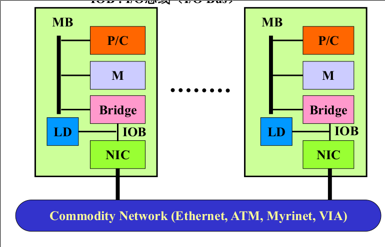
    > 系统中每个节点的处理器少于16个
  * Constellation

    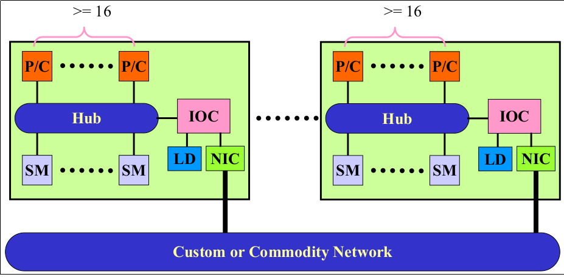
    > 系统中每个节点的处理器多于16个

GPU体系结构
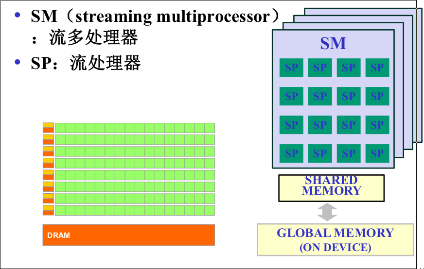

异构多核系统
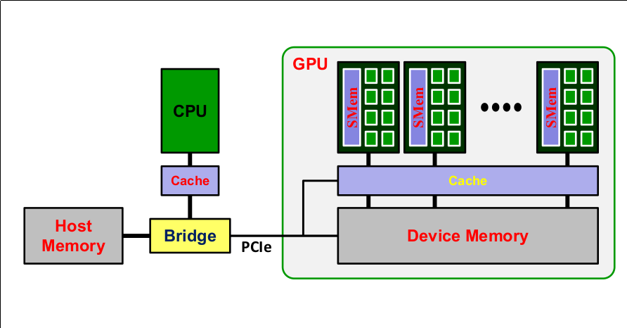

##### 应用分类

* 计算密集型
* 数据密集型
* 网络密集性

### 云计算

##### 特点
* 分布式
  > 物理节点分布
* 虚拟化
  > 每一个应用部署的环境和物理平台没有关系.通过虚拟平台进行管理达到对应用进行扩展,进行迁移,进行备份,种种操作均通过虚拟化完成
* 动态可扩展

##### 服务模式
* IaaS(Infrastructure as a Service)
  > 基础设置即服务(虚拟的服务器,存储,网络)
* PaaS(Platform as a Service)
  > 平台即服务(环境,数据存储)
* SaaS
  > 软件即服务(应用)

##### 高性能计算和云计算的异同点
同:
  * 都是大规模系统,相同的核心技术和挑战
    * 分布式计算,集群,高密度计算等技术
    * 高速互连,存储分层,异构多核处理器
    * 并行/分布式编程
    * 系统可靠性和恢复能力
    * 物理...
异:
  * 应用
    * 高性能计算主要面对科学计算,工程模拟等计算密集型领域
    * 云计算主要以数据密集性,I/O密集型应用
  * 技术
    * 网络: 高性能计算需要特这的高速互联网络
    * 虚拟化: 高性能计算几乎不用虚拟化技术
  * 用户
    * 高性能计算主要面对政府部分/大企业,专业人士
    * 云计算主要面对各种企业和普通用户
