# 2 并行计算机体系结构

### 并行结构

并行计算机
> 由一组处理单元组成,处理单元通过相互之间的通信协作以更快的速度共同完成一项大规模的计算任务

最主要组成部分:
* 计算节点
* 节点间的通信与协作

通用的并行架构
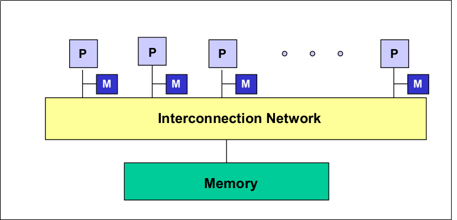

### 互联网络

性能指标
* 时延
  * 软件开销(overhead)
  > 网络两端互相收发信息,取决于主机内核
  * 竞争时延
  > 选路所造成的时延,依赖于程序
  * 通道时延(transmission time)
  * 传输时延(transport latency)
  > 通道时延和选路时延之和

  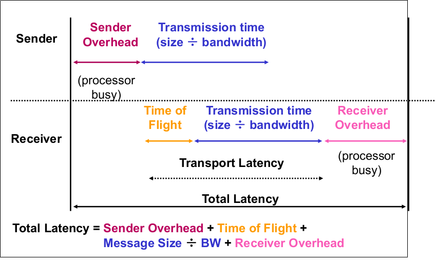
* 带宽(Bandwidth:BW)
  * 端口带宽
  > 从任意端口到另外端口单位时间内传输消息的最大位数(字节数)
  * 聚集带宽
  > 从一半节点到另一般节点单位时间内传输消息的最大位数(字节数)
  * 链路带宽(Link Bandwidth)
  > 单位时间内链路传输消息的最大位数(字节数)
  * 对剖**宽度**
  > 将网络分成两个相等的部分所必须移去的最少边数
  * 对剖**带宽**
  > 每秒钟内在最小对剖平面上通过所有连线的最大信息位数(字节数)  
  > 等于对剖宽度与链路带宽之积
  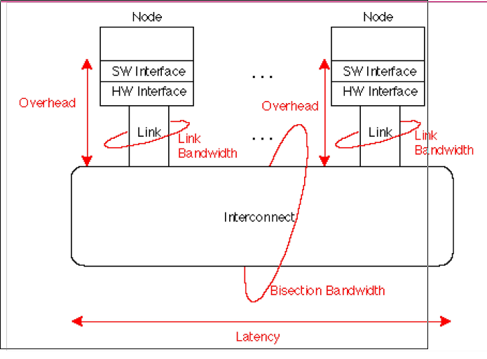
* 硬件复杂度(Cost)
> 将N个处理机按一定拓扑结构连成网络所需的开关个数
* 可拓展性
* 容错能力

##### 静态互连网络
处理单元间有着固定连接的一类网络,在程序执行期间,这种点到点的连接保持不变
* 一维线性阵列(1-Linear Array)
  > 最简单最基本的互连方式  
  > 每个节只与左,右近邻连接(二近邻连接)
  * 线性(Linear Array)
    * 边: N-1
    * 内节点度数: 2
    * 直径 : N-1
    > 最远两个节点之间的距离
    * 对剖宽度 : 1
  * 环形(Ring)
    > 首尾相连,可以单向也可以双向
    * 节点度 : 2
    * 直径 : N/2(双向环) 或 N-1(单向环)
    * 对剖宽度 : 2
* 二维网孔(2-D Mesh)
  > 每个节点只与其上下左右的近邻相连
    * 普通
      * 节点度数 : 4
      * 网络直径 : $2(\sqrt{N}-1)$
      * 对剖宽度 : $\sqrt{N}$
    * Illiac网孔
      > 垂直方向上环绕,水平方向呈蛇形
      * 节点度恒为4
      * 网络直径 : $\sqrt{N} - 1$
      * 对剖宽度 : $2\sqrt{N}$

    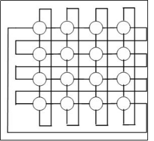
    * 2-D Torus(2D环绕)
      > 水平和垂直方向均环绕
      * 节点度数恒为4
      * 网络直径 : $2 \times \frac{\sqrt{N}}{2}$
      * 对剖宽度 : $2\sqrt{N}$

    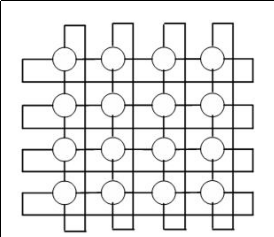
* 树(Tree)
  * 二叉树
    * 节点度 : 3
    * 对剖宽度 : 1
    * 直径 : $2\times k -2 = 2logN - 1$
    > k 是层数,N为树额总节点树
  * 星形
    * 节点度 : N - 1
    * 对剖宽度 : $\frac{N}{2}$
    * 直径 : 2
  * 胖树
    > 节点间的通路自叶向根逐渐变宽  
    > 对剖宽度随着N的增大而增大

    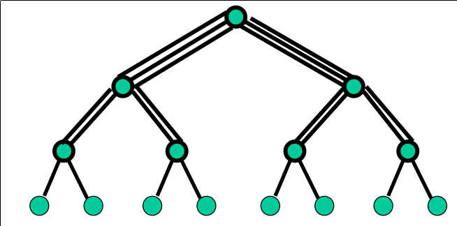
* 超立方(Hypercube)
  * n-立方($N = 2^n$)
    * 节点度 : n
    * 网络直径 : n
    * 对剖宽度 : N/2
  * 3-立方环
  > 3-立方的每个顶点用一个环代替
    
    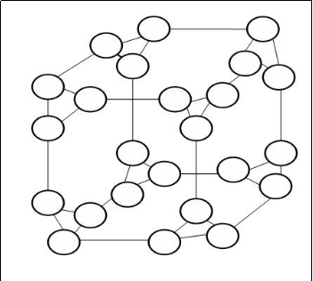
* 蝶形网络(Butterfly)
  * 节点数 : $N = (k+1)2^k$
  * 直径 : 2k
  * 对剖带宽 : $2^k$

比较:

总结:
* 节点小于4比较理想,若能实现所有节点连接,节点度越小越好
* 节点度越大,连接性越好,但网络连接复杂,成本高
* 对剖带宽越大,网络带宽越大
* 网络直径越大,时延越大
* 对称性会影响可扩展性和路由效率
##### 动态互连网路
用交换开关构成,可按应用程序的要求动态地改变连接组态, 连接是在程序执行过程中实时建立
* 总线(Bus)
  * 节点度 : 1
  * 直径 : 1
  * 规模 : 1
  * 特点
  > 成本低,但扩展性不好,随着处理器增加,每个处理器带宽减少  
  > 可利用程序中的局部性原理减少对总线带宽的需求
* 交叉开关(Crossbus Switcher)

  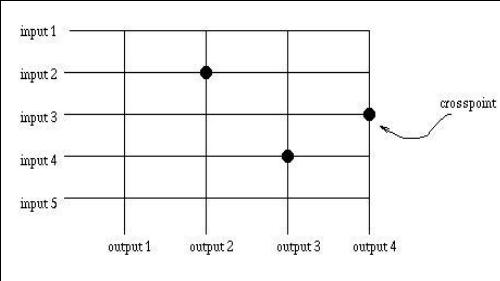
  * 单级交换网络,交叉开关能在源端和目的端之间建立动态连接,每个交叉开关为一个(源;目的)对提供一条专用通路,开关状态动态设置
  * 交叉开关有两种使用方式: 用于处理器间通信和用于处理器和存储模块之间的存储
  * 特点
    > 交叉开关具有良好带宽特性  
    > 非阻塞通信: 两个节点之间的通信,不会阻塞其他节点之间的通信  
    > 代价不可扩放,$O(n^2)$,其中n为交叉开关中的交叉点数
* 多级互连网络(MIN-Multistage Interconnection Network)
  * 由单级交叉开关级连起来形成多级互连网络MIN
    
    * N个输入,N个输出
    * 度 : 1
    * 直径: logN
    * 网络规模 : NlogN
  * 交换开关模块
    > 一个交换开关有n个输入和n个输出,每个输入可以映射一个或多个输出,不允许多对一映射  

    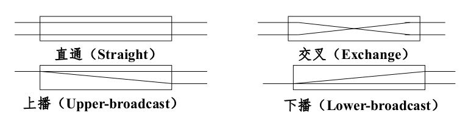
  * 级间互连(ISC)
    > 每一级输入与输出之间连接,输出作为交换开关的输入连接到下一级  
    * 均匀洗牌

      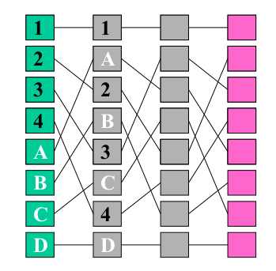
    * 蝶式

      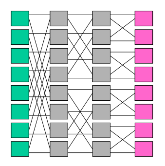
    * ...
  * 动态互连网络比较
    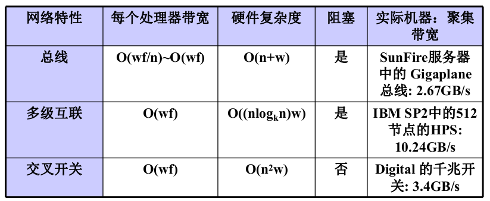
    > 其中n为节点规模, w为数据宽度, f为时钟频率
  
##### 标准连接网络
  * Myrinet(集群互连)
  * 以太网
  * InfiniBand(IB)

### 存储模型
##### 访存模型
MIMD 结构:
* 共享存储(Shared Memory)
  
  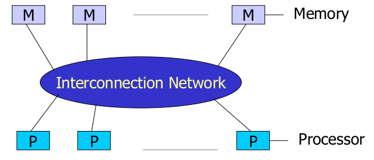
  > 单一地址空间,存储模块定义了一个可在处理器间共享的单一地址空间  
  > 任何处理器可以通过互联网存取任何存取模块

  * 可扩展的共享存储
    * 通过高吞吐率,低时延的互联网络
    * 每个节点有一个本地缓存或存储
    * 逻辑共享的存储可以通过一系列本地存储来实现
* 分布式存储(Distributed Memory)

  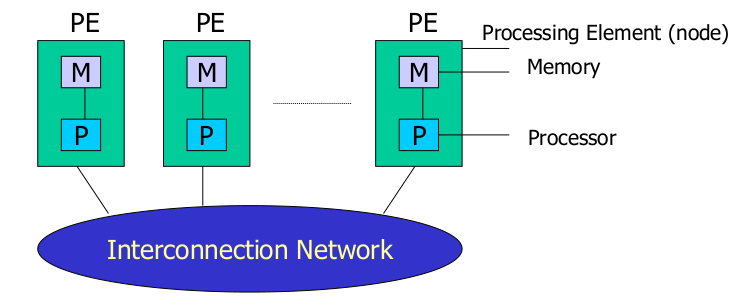
  > 处理器单元(PE)独立工作,每个处理器有自己的本地存储  
  > 通过消息来交互,PE不能直接存取其他PE的内存,必须通过消息传递来交换处理器之间的数据

* 分布式存储和分布式共享存储区别
  * 物理结构是一样
  * 分布式共享存储的本地存储是全局地址空间的组成部分, 分布式存储的本地存储为独立空间,不能被其他处理器远程存取

---
存储器结构分类:
* 集中式存储器
  * UMA(Uniform Memory Access)
    > 均匀存储模型访问模型的简称

  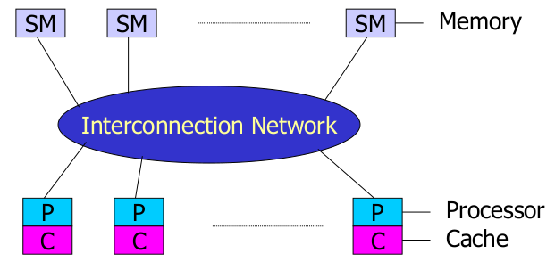
    * 特点:
      * 物理存储器被所有处理器均匀共享
      * 所有处理器访问任何存储字取相同的时间
      * 每台处理器可带私有高速缓存
      * 外围设备可以一定形式共享
* 分布式存储器
  * NUMA(Non-Uniform Memory Access)
  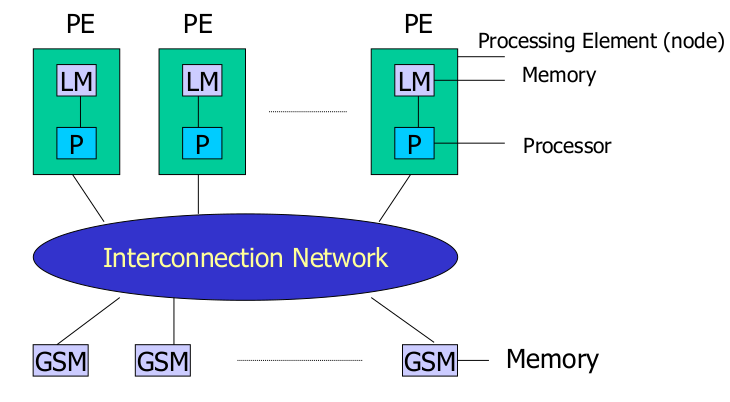
  > LM为本地存储器, GSM为全局共享存储器
    * NCC-NUMA(Non-Cache Coherent NUMA)
      > 非均匀存储访问模型简称
      * 被共享的存储器在物理上是分布在所有的处理器中的,其所有本地存储器的集合组成了全局地址空间
      * 处理器访问存储器的时间不一样
      * 每台处理器可带有高速缓存,外设也可以某种形式共享
    * COMA (Cache Only Memory Architecture)
    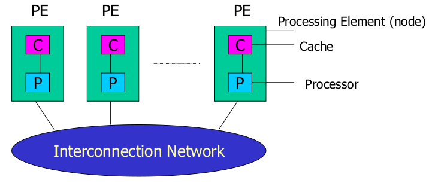
      > 高速缓存存储访问  
      * 各处理器节点中没有存储层次结构,全部高速缓存组成了全局地址空间
      * 利用分布的高速缓存目录进行远程高速缓存的访问
      * COMA中的高速缓存容量一般都大于2级高速缓存容量
      * 使用COMA时,数据开始时可任意分配,因为COMA中没有物理地址,数据可动态迁移
    * CC-NUMA (Cache Coherent NUMA)

      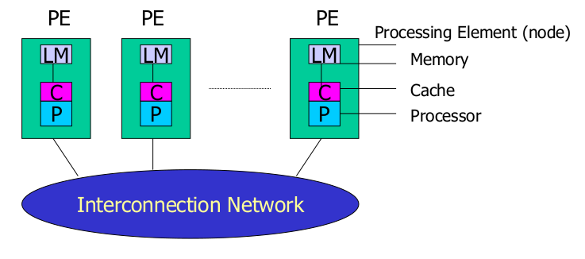
      > 高速缓存一致性非均匀存储访问模型
      * 大多数基于目录的高速缓存一致性协议
      * 保留SMP结构易于编程的特点,也改善常规SMP的可扩放性
      * 实际上是一个分布共享存储的DSM多处理机系统
      * 对高速缓存一致性提供硬件支持
      * 优点是无需明确地在节点上分配数据,系统的硬件和软件开始时自动在各节点分配数据,运行期间,高速缓存一致性硬件会自动地将数据迁移到要用的地方
    * NORMA(No-Remote Memory Access)

      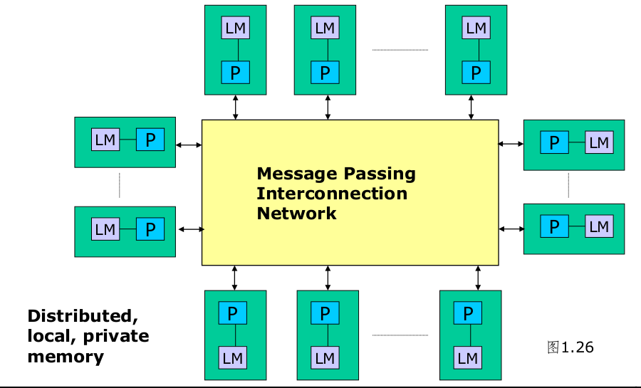
      > 非远程存储访问  
      * 所有存储器都是私有的
      * 节点不能访问远程存储器,必须通过消息传递方式
* 构建并行机系统的不同存储结构

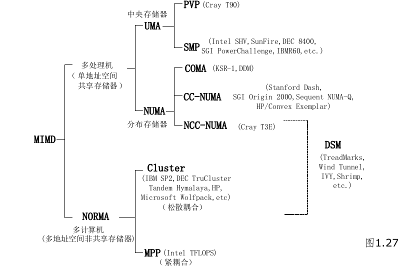
    
##### 存储组织
存储层次结构
* 弥补CPU与主存之间的速度差异
* 各个层次间的访问速度和容量差别

高速缓存写策略
> 以下$M_i$代表存储层次,例如缓存$M_1$,主存储器$M_2$,...
* 写直达(WT)
  > 如果在$M_i$修改了一个字,则在$M_{i+1}$中立即修改
* 写回(WB)(商业常用)
  > $M_{i+1}$中的修改延迟到$M_i$正在修改的字被替换或从$M_i$中消除才进行

高速缓存一致性问题
> 当某个处理器修改了其高速缓存中的内容,而其他处理器的高速缓存的内容仍是原来的值,这就产生高速缓存一致性问题
  * 原因:
    * 由共享可写数据所造成的不一致
    * 由进程迁移所造成的不一致
    * 由绕过高速缓存I/O的I/O操作所造成的不一致
  * 解决方法:
    * 监听总线协议
      > 适用于基于总线连接的多处理机系统
      * 两种策略
        * 写无效(商业常用)
          > 在本地高速缓存的数据块更新时使所有远程副本均无效
        * 写更新
          > 把更新的数据块广播到含该数据块的所有高速缓存
    * 基于目录的协议
      > 适用于多级互连网络连接的多处理机系统,用一个目录来记录共享数据的所有高速缓存行的位置和状态  
      * 实现

      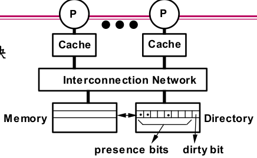
      > 主存中维护一个目录表,presence bits为处理器存在位
        * 当第i个处理器从主存读取数据:
          * 如果主存的dirty-bit是0, 则从主存读取,并令p[i]为1
          * 如果主存的dirty-bit是1,且只有一个处理器存在位为1,则从该处理器读取数据到主存,将dirty-bit设为0, 并令p[i] = 1, 最后读取数据
        * 当第i个处理器写数据到主存
          * 如果主存的dirty-bit是0, 则使得包含该数据的所有缓存块无效,将所有p[k]置0,dirty-bit设为1, 并令p[i]为1
      * 读缺失和写缺失

      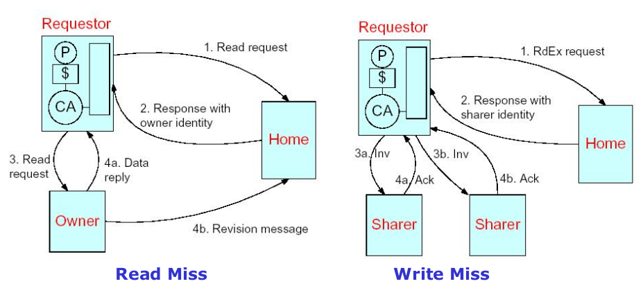

