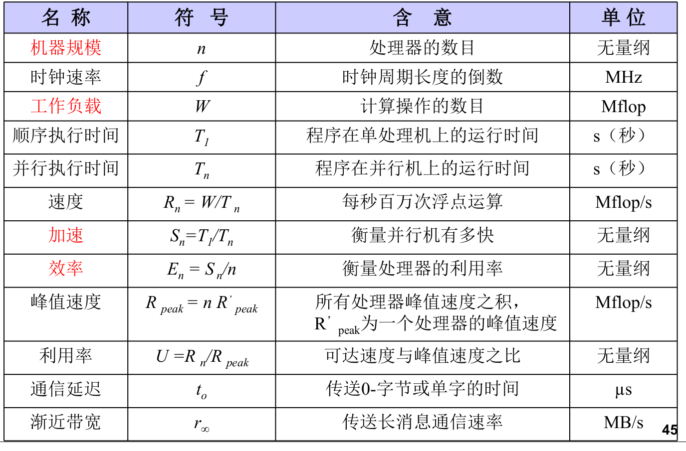
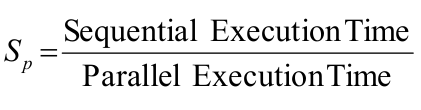
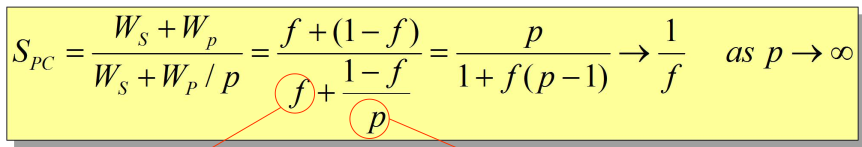
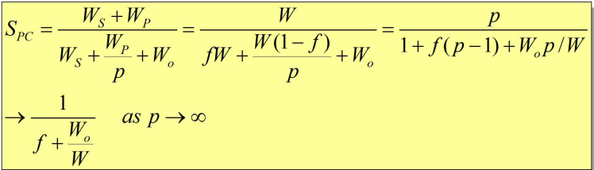
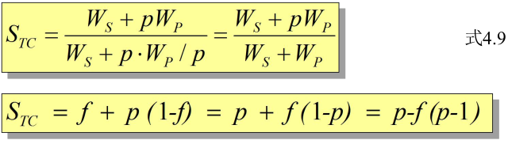
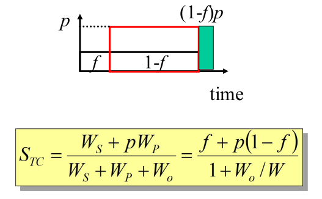
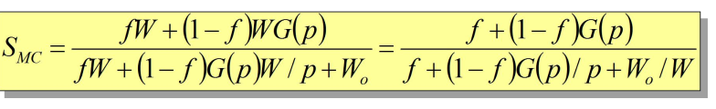
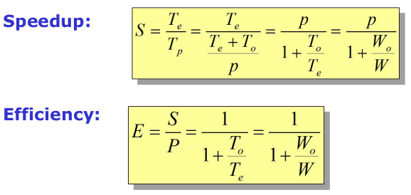
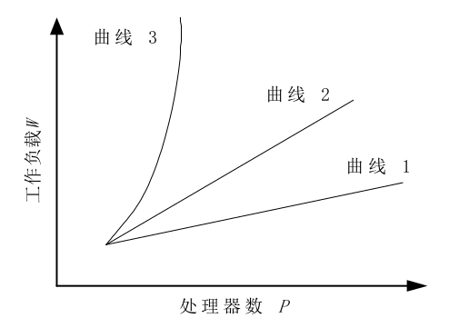

# 3,并行计算机系统及性能评测
### 并行计算机系统
##### 对称多处理机SMP
> 采用商用微处理器,通常有片上和片外Cache,基于总线连接,集中式共享存储,UMA结构  

pic

特点:
* 优点:
  * 对称性
  > 系统中任何处理器均可访问任何存储单元和I/O设备
  * 单地址空间
  > 易编程性,动态负载平衡,无需显示数据分配
  * 高速缓存及其一致性
  > 多级高速缓存可支持数据局部性  
  > 硬件维持一致性
  * 低通信延迟
  > 处理器间通信可用简单的读/写指令完成
* 缺点:
  * 欠可靠性(最大问题)
  > 总线,存储器或OS失效会导致系统崩溃
  * 可观的延迟
  > 虽然通信延迟小,但相对处理器速度而言仍相当可观,且处理器间的竞争会加剧竞争
  * 慢速增加带宽
  > 存储器带宽的增长跟不上处理器速度或存储容量的增长速度
  * 不可扩放性
  > 总线的不可扩放性限制了处理器的个数

##### MPP
> 每个节点有一个或多个处理和高速缓存(P/C)

pic

特点:
 * 节点中使用商品化微处理器,且每个节点有一个或多个微处理器
 * 节点内使用物理上分布的存储器
 * 具有高通信带宽和低延迟的互连网络,节点间紧耦合
 * 能扩展成具有成百上千的处理器

设计问题:
* 可扩放性
* 系统成本
* 通用性和可用性
* 通信要求
* 存储器和I/O能力

##### Cluster
* 集群
> 一组独立计算机(节点)集合体
  * 特点:
    * 各个节点都是一个完整的系统:工作站,PC或SMP机器
    * 互连网络通常使用商品化网络,如以太网,FDDI,ATM等
    * 网络接口与及节点的I/O总线松耦合
    * 各节点通常有一个本地磁盘
    * 各节点有自己的完整的操作系统
    * 各节点除了可以作为一个单一的计算资源供交互式用户使用外,还可以协同工作并表现为一个单一的,集中的计算资源供并行计算任务使用
  * 与分布式系统的区别:
    * 集群继承了分布式系统的大部分知识
    * 分布式系统具有许多不同种类的计算机
    * 集群通常是同构,耦合度较紧密,节点互为信任关系
* 工作站集群COW
> 分布式存储,MIMD,工作站+商用互连网络,每个节点是一个完整的计算机,各自有自己的硬盘和操作系统
  * 优点:
    * 投资风险小
    > 即使技术不够先进,但每台高性能工作站仍可照旧使用
    * 编程方便
    > 无须学习新的并行程序语言,只需要利用并行程序设计环境,在常规程序中插入少量原语即可
    * 系统结构灵活
    > 不同性能的工作站使用不同体系结构和各种互连网络构成同构或异构的工作站机群系统,弥补单一体系结构适应面窄的缺点
    * 性能/价格比高
    * 能充分利用分散的计算资源
    > 当个人工作站处于空闲状态时, COW可在空闲时间内给这些工作站加载并行计算任务
    * 可扩放性好
    > 根据需要增加工作站数目,以高带宽和低延迟的网络技术支持获得高的加速比

  * 关键:
    * 通信性能
    * 并行编程环境

* SMP ,MPP, 集群比较

| 系统特征         | SMP            | MPP                    | 集群           |
|------------------|----------------|------------------------|----------------|
| 节点复杂度       | 中粒度或细粒度 | 细粒度或中粒度         | 中粒度或粗粒度 |
| 节点间通信       | 共享存储器     | 消息传递/共享变量(DSM) | 消息传递       |
| 节点操作系统     | 1              | N(微内核)和1个主机OS   | N(同构)        |
| 支持单一系统影像 | 永远           | 部分                   | 希望           |
| 地址空间         | 单一           | 多或单一(DSM)          | 多个           |
| 作业调度         | 单一运行队列   | 主机上单一运行队列     | 协作多队列     |
| 网络协议         | 非标准         | 非标准                 | 标准或非标准   |
| 可用性           | 通常较低       | 低到中                 | 高可用或容错   |
| 性能/性价比      | 一般           | 一般                   | 高             |
| 互连网络         | 总线/交叉开关  | 定制                   | 商用           |
### 并行计算性能评测
* 性能评测
> 性能评价+性能分析  
> 目的:提高性能  
> 意义:
> * 发挥高性能计算机长处,提高高性能计算机的使用效率
> * 减少用户购机盲目性,降低投资风险
> * 改进系统结构设计, 提高机器性能
> * 促进软/硬见结合,合理功能划分
> * 优化"结构-算法-应用"的最佳组合
> * 提供客观,公正的评价高性能计算机的标准

并行计算机性能评测

* 术语
  * 性能
  > 通常指机器的速度,程序执行时间的倒数
  * 程序执行时间
  > 用户的响应时间
    * 机器的时钟周期$T_C,程序中指令总条数为I_N,执行每条指令所需的平均时钟周期数为CPI,那么一个程序在CPU上运行的时间为I_N\times CPI\times T_C$
  * CPU时间
  > 表示CPU的工作时间,不包括I/O等待时间和运行其他任务的时间

* 机器级的性能评测

    > CPU和存储器的某些基本性能指标  
    > 并行和通信开销分析  
    > 并行机的可用性与好用性  
    > 机器成本,价格与性价比
* 算法级的性能评测
    * 加速比

      
      > 对于一个给定的应用,并性算法/并行程序相对于串行算法的性能提高程度  
      * Amdahl定律
        * 出发点
          * 固定不变的计算负载,分布在多个处理器上
          * 增加处理器加快执行速度,从而达到加速
        * 
          > $W_S为应用程序中的串行分量,W_P为应用中可并行化的部分,p为串行分量,P为处理器数量,f = W_S / W$
        * 增强的Amdahl定律

          
          > $W_O为并行通信开销$  
      * Gustafson定律
        * 在固定时间里,依靠增加处理器处理更多数据
          * 
          * 考虑开销:

          
      * Sun Ni定律
        * 空间许可,尽量增大问题规模以产生更好和更精确的解(存储固定)
        * 
        * 考虑开销:
          
          
        * 特性:
          * 当G\(p\) = 1时,就是Amdahl加速定律
          * 当G\(p\) = p变为f+p(1-f),就是Gustafson加速定律
          * 当G\(p\) > p时,相应于计算机负载比存储要求增加得快,此时SunNi加速均比Amdahl急速和Gustafson加速为高
      * 加速比讨论
        * 参考的加速比经验公式:$p/log p <= S <= p$
          * 线性加速比:很少通信开销的矩阵相加,内积运算等
          * p/logp的加速比:分治类应用问题
        * 通信密集类:S = 1/C(p)
        * 超线性加速
        * 绝对加速(科学研究):最佳并行算法和串行算法
        * 相对加速(工程应用):同一算法在单机和并行机的运行时间
      * 影响加速比的因素: 系统规模和问题规模
        * 求解问题中的串行分量
        * 并行处理所引起的额外开销
          > 增加系统规模(处理器数)会增大额外开销和降低处理器利用率
        * 加大的处理器数超过了算法中的并发程度
      * 增加问题的规模有利于提高加速的因素:
        * 较大的问题规模可提供较高的并发度
        * 额外开销的增加可能慢于有效计算的增加
        * 算法中的串行分量比例不是固定不变
    * 可扩展性
      > 当系统和问题规模增大时,可维持相同性能的能力,即指应用,算法和结构能否充分利用不断增长的处理器能力  
      > {性能,系统规模,数据规模}的综合测度
      * 等效率函数  
        
        > 等效率函数: 如果问题规模W保持不变,处理器数P增加,开销$T_0$增大,效率E下降.为了维持一定的效率,当处理器P增大时,需要相应地增大问题规模W的值,定义函数$f_E(p)为问题规模W随处理器数P变化的函数$
        * 曲线:

        
        > 曲线1具有较好的扩放性;曲线2表示算法可扩放;曲线3表示算法不可扩散
      * 等效率度量标准
      * 等速度度量标准
      * 平均延迟度量标准
    * 效率  
* 程序级的性能评测
    * 基准测试程序
      > * 一组标准的测试程序
      > * 提供一组控制测试条件
      > * 步骤的规则说明
      * 分类
        * 宏观测试程序
        * 微观测试程序

