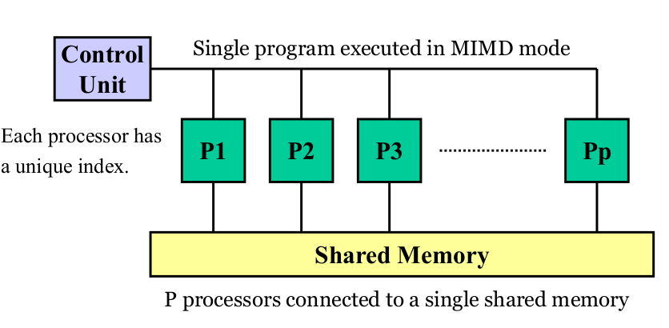
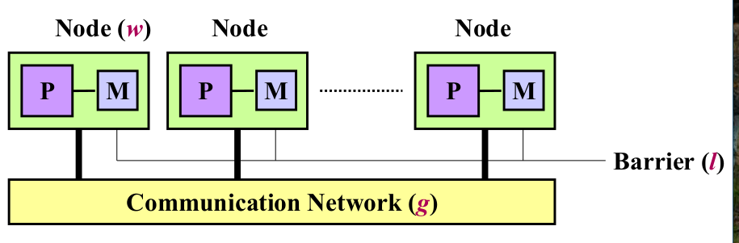
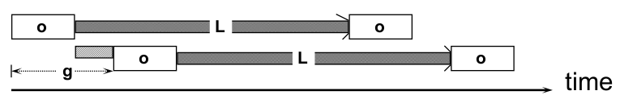
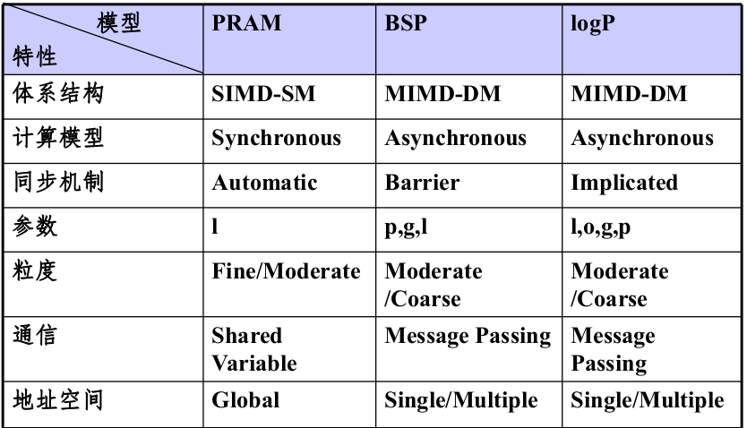

# 4 并行算法设计

### 并行算法的一般概念
并行计算
> 一组可同时执行并可相互协作的诸进程的集合

分类
  * 数值算法
    > 代数类数学运算
  * 非数值算法
    > 基于排序,选择,搜索,匹配等符号处理
  * 同步算法
    > 各进程执行需要相互等待
  * 异步算法
    > 个进程可以独立执行
  * 分布算法
  * 确定算法
  * 非确定算法
    > 随机算法,智能算法

##### 并行算法的表示
~~~language
par-do 语句
for i=1 to n par-do
  ...
end for
或
for i=1 to n do in parallel
  ...
end for

for all语句
for all Pi, where 0 <= i <= k do
  ...
end for
~~~

##### 并行算法的复杂性度量
成本c(n) = t(n) x p(n)
> t(n)为运行时间, p(n)为处理器数目,n为问题规模
* 成本最优性
  > 若c(n)等于在最坏情况下串行算法所需要的时间

加速比$S_p(n) = t_s(n) / t_p(n)$
> * $t_s(n)$为求解问题的最快的串行算法在最坏情形下运行时间,$t_p(n)$为求解同一问题的并行算法在最坏情形下的运行时间  
> * 反映了算法并行度对运行时间的改进程度  
> * 若$S_p(n) = p(n)$,为线性加速;若$S_p(n) > p(n)$为超线性加速

并行效率$E_p(n) = S_p(n) / p(n)$
> 反映了并行系统中处理器的利用程度

工作量W(n)
> 并行算法所执行的操作步数(与处理器数目无关)
### 并行计算模型
对并行计算机的抽象,为设计,分析和评价算法提供基础
##### SISD,MIMD
##### SIMD-DM模型
具体在2
##### PRAM模型(SIMD-SM模型)

* 有一个集中的共享存储器和一个指令控制器,通过共享存储(SM)的R/W交换数据,隐式同步计算
* 在一个时钟周期内,每个处理器执行一条指令,可完成3个操作
  * 从存储器取出数据
  * 完成一个运算
  * 将结果存会存储器
* 存取模式
  > $T_{EREW} >= T_{CREW} >= T_{CRCW}\\T_{EREW} = O(T_{CREW}\centerdot log(p)) = O(T_{CRCW}\centerdot log(p))$
  * CRCW:并发读并发写,冲突解决模式
    * 相同/公共并发读写
      > 仅允许写入相同数据
    * 优先并发读
      > 仅允许优先级最高的处理器写入
    * 任意并发读写
      > 允许任意处理器自由写入
  * CREW:并发读互斥写
  * EREW:互斥读,互斥写
* 特点
  * 全局共享存储,单一地址空间
  * 同步,通信和并行化的开销为零
* 优点
  * 适合并行算法和复杂性分析,易于使用
  * 隐藏并行机的通讯,同步等细节
  * 易于扩展:可以根据需要,可以在PRAM模型中加入一些诸如同步和通信等需要考虑的内容
* 缺点
  * 不适合MIMD并行机
  * 忽略竞争,通讯延迟的因素
  * 由于使用一个全局共享存储器,不适合分布存储结构的并行机
  * 模型是同步的,不能反映现实中很多系统的异步性
  * 假设了每个处理器可在单位时间访问共享存储器的任一单元,因此要求处理机间通信无延迟,无线带宽和无开销,不现实

* 其他PRAM
  * 分相PRAM(Phased PRAM)
    * 异步PRAM模型
    * 各个处理器异步执行局部程序,每个局部程序的最后一条语句是同步障指令
  * 本地存储PRAM(LPRAM: Local memory PRAM)
    * 考虑本地存储和远程存储的开销不同
  * 块PRAM(BPRAM:Block PRAM)
    * LPRAM+通信开销
##### BSP模型(MIMD-DM模型)

块同步模型
* 一种异步MIMD-DM(分布式存储)模型,支持消息传递,块内异步并行,块间显式同步
* 组成部分:
  * 节点:处理器,本地存储
  * 通信网络:点到点,消息传递
  * 同步障:同步机制

超步

> BSP计算过程由若干超级步组成

模型参数
* 参数w:计算参数
  * 每个超步内最大的计算时间
  * 计算操作最多为w个时钟周期
* 参数g:带宽参数
  * 单位消息所的通信时钟数-网络带宽的倒数
  * 关系因子h:每个节点至多发送和接受h个信息
  * 通信操作最多gh个时钟周期
* 参数l:同步障参数
  * 同步障操作最多l个周期

时间复杂度
* Valiant公式: max{w,gh,l}
* McColl公式: w+gh+l

优点:
* 软硬件之间架起一座类似冯诺依曼机的桥梁(桥模型)
* 将处理器和路由器分开,强调了计算任务和通信任务的分开,而路由器仅仅万恒点到点的消息传递,不提供组合,复制和广播等功能.这掩盖具体的互连网络拓扑和通信协议

缺点:
* 需要显示同步,编程效率不高
* 全局障同步假定是用特殊硬件的支持的,但在很多并行机中可能没有相应的硬件
##### LogP模型(基于MPC)
一种分布存储,点到点通信多处理机模型,其中通讯由一组参数描述,实行隐式同步

模型参数:
* L:网络时延
* o: 通信开销
* g: gap=1/bandwidth
* P:处理器数目

模型的使用

* 从处理器发送n个消息到处理器,需要时间:2o+L+g(n-1)

优点:
* 异步模型,没有同步障
* 捕捉了并行计算机的通讯瓶颈
* 通信有一组参数描述,但并不涉及具体网络结构,隐藏了并行机的网络拓扑,路由,协议
* 可以应用到共享存储,消息传递,数据并行的模型中

缺点:
* 难以算法描述,设计和分析
* 对网络通信模式描述如不够深入
* 主要适用于消息传递算法设计,对于共享存储模式,则简单认为远地读操作相当于两次消息传递,未考虑流水线预取技术,Cache引起的数据一致以及Cache命中率对计算影响

### 三种模型比较

### 并行算法的一般设计方法
##### 串行算法的直接并行化
##### 从问题

