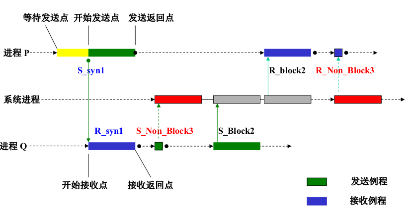

# 消息传递编程
### 消息传递编程模型
* 每个处理器运行一个子程序
* 类似通常的串行程序
* 所有变量都是私有的
* 通过特殊的函数用来通信

> 消息是子程序之间传递的数据包

### 通信类型
#### 点到点通信
> 一个进程发送消息给另一个  
> 最简单的消息传递模式

传递方式
* 同步方式
  > 提供信息完成的信息
* 异步发送
  > 仅知道消息已经发走
* 阻塞操作
  > 仅当传输操作完成才从调用中返回
* 非阻塞操作
  > 直接返回以后再等待是否完成

#### 群集通信
> 一次有多个进程参与,可以建立在点到点通信的基础上

方式:
* 同步
* 广播
* 归约操作
