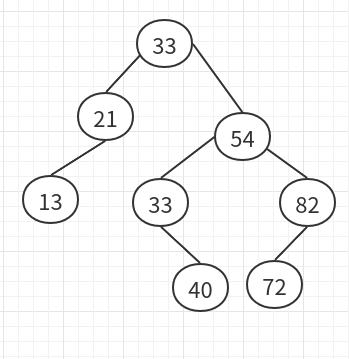
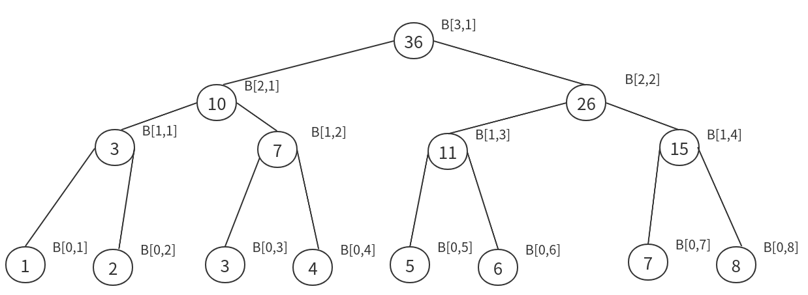

# 第二次作业
### 5.9
当 t = 28, p = 8, L = 5, o = 2, g = 4时
##### 工作原理:
根的远程子节点发送数据的时刻为:$(28-1) - (5+2 \times 2) = 18$  
其余3个子节点发送数据的时刻分别为:  
$(28-1) - (5+2 \times 2 + 4) = 14$  
$(28-1) - (5+2 \times 2 + 2\times 4) = 10$  
$(28-1) - (5+2 \times 2 + 3\times 4) = 6$  
##### 对于$P_0$
$P_0$有4个子节点,所以会接受4次消息,所以需要$4 \times (4 - 2) = 8$次局部加法来填充计算g,至少需要$4 \times (4 - 2 - 1) = 4$次自身内部加法来填充g
##### 对于$P_5$
$P_5$有2个子节点,所以会接受2次消息,所以需要$2 \times (4 - 2) = 4$次局部加法来填充计算g,至少需要$2 \times (4 - 2 - 1) = 2$次自身内部加法来填充g

### 6.3
由题初始序列为

| A1 | A2 | A3 | A4 | A5 | A6 | A7 | A8 |
|----|----|----|----|----|----|----|----|
| 33 | 21 | 13 | 54 | 82 | 33 | 40 | 72 |

选取主元A1 = 33, 得
 
| -  | 1 | 2 | 3 | 4 | 5 |
|----|---|---|---|---|---|
| LC | 2 | 3 | 6 | - | 8 |
| RC | 4 | - | 5 | 7 | - |

最后构建的二叉树为

所得的序列为

| 13 | 21 | 33 | 33 | 40 | 54 | 72 | 82 |
|----|----|----|----|----|----|----|----|

### 7.3
由题
$m = 16, 则log_2m = 4, k(m) = \frac{m}{log_2m} = 4$  
所以B可被划分为  
$B_0 = (3,4,5,6), B_1 = (8,10,12,13), B_2 = (14,15,20, 21), B_3 = (22,26,29,31)$  
由于:  
$rank(b_4=4 : A) = 3,rank(b_8=13 : A) = 6,rank(b_{12}=21 : A) = 10$  
所以,A可以划分为  
$A_0 = (0,1,2),A_1 = (7,9,11),A_2 =(16,17,18,19),A_3 = (23,24,25,27,28,30,33,34)$  
在分别归并$(A_0,B_0),(A_1,B_1),(A_2,B_2),(A_3,B_3)$后  
最终的结果为$(0,1,2,3,4,5,6,7,8,9,10,11,12,13,14,15,16,17,18,19,20,21,22,23,24,25,26,27,28,29,30,31,32,33,34)$

### 7.6
#### 1.
正向传播次数:$n/2 + n / 4 + ... + n/ n = n-1$  
反向传播次数:$n/n + n/ 2 + ... + n = 2n-1$  
所以$W(n) = 3n-2$
#### 2.
正向遍历:

反向遍历:

所以前缀和为:1,3,6,10,15,21,28,36
